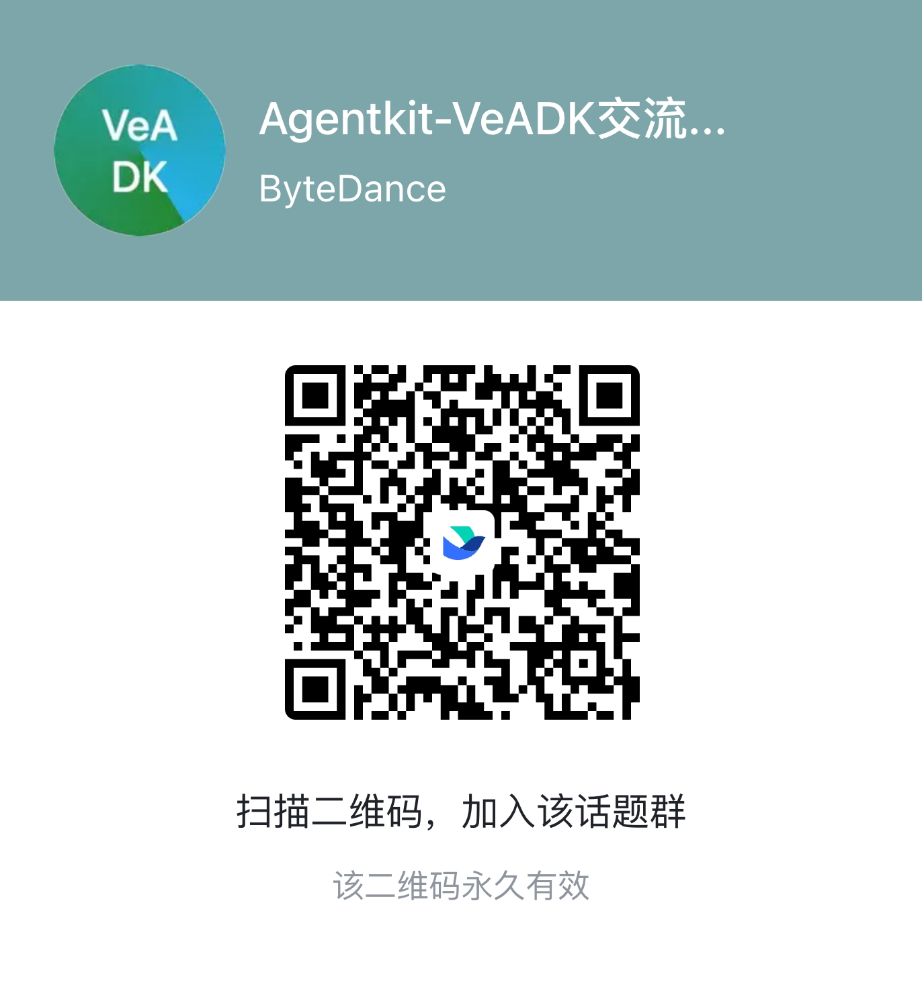

<p align="center">
    
</p>

# Volcengine Agent Development Kit

[](LICENSE)
[](https://deepwiki.com/volcengine/veadk-python)

An open-source kit for agent development, integrated the powerful capabilities of Volcengine.

For more details, see our [documents](https://volcengine.github.io/veadk-python/).

A [tutorial](https://github.com/volcengine/veadk-python/blob/main/veadk_tutorial.ipynb) is available by Jupyter Notebook, or open it in [Google Colab](https://colab.research.google.com/github/volcengine/veadk-python/blob/main/veadk_tutorial.ipynb) directly.

## Installation

### From PyPI

```python
pip install veadk-python

# install extensions
pip install veadk-python[extensions]
```

### Build from source

We use `uv` to build this project ([how-to-install-uv](https://docs.astral.sh/uv/getting-started/installation/)).

```bash
git clone ... # clone repo first

cd veadk-python

# create a virtual environment with python 3.12
uv venv --python 3.12

# only install necessary requirements
uv sync

# or, install extra requirements
# uv sync --extra database
# uv sync --extra eval
# uv sync --extra cli

# or, directly install all requirements
# uv sync --all-extras

# install veadk-python with editable mode
uv pip install -e .
```

## Configuration

We recommand you to create a `config.yaml` file in the root directory of your own project, `VeADK` is able to read it automatically. For running a minimal agent, you just need to set the following configs in your `config.yaml` file:

```yaml
model:
  agent:
    provider: openai
    name: doubao-seed-1-6-250615
    api_base: https://ark.cn-beijing.volces.com/api/v3/
    api_key: # <-- set your Volcengine ARK api key here
```

You can refer to the [config instructions](https://volcengine.github.io/veadk-python/configuration/) for more details.

## Have a try

Enjoy a minimal agent from VeADK:

```python
from veadk import Agent
import asyncio

agent = Agent()

res = asyncio.run(agent.run("hello!"))
print(res)
```

## AgentKit application

Use the shared AgentKit application factory when your project needs AgentKit
APIs, VeADK's bundled Web UI, health checks, and agent-topology endpoints. This
keeps platform routes and lifecycle code out of your agent module:

```python
from veadk import Agent
from veadk.integrations.agentkit import create_agentkit_app

root_agent = Agent(name="customer_support")
app = create_agentkit_app(
    root_agent,
    enable_studio_tools=True,
)
```

Studio-owned dynamic tools and HTTP routes are separate Runtime capabilities.
Enable them explicitly with `enable_studio_tools=True` and
`enable_studio_routes=True`; both default to disabled.

See [`examples/generated_agentkit_project`](examples/generated_agentkit_project)
for a complete generated project.

The Agent Server metadata endpoint reports the root Agent's name, description,
model, sub-Agents, tools, skills, and mounted component summaries. Each Runtime
row in Studio has explicit connect and info actions; the info panel's tabs switch
between this live metadata and control-plane information without exposing prompts
or credentials. The same metadata advertises mounted smart-search sources, so
Studio can disable unavailable sources up front and query the Agent's web-search
tool, KnowledgeBase, or long-term memory without exposing component credentials.
Studio also manages user-owned Codex, OpenClaw, and Hermes AgentKit Sessions.
Users can create, reopen, inspect, and explicitly delete each Agent; leaving a
Codex conversation only disconnects it, while OpenClaw and Hermes expose their
main interface and Terminal through Studio.
When configuring skills, Studio can also browse account-scoped AgentKit Skill
Spaces and their paginated skill lists by region and project. These requests are
signed on the server, so browser clients never receive Volcengine credentials.

The Studio deployment flow lists Feishu, knowledge-base, short-/long-term
memory, and observability settings in their feature sections. Values entered
there are mirrored in the deployment environment-variable summary and converted
to VeADK runtime environment variables only when deploying; secrets are not
written to generated source or exported YAML. For multi-instance runtimes, use
a database-backed short-term memory store so sessions remain available across
instances.

When a cloud image build fails from the bundled Web UI, the deployment error
includes a credential-safe excerpt from the build log so dependency and
Dockerfile failures can be diagnosed directly.

When Studio connects to an AgentKit Runtime, users can rate completed answers
with like/dislike controls. Feedback is written server-side to per-Agent
`{agent_name}_good_case` and `{agent_name}_bad_case` evaluation sets, with
stable item keys so repeated clicks and rating changes remain idempotent.

## Feishu bot channel

VeADK now provides `veadk.extensions.FeishuChannelExtension` for bridging a Feishu bot with a `Runner`. It maps `union_id` to `user_id`, and `thread_id` / `chat_id` to `session_id`, so VeADK memory and tracing can work directly in Feishu conversations.

```python
from veadk import Agent, Runner
from veadk.extensions import FeishuChannelExtension

agent = Agent()
runner = Runner(agent=agent, app_name="feishu_demo")
channel = FeishuChannelExtension(runner=runner)
```

Configure credentials with `TOOL_FEISHU_CHANNEL_APP_ID` and `TOOL_FEISHU_CHANNEL_APP_SECRET`, or in `config.yaml` under `tool.feishu_channel`.

## Contribution

Before making your contribution to our repository, please install and config the `pre-commit` linter first.

```bash
pip install pre-commit
pre-commit install
```

Before commit or push your changes, please make sure the unittests are passed ,otherwise your PR will be rejected by CI/CD workflow. Running the unittests by:

```bash
pytest -n 16
```

## Security and privacy

This project takes security seriously.
For vulnerability reporting and supported versions, see [SECURITY.md](SECURITY.md)

## Contact with us

Join our discussion group by scanning the QR code below:

<p align="center">
    
</p>

## License

This project is licensed under the [Apache 2.0 License](./LICENSE).

## Codex 性能诊断

Codex 路径保留 `call_llm` 作为整轮执行的兼容记录，供现有会话索引与评测使用；它不是单次模型请求耗时。Responses Shim 为每次 `litellm.aresponses` 调用生成 `codex.model.request` Span，并接续本轮 Agent 的 Trace 上下文。该 Span 包含库内部重试，reasoning 兼容重试会另生成一条；不等于底层每次 HTTP 尝试。此路径以非流式方式获取模型完整响应，不据此计算首 Token 耗时。模型 Span 不重复记录整轮 Token 用量，也不采集请求、响应、Endpoint 或异常正文。

验证使用 `tests/runtime/codex/test_model_tracing.py` 与现有 `test_codex_tracing.py`、`test_codex_shim_rounds.py`；实际观测接收仍需按部署环境验证。

远端 CodeEnv Worker 客户端为就绪检查、创建会话、启动、查询和取消请求生成 CLIENT Span，按 W3C 透传 Trace 上下文；一次请求 Span 包含已有重试及退避，记录每次响应或传输异常。身份认证与幂等 Key 保持原行为，Span 不保存 Endpoint、Session / Turn 路由 ID、请求正文或凭证。SSE 订阅、Worker 内部排队与启动、跨轮恢复关联仍需分别采集，客户端请求耗时不能代替这些阶段或任务总耗时。
