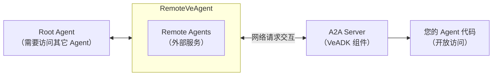
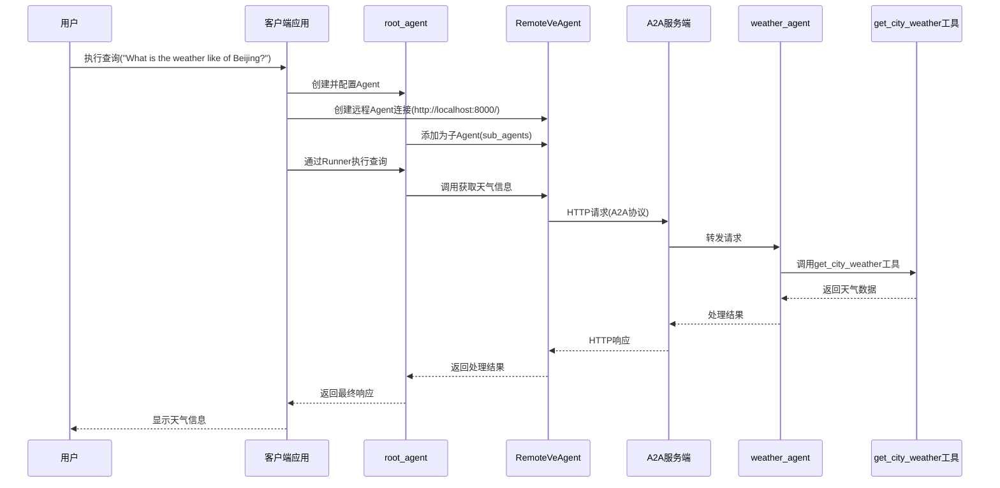

## Introduction to the Agent-to-Agent Protocol

For highly complex tasks, a single Agent often cannot complete the work alone and must coordinate multiple specialized Agents. The **Agent2Agent (A2A) protocol** is the standard for communication between multiple Agents.

<Callout type="info" title="Reference">
[A2A protocol official docs](https://a2a-protocol.org/latest/)
</Callout>

## Multi-Agent Systems

There are generally two ways to architect a multi-agent system: **Local Sub-Agents** and **Remote Agents (A2A)**.

- **Local Sub-Agents**: These Agents run in the same application process as the main Agent. They are more like internal modules or libraries used to organize code into logical, reusable components. Communication between the main Agent and local sub-agents happens directly in memory with no network overhead, so it is very fast.
- **Remote Agents (A2A)**: These Agents run as independent services and communicate over the network. A2A defines a standard protocol for this kind of communication.

### How to Choose the Right Agent Architecture

A2A is not suitable for every scenario. Use the following guidance to make the right choice for your actual use case and requirements.

#### Scenarios suited to A2A

| Scenario | Description |
| - | - |
| **Integrating third-party services** | The Agent you need to interact with is an independent, separately running third-party service (e.g. fetching real-time trading info from an external financial data service). |
| **Microservice architecture** | Different Agents are maintained by different teams or organizations; A2A lets these services communicate across network boundaries. |
| **Cross-language communication** | To connect Agents implemented in different programming languages or Agent frameworks, A2A provides a standardized communication layer. |
| **Strict API contracts** | To guarantee compatibility and stability, you need a strict contract for the interaction between Agents. |

#### Scenarios not suited to A2A (better as Local Sub-Agents)

| Scenario | Description |
| - | - |
| **Internal code organization** | When you split a complex task into smaller, manageable functions or modules within a single Agent, this is better kept as local sub-agents for performance and simplicity. |
| **Performance-critical internal operations** | When a sub-agent performs high-frequency, low-latency operations tightly coupled with the main Agent's execution, it is better as a local sub-agent because it needs low-latency responses. |
| **Shared memory or context** | When a sub-agent needs direct access to the main Agent's internal state or shared memory for efficiency, A2A's network overhead and serialization/deserialization would be counterproductive. |
| **Simple helper functions** | For small reusable logic that needs no independent deployment or complex state management, writing a function or class within the same Agent is usually more appropriate than splitting it into a separate A2A Agent. |

## A2A Workflow in VeADK

**VeADK** simplifies the process of building and connecting Agents based on the A2A protocol. Here is an intuitive overview of the workflow:

1. **Exposing an Agent:** Start from an existing VeADK Agent and turn it into an A2AServer, making it accessible to other Agents. The A2AServer can be thought of as a web service built around the Agent, through which other Agents can send requests to your Agent.
2. **Consuming an exposed Agent:** In another Agent (which may run on the same machine or a different one), you can use a VeADK component named `RemoteVeAgent` as a client to access the A2AServer created in the previous step. `RemoteVeAgent` handles complex matters such as network communication, authentication, and data formats in the background.

**VeADK** abstracts away the network layer so that using a distributed multi-agent system feels close to a local system. The diagram below shows a complete **A2A system topology**:



## Building a Local A2A Project

Below is an example system built with A2A:

### Create the A2A Server

1. Define the Agent's tools and capabilities
2. Convert the Agent into an A2AServer with the `to_a2a(...)` function
3. Configure server parameters (port, host, etc.)

```python title="server.py"
from google.adk.a2a.utils.agent_to_a2a import to_a2a
from veadk import Agent
from veadk.tools.demo_tools import get_city_weather

agent = Agent(
    name="weather_agent",
    description="An agent that can get the weather of a city",
    tools=[get_city_weather],
)

app = to_a2a(agent=agent)
```

### Client Integration

1. Import the `RemoteVeAgent` class
2. Configure the remote Agent connection parameters
3. Add the Remote Agent as a sub-agent of the Root Agent

```python title="client.py"
from veadk import Agent, Runner
from veadk.a2a.remote_ve_agent import RemoteVeAgent

async def main(prompt: str) -> str:
    """Main function for run an agent.

    Args:
        prompt (str): The prompt to run.

    Returns:
        str: The response from the agent.
    """
    weather_agent = RemoteVeAgent(
        name="weather_agent",
        url="http://localhost:8000/",  # <--- url of A2A server
    )
    print(f"Remote agent name is {weather_agent.name}.")
    print(f"Remote agent description is {weather_agent.description}.")

    agent = Agent(
        name="root_agent",
        description="An assistant for fetching weather.",
        instruction="You are a helpful assistant. You can invoke weather agent to get weather information.",
        sub_agents=[weather_agent],
    )

    runner = Runner(agent=agent)
    response = await runner.run(messages=prompt)

    return response


if __name__ == "__main__":
    import asyncio

    response = asyncio.run(main("What is the weather like of Beijing?"))
    print(response)
```

### Interaction Flow

The diagram below shows the interaction flow corresponding to the example:



## Authentication and Authorization

VeADK's A2A auth mechanism provides flexible authentication options. It supports the standard Bearer token authentication and query-parameter authentication, as well as no-auth public service scenarios, meeting different security needs.

### QueryString Method

- Pass the auth token as the URL query parameter `?token={auth_token}`
- Enable it by setting `auth_method` to `querystring`
- Suitable for certain API gateways or service configurations

```python title="client.py"
remote_agent = RemoteVeAgent(
    name="a2a_agent",
    url="https://example.com/a2a",
    auth_token="your_token_here",
    auth_method="querystring",
)
```

### Header Method

- Authenticate using an HTTP request header in the format `Authorization: Bearer {auth_token}`
- Enable it by setting `auth_method="header"`
- Suitable for scenarios that require passing authentication info in HTTP headers

```python title="client.py"
remote_agent = RemoteVeAgent(
    name="a2a_agent",
    url="https://example.com/a2a",
    auth_token="your_token_here",
    auth_method="header",
)
```

<Accordions>
<Accordion title="Default auth method used by Volcengine VeFaaS">

When you use Volcengine veFaaS as your Agent runtime, Querystring authentication is used by default. As shown in the screenshot below, under "My Applications" you can view the Querystring authentication info carried in the access URL of the resources you created.


</Accordion>
</Accordions>

### Custom HTTP Client

In VeADK, custom HTTP client configuration is primarily done through the `RemoteVeAgent` class, which provides an `httpx_client` parameter that lets you pass a pre-configured `httpx.AsyncClient` instance. This gives you flexible control over various HTTP request parameters such as proxy settings, timeout control, and connection-pool management, so you can better adapt to different network environments and needs.

You can refer to the example code below to create a custom HTTP client and configure various client parameters, such as:

- Timeout settings
- Proxy configuration
- Connection-pool size
- Retry strategy
- Custom request headers
- SSL verification options

```python title="client.py"
# <...code truncated...>

# Create a custom httpx.AsyncClient instance
custom_client = httpx.AsyncClient(
    # Base URL setting
    base_url="https://vefaas.example.com/agents/",
    
    # Timeout setting (seconds)
    timeout=30.0,
    
    # Connection-pool settings
    limits=httpx.Limits(
        max_connections=100,        # Max concurrent connections
        max_keepalive_connections=20,  # Max keep-alive connections
        keepalive_expiry=60.0,      # Keep-alive connection expiry
    ),
    
    # Retry config (requires httpx >= 0.24.0)
    follow_redirects=True,        # Follow redirects
    
    # Custom default request headers
    headers={
        "User-Agent": "Custom-VeADK-Client/1.0",
        "X-Custom-Header": "custom-value"
    },
    
    # SSL verification option (keep the default True in production)
    verify=True,
    
    # Proxy configuration (if a proxy is needed)
    proxies="http://proxy.example.com:8080",
    
    # Concurrency settings
    http2=True,  # Enable HTTP/2 support
)

# When creating the RemoteVeAgent instance, pass the custom client to httpx_client
remote_agent = RemoteVeAgent(
    name="a2a_agent",
    url="https://example.com/a2a",
    auth_token="your_token_here",
    auth_method="header",
    httpx_client=custom_client,
)

# <...code truncated...>
```
