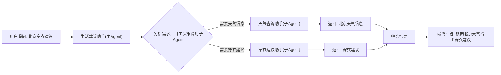
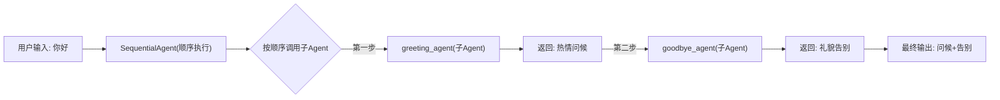
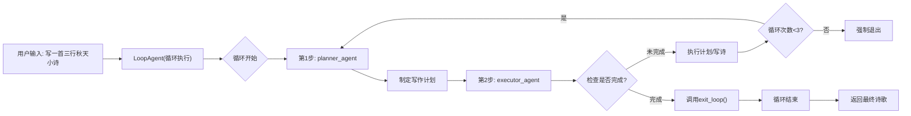
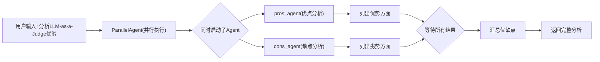

This document explains how to define, coordinate, and run multiple Agents within one system. The core of multi-agent system design lies in **role division** and **communication mechanisms**.

With sensible collaboration strategies, you can decompose a complex task into controllable subtasks, improving overall stability and scalability.

## Building a Multi-Agent System

A multi-agent system usually consists of several Agents with independent responsibilities. Common types of the main Agent include:

- **Autonomous Agent**: A general-purpose Agent based on a large language model, supporting natural-language understanding, reasoning, and generation, and configurable with tools, memory, knowledge base, etc.
- **Workflow Agent**: An Agent optimized for a specific execution pattern, including sequential, parallel, and loop execution modes, suited to different task-orchestration scenarios.

<Accordions>
<Accordion title="Common multi-agent issues and solutions">

**Sub-agent returns no result after being invoked**

- Symptom: After the main Agent invokes a sub-agent, there is no response for a long time or it returns an empty value.
- Solution: Try the Agent-as-a-Tool pattern, invoking the sub-agent as a tool. See the [tools documentation](/en/docs/framework/tools/function).

**Sub-agent is invoked inaccurately or misunderstands the task**

- Symptom: The sub-agent does not correctly understand the task and returns irrelevant content.
- Solution: Switch to a model with stronger comprehension, such as a thinking or reasoning model.

**Data transfer between sub-agents fails**

- Symptom: The output of the previous Agent cannot be correctly received by the next Agent.
- Solution: Check that the data formats are consistent, and ensure the output format matches the next Agent's input requirements.

**Loop invocation causes deadlock**

- Symptom: Agents invoke each other, forming an infinite loop.
- Solution: Set a maximum invocation-depth limit, or use a timeout mechanism.

</Accordion>
</Accordions>

### Autonomous Agent

**Definition**: The autonomous Agent is VeADK's core Agent. Built on a large language model, it supports full intelligent conversation, tool calling, and memory management. Based on its configuration, it can **automatically invoke sub-agents or tools** to complete complex tasks.

**Example**: The following life-advice Agent demonstrates the main interaction patterns of an autonomous Agent. The main Agent receives user input, while the sub-agents respectively fetch the weather and give clothing suggestions. The call diagram below shows that, based on the user's prompt, the main Agent first calls the weather Agent to get the weather, then calls the clothing-suggestion Agent to give advice.



<Tabs items={['Python', 'Golang', 'Environment variables']}>
<Tab value="Python">

```python title="examples/agent/agents/llm_agent.py"
import asyncio

from veadk import Agent, Runner
from veadk.tools.demo_tools import get_city_weather

weather_reporter = Agent(
    name="weather_reporter",
    description="A weather reporter agent to report the weather.",
    tools=[get_city_weather],
)

suggester = Agent(
    name="suggester",
    description="A suggester agent that can give some clothing suggestions according to a city's weather.",
    instruction="""Provide clothing suggestions based on weather temperature: 
    wear a coat when temperature is below 15°C, wear long sleeves when temperature is between 15-25°C, 
    wear short sleeves when temperature is above 25°C.""",
)

root_agent = Agent(
    name="planner",
    description="A planner that can generate a suggestion according to a city's weather.",
    instruction="""Invoke weather reporter agent first to get the weather, 
                then invoke suggester agent to get the suggestion. Return the final response to user.""",
    sub_agents=[weather_reporter, suggester],
)

if __name__ == "__main__":
    runner = Runner(root_agent)
    response = asyncio.run(runner.run("北京穿衣建议"))
    print(response)
```

</Tab>
<Tab value="Golang">

```go title="examples/agent/agents/llm_agent.go"
package main

import (
	"context"
	"fmt"
	"log"
	"os"

	veagent "github.com/volcengine/veadk-go/agent/llmagent"
	vetool "github.com/volcengine/veadk-go/tool"
	"google.golang.org/adk/agent"
	"google.golang.org/adk/agent/llmagent"
	"google.golang.org/adk/cmd/launcher"
	"google.golang.org/adk/cmd/launcher/full"
	"google.golang.org/adk/session"
	"google.golang.org/adk/tool"
)

func main() {
	ctx := context.Background()

	getCityWeatherTool, err := vetool.GetCityWeatherTool()
	if err != nil {
		fmt.Printf("GetCityWeatherTool failed: %v", err)
		return
	}

	weatherReporter, err := veagent.New(&veagent.Config{
		Config: llmagent.Config{
			Name:        "weather_reporter",
			Description: "A weather reporter agent to report the weather.",
			Tools:       []tool.Tool{getCityWeatherTool},
		},
	})
	if err != nil {
		fmt.Printf("NewLLMAgent weatherReporter failed: %v", err)
		return
	}

	suggester, err := veagent.New(&veagent.Config{
		Config: llmagent.Config{
			Name:        "suggester",
			Description: "A suggester agent that can give some clothing suggestions according to a city's weather.",
			Instruction: `Provide clothing suggestions based on weather temperature:
			wear a coat when temperature is below 15°C, wear long sleeves when temperature is between 15-25°C,
			wear short sleeves when temperature is above 25°C.`,
		},
	})
	if err != nil {
		fmt.Printf("NewLLMAgent suggester failed: %v", err)
		return
	}

	rootAgent, err := veagent.New(&veagent.Config{
		Config: llmagent.Config{
			Name:        "planner",
			Description: "A planner that can generate a suggestion according to a city's weather.",
			Instruction: `Invoke weather reporter agent first to get the weather,
			then invoke suggester agent to get the suggestion. Return the final response to user.`,
			SubAgents: []agent.Agent{weatherReporter, suggester},
		},
	})
	if err != nil {
		fmt.Printf("NewLLMAgent rootAgent failed: %v", err)
		return
	}

	config := &launcher.Config{
		AgentLoader:    agent.NewSingleLoader(rootAgent),
		SessionService: session.InMemoryService(),
	}

	l := full.NewLauncher()
	if err = l.Execute(ctx, config, os.Args[1:]); err != nil {
		log.Fatalf("Run failed: %v\n\n%s", err, l.CommandLineSyntax())
	}

}
```

</Tab>
<Tab value="Environment variables">

Environment variable list:

- `MODEL_AGENT_API_KEY`: API key for the Agent inference model

Or define them in `config.yaml`:

```yaml title="config.yaml"
model:
  agent:
    provider: openai
    name: doubao-seed-1-6-250615
    api_base: https://ark.cn-beijing.volces.com/api/v3/
    api_key: your-api-key-here
```

</Tab>
</Tabs>

Result:


### Workflow Agent

**Definition**: A Workflow Agent is a control Agent responsible for scheduling, invoking, and integrating results. It has no language-model capability of its own; instead, through a **user-defined sub-agent workflow category**, it invokes underlying sub-Agents to accomplish the overall task. In VeADK, workflow Agents fall into three categories:

- Sequential Agent: a flow that executes multiple Agents serially, one after another.
- Loop Agent: a flow that executes multiple Agents in a loop until a specific exit condition is met.
- Parallel Agent: a flow that executes multiple Agents in parallel.

The following sections explain how to build each of these three types of multi-agent flow.

#### Sequential Agent

**Example**: The following copywriting Agent demonstrates the execution flow of a Sequential Agent. We implement 3 Agents to run a "greet–farewell" workflow. As shown in the call diagram, the SequentialAgent invokes greeting_agent and goodbye_agent in the user-defined order; after each sub-agent finishes its task, it passes the result to the next Agent.



```python title="examples/agent/agents/seq_agent.py"
import asyncio

from veadk import Agent, Runner
from veadk.agents.sequential_agent import SequentialAgent

greeting_agent = Agent(
    name="greeting_agent",
    description="A friendly agent that greets the user.",
    instruction="Greet the user warmly.",
)

goodbye_agent = Agent(
    name="goodbye_agent",
    description="A polite agent that says goodbye to the user.",
    instruction="Say goodbye to the user politely.",
)

root_agent = SequentialAgent(sub_agents=[greeting_agent, goodbye_agent])

if __name__ == "__main__":
    runner = Runner(root_agent)
    response = asyncio.run(runner.run("你好"))
    print(response)
```

Result:


#### Loop Agent

**Definition**: A Loop Agent repeatedly executes its sub-Agents until a specific condition is met to exit the loop. It is suited to complex tasks that require iterative refinement, multi-turn dialogue, or conditional judgment.

**Example**: The following poetry-writing Agent demonstrates the execution flow of a Loop Agent. We implement 2 Agents to run a "plan–execute" loop workflow with a maximum of 3 iterations:

- Planner Agent: decides the next action plan based on the user's goal.
- Executor Agent: executes the plan and checks the result, calling the exit function once done.

As shown in the call diagram, the LoopAgent repeatedly invokes planner_agent and executor_agent until executor_agent detects that the task is complete and calls the exit function.



```python title="examples/agent/agents/loop_agent.py"
import asyncio

from google.adk.tools.tool_context import ToolContext
from veadk import Agent, Runner
from veadk.agents.loop_agent import LoopAgent


def exit_loop(tool_context: ToolContext):
    print(f"  [Tool Call] exit_loop triggered by {tool_context.agent_name}")
    tool_context.actions.escalate = True
    return {}


planner_agent = Agent(
    name="planner_agent",
    description="Decomposes a complex task into smaller actionable steps.",
    instruction=(
        "Given the user's goal and current progress, decide the NEXT step to take. You don't need to execute the step, just describe it clearly. "
        "If all steps are done, respond with 'TASK COMPLETE'."
    ),
)

executor_agent = Agent(
    name="executor_agent",
    description="Executes a given step and returns the result.",
    instruction="Execute the provided step and describe what was done or what result was obtained. If you received 'TASK COMPLETE', you must call the 'exit_loop' function. Do not output any text.",
    tools=[exit_loop],
)

root_agent = LoopAgent(
    sub_agents=[planner_agent, executor_agent],
    max_iterations=3,  # Limit the number of loops to prevent infinite loops
)

if __name__ == "__main__":
    runner = Runner(root_agent)
    response = asyncio.run(runner.run("用中文帮我写一首三行的小诗，主题是秋天"))
    print(response)
```

Result:


#### Parallel Agent

**Definition**: A Parallel Agent executes multiple sub-Agents simultaneously. It is suited to tasks that can be processed independently, such as pros-and-cons analysis and multi-perspective evaluation, and can significantly improve processing efficiency.

**Example**: The following pros-and-cons analysis Agent demonstrates the execution flow of a Parallel Agent. We implement 2 Agents to analyze the "LLM-as-a-Judge evaluation pattern" in parallel:

- Pros Agent: identifies and explains the advantages of the pattern.
- Cons Agent: identifies and explains the disadvantages of the pattern.

As shown in the call diagram, the ParallelAgent invokes pros_agent and cons_agent at the same time; the two sub-agents run independently and the results are aggregated and returned at the end.



```python title="examples/agent/agents/parallel_agent.py"
import asyncio

from veadk import Agent, Runner
from veadk.agents.parallel_agent import ParallelAgent

pros_agent = Agent(
    name="pros_agent",
    description="An expert that identifies the advantages of a topic.",
    instruction="List and explain the positive aspects or advantages of the given topic.",
)

cons_agent = Agent(
    name="cons_agent",
    description="An expert that identifies the disadvantages of a topic.",
    instruction="List and explain the negative aspects or disadvantages of the given topic.",
)

root_agent = ParallelAgent(sub_agents=[pros_agent, cons_agent])

if __name__ == "__main__":
    runner = Runner(root_agent)
    response = asyncio.run(runner.run("请分析 LLM-as-a-Judge 这种评测模式的优劣"))
    print(response)
```

Result:


## Multi-Agent Use Cases

Here are some scenarios where multi-agent interaction may be useful:

| Scenario | Description | Typical Agent composition |
| ----------- | ----------------------------------------- | ---------------------------------------- |
| **Content generation assistant** | The user inputs a topic, and the system automatically generates an outline, writes the body, then polishes and summarizes it. | Planner → Writer → Editor |
| **Research assistant** | Automatically retrieves materials based on a research question, summarizes key information, and generates citation formats. | Researcher → Retriever → Summarizer |
| **Task auto-executor** | The user describes a goal, and the system splits the task and invokes different tools or services to execute it. | Planner → Executor → Auditor |
| **Customer-service collaboration** | One Agent understands the user's question, another retrieves from the knowledge base and generates a response. | FrontAgent → SupportAgent |
| **Meeting-minutes assistant** | Transcribes the meeting recording, summarizes key points, and generates an action-item list. | Transcriber → Summarizer → ActionPlanner |

A multi-agent system typically follows these construction steps:

1. **Define each Agent**: create a separate config file or instance for each role;
2. **Define the communication mechanism**: determine how data is passed between Agents (direct call, message queue, or shared memory);
3. **Set up the collaboration logic**: use a Workflow Agent or a control script to orchestrate the invocation order;
4. **Configure logging and observability**: ensure every call chain is traceable.
