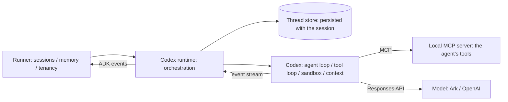

The runtime decides how an agent's inner loop runs — how each turn calls the model, parses intent, and invokes tools. The default runtime is built on Google ADK's execution flow and works out of the box. You can also switch to another execution backend, or insert shared processing into the flow (auth, logging, retries) without touching the agent itself.

## Basic usage

The ADK runtime is the default — no extra configuration needed:

```python title="agent.py"
import asyncio
from veadk import Agent, Runner

agent = Agent(name="assistant")  # uses the ADK runtime by default
print(asyncio.run(Runner(agent=agent).run("Hello")))
```

## Switch the execution backend

Use `runtime` to choose the inner-loop backend:

```python title="agent.py"
agent = Agent(name="assistant", runtime="codex")
```

| Value | Description |
| :--- | :--- |
| `adk` (default) | Google ADK's built-in execution flow; fits almost every case. |
| `codex` | Uses the OpenAI Codex SDK to drive the inner loop, executing commands and file edits inside a sandbox. |
| `piagent` | Uses a local Pi coding agent binary (through its RPC mode) to drive the inner loop. The binary is downloaded on first run, or point `PIAGENT_BINARY` at an existing executable. |

<Callout type="warn">
**Positioning: `codex` and `piagent` are *sandboxed-execution* runtimes, not drop-in equivalents of the ADK flow.**
They hand the entire inner loop to an external agent harness, so ADK request/response processors (planner, code executor, example store, knowledge base injection), per-LLM-call callbacks and spans do not run there. VeADK bridges `sub_agents` as a `transfer_to_agent` tool, but these runtimes are still best suited for work where the model needs to run commands and edit files under a controlled sandbox, not as a transparent backend swap for every ADK feature. See the [support matrix](#support-matrix) for the exact differences.
</Callout>

Install the optional dependency before using the Codex runtime:

```bash
pip install "veadk-python[codex]"
```

### When to use the Codex runtime

The positioning callout above reduces to a single test: **the Codex runtime's
one real advantage is that the model can write a file, run it, read the
traceback, fix it, and run it again — inside an OS sandbox, without you having
to pre-enumerate every step as a tool.** On every other axis it costs more than
`runtime="adk"`.

**Good fits**

- **Work whose steps cannot be enumerated as tools ahead of time** — ad-hoc analysis, log triage, data wrangling, code modification. What to do next depends on the last step's output, not on what you imagined while writing the agent.
- **Work over a filesystem** — intermediate artifacts stay in the workspace and are still there on the next turn of the same session (see [Workspace lifetime](#workspace-lifetime)).
- **Work where a wrong first attempt is normal and retrying is cheap** — the error message *is* the model's next input. Under the ADK runtime a failed tool call is just an error string; here it is a traceback the model can read, diagnose and fix.

**Bad fits**

- **A fixed tool call and a formatted answer.** That is the ADK runtime's home ground: faster, cheaper, and subject to none of the limits below.
- **An agent that needs `output_schema`, `planner`, `code_executor` or `generate_content_config`.** Under a non-adk runtime these **raise** — they do not degrade. See the [support matrix](#support-matrix) for the full list.
- **Latency-sensitive paths.** Every invocation builds a fresh `CODEX_HOME`, spawns a Codex subprocess and opens an ephemeral thread; that fixed cost is paid per turn.
- **`run_live`.** Non-adk runtimes have no live/bidi implementation — see [below](#run_live-is-unsupported).

**The costs, stated honestly**

- **One Codex subprocess per invocation.** The runtime rebuilds `CODEX_HOME` and enters `AsyncCodex(...)` every turn, with an `ephemeral=True` thread.
- **The whole ADK history is re-serialized into the prompt every turn.** Prior turns are rendered as a `<conversation_history>` JSON block in front of the current message — there is no incremental continuation — so prompt tokens grow with conversation length. It is also why `include_contents="none"` raises instead of being ignored.
- **ADK tool results travel through the model's context.** See [The workspace is the data plane](#the-workspace-is-the-data-plane) — the easiest way to ruin a turn with this runtime.

The one-line version: **if you can express the task as a fixed sequence of tool
calls, use `runtime="adk"`; reach for `runtime="codex"` only when you can
describe the goal but the path has to be discovered.**

The repository's four codex examples divide up like this:

| Example | What it teaches |
| :--- | :--- |
| [`codex_data_analysis`](https://github.com/volcengine/veadk-python/tree/main/examples/codex_data_analysis) | **What the runtime is for.** Codex writes an analysis script, runs it, hits a real error in dirty data, fixes it, re-runs, and reports — the self-iteration loop. |
| [`codex_ops_assistant`](https://github.com/volcengine/veadk-python/tree/main/examples/codex_ops_assistant) | **What the runtime is for.** ADK tools land logs, metrics and deploy history in the workspace; Codex writes throwaway scripts to correlate the three and find a root cause, all inside a no-network sandbox. |
| [`codex_with_skill_and_mcp`](https://github.com/volcengine/veadk-python/tree/main/examples/codex_with_skill_and_mcp) | **How to wire it up.** The paths a local skill and an MCP tool take under this runtime. |
| [`codex_runtime_on_agentkit`](https://github.com/volcengine/veadk-python/tree/main/examples/codex_runtime_on_agentkit) | **How to deploy it.** Ship a `runtime="codex"` agent to Volcengine AgentKit. |

### Codex security configuration

Codex defaults to a session-isolated workspace, the `workspace_write` sandbox, no network access, and denial of every escalated operation:

```python title="agent.py"
from veadk import Agent
from veadk.runtime.codex import CodexRuntimeConfig

agent = Agent(
    name="assistant",
    runtime="codex",
    codex_runtime_config=CodexRuntimeConfig(
        sandbox="workspace_write",
        approval_mode="deny_all",  # the default; auto_review means full auto-approval, see below
        network_access=True,
        # Set this explicitly to work inside an existing project.
        workspace_root="/workspace/codex",
    ),
)
```

<Callout type="error">
**`approval_mode="auto_review"` is not a review gate — it is full auto-approval.**
The Codex SDK's built-in approval handler answers every `requestApproval` notification with `accept`, and `AsyncCodex` exposes no hook to replace it. So `auto_review` auto-approves every sandbox escalation and file change without consulting a human or ADK. Only the default `deny_all` actually keeps Codex inside the sandbox. Do not use `auto_review` for multi-tenant deployments or untrusted input.
</Callout>

One sandbox/network combination is easy to misread: `network_access` is written to the `[sandbox_workspace_write]` table of Codex's `config.toml`, and **only the `workspace_write` sandbox reads it**.

| `sandbox` | Is `network_access` honoured? |
| :--- | :--- |
| `workspace_write` | Yes. |
| `read_only` | No (setting it to `True` logs a warning). |
| `full_access` | No — `danger-full-access` already means full network and filesystem access. |

Because of that, `CodexRuntimeConfig(sandbox="full_access", network_access=False)` **raises `ValueError`**: the combination reads as "no network" while actually granting full access. If you need `full_access`, write `network_access=True` explicitly to acknowledge the risk.

`full_access` and `reuse_workspace=True` relax filesystem isolation between invocations and should only be enabled in trusted environments.

Commands Codex runs never see credential-like environment variables. The generated Codex config always sets `[shell_environment_policy]` to exclude these variables from the command environment:

| Excluded pattern | Covers |
| :--- | :--- |
| `VEADK_CODEX_*` | Configuration and per-turn tokens the runtime passes to Codex. |
| `*API_KEY*` | Model API keys and similar secrets, such as `MODEL_AGENT_API_KEY`. |
| `*SECRET*` | Cloud secret keys and similar credentials. |
| `*TOKEN*` | Access tokens of any kind. |

Without this policy, running `env` inside the sandbox printed the model API key and the turn tokens (verified on Codex CLI 0.159). Any other credential a command needs belongs behind an ADK tool rather than in the sandbox environment.

Model request headers stay out of the sandbox as well. On the `direct` transport, a header in `model_extra_config.extra_headers` whose name is `Authorization`, `Proxy-Authorization` or `Cookie`, or contains `key`/`token`/`secret`/`password`/`signature` (case-insensitive), is **never written to Codex's config file**: its value reaches Codex through environment variables via Codex's `env_http_headers`, which the sandboxed shell cannot see. Other headers are sent as static headers.

#### The security baseline

Put the pieces above together and you get the default recipe for running codex
over untrusted input. Each of the four settings blocks a different direction,
and none of them is redundant:

```python title="agent.py"
from google.adk.agents import RunConfig
from veadk import Agent, Runner
from veadk.runtime.codex import CodexRuntimeConfig

agent = Agent(
    name="analyst",
    runtime="codex",
    tools=[load_orders, publish_report],  # the only way in and out
    codex_runtime_config=CodexRuntimeConfig(
        sandbox="workspace_write",  # writes confined to the workspace
        network_access=False,       # no outbound path from the sandbox
        approval_mode="deny_all",   # the default; refuses every escalation
    ),
)

await Runner(agent=agent).run(
    "...",
    run_config=RunConfig(max_llm_calls=40),  # cost ceiling for the invocation
)
```

They compose because **with the network off, the ADK tools you wired up are the
only outbound path**: the model can compute freely over sensitive data and retry
as often as it likes, but to get anything *out* it has to go through a function
you audited, signed and logged. Your tool list is your data-egress policy — which
holds only as long as no individual tool offers arbitrary outbound calls of its own.

Three related points, covered elsewhere rather than repeated here:

- `approval_mode="auto_review"` removes the foundation this recipe stands on; see the [error callout above](#codex-security-configuration).
- The `sandbox` × `network_access` semantics are in the [table above](#codex-security-configuration): only `workspace_write` reads `network_access`.
- The `VEADK_CODEX_*` environment variables take **precedence over** the Python config; see [Codex environment variables](#codex-environment-variables). A single `VEADK_CODEX_SANDBOX=full_access` in the deployment environment overrides all of the code above.

When `RunConfig(max_llm_calls=...)` is unset, VeADK's `Runner` falls back to the
`MODEL_AGENT_MAX_LLM_CALLS` environment variable (default `100`). Under this
runtime, set it explicitly and lower: the model decides for itself how many
script rounds to run, and this budget is the only hard stop.

#### Workspace lifetime

By default a workspace is keyed by `app_name` / `user_id` / `session_id` / agent name: every invocation of one session **shares the same directory**, and it is not deleted at the end of a turn, so files written by one turn are still there for the next. The whole tree is removed when the process exits; while the process runs, session workspaces left **idle for more than 6 hours** are reaped the next time a workspace is created, which bounds disk growth in a long-lived server.

A tool never has to derive that path: `current_workspace()` returns the workspace of the turn that is calling it, with nothing configured — see [The workspace is the data plane](#the-workspace-is-the-data-plane) below.

A `workspace_root` you pass explicitly is *your* directory: the runtime never deletes it and never applies that idle reaping to it — it still creates a per-session subdirectory underneath, but cleaning those up is on you. `reuse_workspace=True` only means anything alongside `workspace_root`: it makes every session share that directory itself, with no per-session isolation.

### The workspace is the data plane

This is the most important technique for this runtime, and the easiest one to
miss: **tool arguments and tool results are the control plane; the workspace is
the data plane.**

The reason is the path a tool call takes. ADK/MCP tools are not called by Codex
itself — the runtime's Responses shim executes them, serializes the return value
with `json.dumps`, and appends the resulting string to the model's `input` array
as a `function_call_output`. And because Codex rebuilds the entire `input` after each
of its own native tool rounds, the shim must **replay that
`function_call`/`function_call_output` pair into every subsequent backend
request of the same turn**. So:

<Callout type="warn">
A tool that returns 50k log lines pushes those 50k lines into the model's context — and pushes them again on each following request of that turn. This is not "a bit slower"; it is a wasted turn.
</Callout>

The fix is for a tool to hand back **a path, never a payload**: write the data
into the workspace (which is Codex's `cwd`) and return only its location plus a
little metadata. The data sits on disk where the model can grep, slice and
aggregate it with shell commands, and only one line of it reaches the context.

```python title="tools.py"
from pathlib import Path

from veadk.runtime.codex import current_workspace


def load_orders(day: str) -> dict:
    """Write one day of orders into your working directory as CSV.

    Returns a receipt, never the rows themselves — read the CSV at the
    returned path with your own code.
    """
    workspace = current_workspace()   # this turn's directory, or None
    if workspace is None:             # not a Codex turn: an error the model can read
        return {"status": "error", "message": "no codex workspace on this call"}
    rows = warehouse.query(day)
    name = f"orders-{day}.csv"
    write_csv(Path(workspace) / name, rows)
    # A receipt, not a payload: where it is and what shape it has.
    return {"path": name, "rows": len(rows), "columns": list(rows[0])}
```

The docstring is doing real work here: it is what the model reads, so it has to
say that the result is a receipt. Otherwise the model asks the tool for the data
and you are back where you started.

The same holds in the other direction. Once Codex has written a report into the
workspace, a "publish" tool should take **the path of the file it wrote** and
read it off disk itself — not have the model re-dictate the whole report as a
tool argument, which pushes it through the context a second time and invites it
to drift on the way.

How a tool knows where the workspace is:

- **`current_workspace()` — the primary way, and the one multi-tenancy needs.** `from veadk.runtime.codex import current_workspace` gives the absolute path of the workspace for the turn that is calling the tool. It needs no configuration and works with `workspace_root` and `reuse_workspace` both **unset**. The value is bound around each tool call rather than read from ambient invocation state, so turns running concurrently in one process each see their own directory. It returns `None` — never raises — when no Codex turn is on the call stack, because the same tool object is also run by other runtimes, by `AgentTool`, and by unit tests; branch on that and return your own `{"status": "error", ...}`, which the model can act on, instead of raising or falling back to a directory of your own choosing.
- **A fixed path — single tenant, and you want to read the directory afterwards.** Set `workspace_root` together with `reuse_workspace=True`; the workspace is then `workspace_root` itself, so a tool and the `CodexRuntimeConfig` can share one constant and the directory is still on disk once the process has exited. The price is that every session shares it — see [Workspace lifetime](#workspace-lifetime).

Either way, a path that came from the *model* is untrusted input: resolve it against the workspace and reject anything that escapes (`..`, absolute paths, symlinks pointing out) before opening it.

### Codex execution knobs

| Field | Default | Description |
| :--- | :--- | :--- |
| `reasoning_effort` | `"medium"` | Reasoning budget: `minimal`/`low`/`medium`/`high`/`xhigh`. Higher is slower and uses more tokens. |
| `personality` | `"pragmatic"` | Codex's own reply style: `none`/`friendly`/`pragmatic`. |
| `model_transport` | `"auto"` | How Codex reaches the model. `direct`: Codex calls a Responses-capable backend itself and uses the agent's tools through a local MCP server the runtime runs for the turn, so Codex drives the tool loop. `shim`: an in-process Responses→Chat shim sits in between and executes the tools, for chat-only backends. `auto` picks `direct` for Volcengine Ark (`*.volces.com`), BytePlus (`*.bytepluses.com`) and `api.openai.com`, `shim` otherwise; an agent whose `model_extra_config` has a non-empty `extra_body` stays on `shim` under `auto`, because `direct` cannot forward a request body. With an explicit `direct`, `extra_body` is not forwarded and a warning is logged. |
| `turn_timeout_seconds` | `1800.0` | Upper bound for one Codex turn, in seconds; past it the turn is interrupted and a `TimeoutError` is raised. `None` means no bound. On the `direct` transport with `thread_mode="resume"`, invocations of one session queue on a per-session lock, so an unbounded turn would also block every later invocation of that session; the default is therefore 30 minutes. In the other modes invocations of one session may run concurrently. |
| `auto_compact_token_limit` | `None` | Token count at which Codex compacts the history itself (Codex's `model_auto_compact_token_limit`). `direct` transport only; `None` keeps Codex's default. |
| `thread_mode` | `"resume"` | `resume`: each session is bound to one Codex thread whose rollout is saved with the session (in the same database when short-term memory is database-backed) and resumed on the next turn on any instance, so Codex keeps its own full history instead of being handed a replayed transcript. A changed agent instruction starts a new thread seeded from the transcript. `ephemeral`: a fresh thread every invocation. Applies to the `direct` transport only; the `shim` is always `ephemeral`. |
| `max_tool_iterations` | `32` | Budget of bridged ADK/MCP tool calls for the whole Codex turn (1–256), on both transports. On `shim` the shim counts them; on `direct` the runtime counts the calls the local MCP server receives in the turn and, once over the limit, interrupts the turn with `CodexToolIterationLimitError`. Note that `direct` counts individual calls: parallel calls in one model reply count separately, so the same limit trips earlier than on the round-counting `shim`. See the behavior change below. |
| `tool_timeout_seconds` | `120.0` | Per-call timeout for a bridged ADK/MCP tool. `None` disables the timeout. |
| `reuse_workspace` | `False` | Only meaningful alongside `workspace_root`, and only worth setting for a single tenant — see [Workspace lifetime](#workspace-lifetime) above. Leave both unset and let tools call `current_workspace()`; see [The workspace is the data plane](#the-workspace-is-the-data-plane). |

<Callout type="warn">
**Behavior change: `max_tool_iterations` changed meaning, and its default went from `8` to `32`.**
It now bounds the **whole Codex turn**, not a single backend request. Codex issues a fresh backend request after every native tool round, so the old per-request counter actually allowed *rounds × budget* tool executions. The default was raised at the same time so that turns which reach for an ADK tool only after several native tool rounds are not cut short. If you were relying on `8` as a cost backstop, re-evaluate — `RunConfig(max_llm_calls=...)` (below) is now the better ceiling.
</Callout>

### How instructions reach Codex

Codex ships its own ~20KB system prompt, tuned for its own toolchain (`apply_patch`, `update_plan`, shell, AGENTS.md). VeADK deliberately does **not** override it via `base_instructions`: Codex *replaces* the built-in template outright when that field is set, which would delete all of that guidance (Codex's own docs call the equivalent config key strongly discouraged).

The agent's identity block and its `instruction` therefore travel over Codex's native `developer_instructions` channel instead. Codex renders that as its own `developer` message alongside AGENTS.md, skills and environment context — purely additive, never a replacement.

One consequence: **`personality` now actually takes effect.** It is rendered into Codex's built-in system prompt template, and that template — personality included — used to be replaced wholesale whenever `base_instructions` was set, leaving the field inert.

Two corrections ride along on the same channel, because Codex's preserved system prompt describes a toolchain this bridge cannot fully deliver. The runtime appends a short **tool-availability note** to every turn's developer instructions:

- `apply_patch` is not one of the tools on this run — the shim forwards only `function`-typed tools, and Codex's file-editing tool is not one — so files are created and edited with `exec_command` (for example a `cat > file <<'EOF'` heredoc).
- (`shim` transport only) `request_user_input` *is* advertised, but nothing can answer it: an ADK invocation has no interactive channel, so calling it ends the turn with the work undone. The model is told to decide with what it has and to say what was missing in its final message.

The `direct` transport removes `request_user_input` (and `web_search`, multi-agent and other unused tools) from the thread config altogether, so its note carries only the first point. You do not need to counter-instruct for any of this in your agent's `instruction`.

### Codex environment variables

<Callout type="warn">
The six variables below **override** the Python `CodexRuntimeConfig` rather than acting as defaults for it. A hard-coded `sandbox="workspace_write"` in your code is still overridden by `VEADK_CODEX_SANDBOX=full_access` in the deployment environment. This precedence is the opposite of most settings and matters most where the platform injects environment variables (containers, FaaS).
</Callout>

| Variable | Overrides | Notes |
| :--- | :--- | :--- |
| `VEADK_CODEX_SANDBOX` | `sandbox` | Same values as the field. |
| `VEADK_CODEX_APPROVAL_MODE` | `approval_mode` | Same values as the field. |
| `VEADK_CODEX_WORKSPACE_ROOT` | `workspace_root` | Absolute path to the workspace. |
| `VEADK_CODEX_NETWORK_ACCESS` | `network_access` | `1`/`true`/`yes`/`on` enable it; anything else disables it. |
| `VEADK_CODEX_MODEL_TRANSPORT` | `model_transport` | `auto`/`direct`/`shim`. |
| `VEADK_CODEX_THREAD_MODE` | `thread_mode` | `resume`/`ephemeral`. |

Four more variables tune the Responses→Chat shim. These are not part of the override rule above — they only tune the shim itself:

| Variable | Default | Notes |
| :--- | :--- | :--- |
| `CODEX_SHIM_NUM_RETRIES` | `2` | Retries for a backend request that fails transiently (429/5xx/overloaded/timeout). |
| `CODEX_SHIM_TIMEOUT` | `0` (no timeout) | Per-request timeout in seconds. |
| `CODEX_SHIM_START_TIMEOUT` | `10` | Seconds to wait for the shim's local HTTP server to come up. On timeout the startup fails loudly instead of leaving Codex unable to connect. |
| `CODEX_SHIM_CACHE_MAX` | `8` | Cap on cached shim instances per process (keyed by backend address + credential), bounding servers and ports in a multi-tenant process. |

Three more variables size the thread store. They are not part of the override rule either; see [Limitations](#limitations):

| Variable | Default | Notes |
| :--- | :--- | :--- |
| `VEADK_CODEX_MAX_ROLLOUT_BYTES` | `33554432` (32 MiB) | Size cap for one thread's rollout, in bytes; past it the rollout is not saved. |
| `VEADK_CODEX_MEMORY_STORE_MAX_BYTES` | `268435456` (256 MiB) | Total byte cap of the in-process thread store used with the `local` short-term memory backend; least-recently-used threads are evicted beyond it. |
| `VEADK_CODEX_MEMORY_STORE_MAX_RECORDS` | `10000` | Record cap of the same in-process thread store. |

### Codex runtime architecture

Codex owns the agent loop, the tool loop, the sandbox and short-term context; VeADK owns session binding, tool access, event translation, policy mapping, observability and deployment.



- **Direct (`direct`)**: Codex calls a Responses-capable model itself, and the agent's function and MCP tools reach Codex through a local MCP server the runtime runs for the turn, so Codex drives the tool loop.
- **Session continuity (`thread_mode="resume"`)**: each session is bound to one Codex thread, persisted with the session and resumed on the next turn on any instance, so the model sees Codex's own full history rather than a replayed transcript.
- **Resume retries**: resuming a thread retries transient errors (server busy / overloaded, transport closed) a bounded number of times with backoff before falling back to a new thread seeded from the transcript; a thread that does not exist or invalid parameters fall back immediately. A turn that has started is never retried, because its tools may already have had side effects.
- **Steering**: `await runner.steer(session_id, "use pandas instead")` adds an instruction to the turn in flight without starting a new one; the turn must be running in this process, otherwise it returns `False`.
- **Turn timeout**: past `turn_timeout_seconds` (1800 seconds by default) the turn is interrupted and the caller gets a `TimeoutError`.
- **Context compaction**: `auto_compact_token_limit` lets Codex compact the history itself once tokens cross the limit.

| Backend | Status | Notes |
| :--- | :--- | :--- |
| Local (`local`) | Supported | Codex runs as a subprocess on the agent's instance; threads persist with the session, which suits stateless multi-instance deployments. |
| Managed (`managed`) | Planned | Codex turns run in a managed service; VeADK keeps session binding and event translation. The interface stays the same. |

#### Limitations

| Area | Notes |
| :--- | :--- |
| Workspace persistence | Workspace files are not persisted across instances or restarts. The thread (conversation) resumes on any instance, but the workspace is an instance-local temporary directory by default; when a resumed turn finds an empty workspace, the model is told that files from earlier turns may be gone and to recreate them if needed. Persisting the workspace is planned. |
| Concurrency | Within a process, invocations of one session are serialized (`direct` + `resume`). Across instances there is no lease: two instances running the same session concurrently may both execute tools; the later rollout save is rejected, and that turn is handed back to the thread from the session transcript on the next resume. Route one session to one instance at a time if tool side effects must not run twice. |
| `max_llm_calls` | Best effort on the `direct` transport: the budget is charged after each model call, so one request already in flight may still be sent before the turn is interrupted. Use `model_transport="shim"` for a hard pre-request limit. |
| Rollout size | A thread's rollout is capped (32 MiB by default, `VEADK_CODEX_MAX_ROLLOUT_BYTES`); past it the rollout is not saved and the next turn starts a new thread seeded from the session transcript. With the `local` short-term memory backend, the in-process thread store evicts least-recently-used threads; see [Codex environment variables](#codex-environment-variables) for its caps. |
| Rolling upgrades | Database thread records live in the `veadk_codex_threads` table, and each record carries a schema version. An older instance that meets a record written by a newer one neither reads nor overwrites it: the turn runs on a new thread and is counted as `outcome=incompatible`. |

### Codex observability

Codex-native lifecycle notifications and ADK Function/MCP tool calls are converted into ADK Events. Runtime logs use stable `codex_*` event names and attribution fields such as `invocation_id`, `call_id`, `tool`, `status`, and `duration_ms`. Tool arguments, tool results, API tokens, credentials, and backend addresses are not logged. Token usage is exposed through `codex_event_type=token_usage` events and the corresponding log entry.

On top of that:

- **A `call_llm` span.** ADK opens `call_llm` from its own LLM flow, which this runtime replaces, so the runtime opens the equivalent span itself and writes the prompt, the response and the token usage onto it at the end of the turn. VeADK's whole telemetry chain — the in-memory exporter's session index, trace export, portal metrics, and trace-based evaluation — therefore sees a Codex invocation at all. Mind the granularity: **one span per turn**, not one per inner model call.
- **`veadk.codex.*` span attributes.** The `call_llm` span also records `transport`, `thread_id`, `turn_id`, `thread_resumed`, `model`, `sandbox`, `approval_mode`, `tool_count`, `status` and `duration_ms` — never prompts, tool arguments or keys.
- **`usage_metadata`.** The turn's token usage is summed and attached to the single merged final event of that turn, rather than to each intermediate event, so downstream consumers that sum `usage_metadata` across events do not double-count.
- **`RunConfig(max_llm_calls=...)` is enforced.** The shim charges the budget before every real backend model call. On exhaustion Codex sees a `429 llm_calls_limit` (not a 500, which it would retry — replaying every tool side effect of the turn), and once the turn ends the runtime re-raises `LlmCallsLimitExceededError` to the caller instead of returning whatever partial answer Codex salvaged. On the `direct` transport there is no shim, and Codex announces nothing before it sends a model request, so the runtime charges the budget after each model call instead: the call that crosses the limit completes, one more request may already be in flight and is aborted when the turn is interrupted, and no further call is made.

#### Metrics

The runtime emits the following metrics through the process's OpenTelemetry MeterProvider; they are no-ops when none is configured. All attributes are low-cardinality and carry no user, session or thread IDs.

| Metric | Type | Unit | Attributes | Description |
| :--- | :--- | :--- | :--- | :--- |
| `veadk.codex.thread.resume` | Counter | 1 | `outcome`: `resumed`/`new_thread`/`instructions_changed`/`retried_then_resumed`/`fallback_after_error`/`store_error`/`incompatible` | Outcome of resuming a thread. |
| `veadk.codex.thread.save` | Counter | 1 | `outcome`: `saved`/`conflict`/`failed`/`skipped`/`cancelled`/`too_large` | Outcome of saving a rollout. |
| `veadk.codex.turn` | Counter | 1 | `status`: `completed`/`failed`/`cancelled`/`transferred`/`timeout`; `transport`: `direct`/`shim` | Turns run. |
| `veadk.codex.turn.duration` | Histogram | s | Same as `veadk.codex.turn` | Turn duration. |
| `veadk.codex.turn.startup` | Histogram | s | `transport` | Time from invocation start to the Codex turn starting. |
| `veadk.codex.turn.tokens` | Counter | token | `transport`; `kind`: `input`/`output`/`cached_input`/`reasoning_output` | Token usage of turns. |

## Support matrix

`runtime="codex"` and `runtime="piagent"` replace the whole ADK LLM flow, so a substantial part of the `Agent` configuration surface has no effect. VeADK checks for this at construction time and again before every invocation: **configuration that produces a wrong result raises `ValueError`**, and **configuration that is merely ignored logs a warning once**.

### Error — the agent refuses to run

| Configuration | Why |
| :--- | :--- |
| `model=...` | The runtime resolves the model from `model_name` and ignores the `model` object entirely, dropping its `api_base`, headers and fallbacks. Set `model_name`. |
| `generate_content_config=...` | Only `system_instruction` is forwarded; `temperature`, `max_output_tokens`, `thinking_config` and friends are dropped. |
| `output_schema=...` | The schema reaches neither the backend nor the prompt, so the model is never asked for it; `state[output_key]` would hold an unvalidated reply or silently be missing. |
| `planner=...` / `code_executor=...` | Both run as ADK request/response processors, a layer external runtimes never execute. |
| `include_contents="none"` | External runtimes always send the full conversation history, so this would be silently ignored and prior turns leaked to the model. |
| `enable_supervisor=True` | Supervision is installed through the ADK LLM flow, which the runtime replaces. |

<Callout type="info">
`sub_agents` are supported for `runtime="codex"` and `runtime="piagent"` through an injected `transfer_to_agent` tool. Placing a `runtime="codex"` agent inside a `SequentialAgent`/`ParallelAgent`'s `sub_agents` is also supported — in that case the parent does the orchestration.
</Callout>

### Warning — ignored, but the turn still answers

| Configuration | Behavior |
| :--- | :--- |
| `model_name=[primary, fallback...]` | Only the first entry is used; the fallback chain does not apply. |
| `model_provider` (non-`openai`) | The runtime always talks to `model_api_base` over an OpenAI-compatible API. |
| `model_extra_config` | `piagent` only. **codex forwards it**: the shim puts `extra_headers` and `extra_body` — including VeADK's Ark defaults for request encryption and prompt caching — onto the backend request, matching the `adk` path. The `direct` transport forwards only `extra_headers`; with a non-empty `extra_body`, `auto` stays on `shim` — see [Codex execution knobs](#codex-execution-knobs). |
| `enable_responses` / `enable_responses_cache` | The Ark Responses API is unused, so `previous_response_id` continuation and response caching do not apply. |
| `example_store` | Delivered by `ExampleTool.process_llm_request`, a hook external runtimes never call, so no few-shot examples reach the model. |
| `knowledgebase` | **The knowledge base is silently disabled.** Same root cause: `LoadKnowledgebaseTool.process_llm_request` is what tells the model the knowledge base exists and when to query it, and that hook is never called, so retrieval is never triggered. |
| `skills_mode` | External runtimes skip VeADK's `SkillsToolset` when bridging tools, so the `execute_skills`/`skills_tool` the instruction advertises is not registered. |
| `enable_skills_checklist` | Depends on an ADK before-tool callback over the skills toolset; neither is bridged. |
| `after_model_callback` | Different semantics: it fires once per turn on the merged final text, not once per LLM call. |
| `tracers` | Different granularity: codex does add a `call_llm` span (prompt, response, whole-turn token usage), but **one per turn** — the inner model loop runs inside the external harness, so there are still no per-model-call spans. |
| `codex_runtime_config` (with `runtime="piagent"`) | Codex-only; piagent ignores it entirely. |
| `RunConfig(max_llm_calls=...)` | `piagent` only — its model loop counts its own iterations inside the harness and the budget does not bind. **codex enforces it**; see [Codex observability](#codex-observability) above. |

### `run_live` is unsupported

Non-`adk` runtimes have no live/bidi implementation. `/run_live`, exposed by ADK's `get_fast_api_app` and used by `veadk web`, raises `NotImplementedError` for such an agent instead of silently falling back to the ADK flow — which would run a different model loop with a different tool set. Use `runtime="adk"` for live sessions, and `runner.run_async` everywhere else.

## Request processing

Insert shared, cross-cutting processing into every run — auth, logging, retries, performance monitoring — without touching business logic. Pass a processor to `run_processor`, for example to enforce login via identity auth:

```python title="agent.py"
from veadk import Agent
from veadk.integrations.ve_identity import AuthRequestProcessor

agent = Agent(name="assistant", run_processor=AuthRequestProcessor())
```

When unset, a default no-op processor is used and behavior is unchanged.
