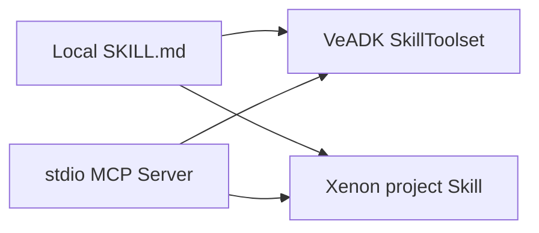

[Xenon](https://github.com/xianyu-sheng/Xenon) is a terminal AI coding
workspace. VeADK and Xenon both support directory-based `SKILL.md` files and
standard MCP, so the same local Skill and MCP Server can be reused in both
environments without converting it to a vendor-specific format.

<Callout type="info">
  This page covers component interoperability. It does not mean that VeADK
  supports `Agent(runtime="xenon")`. Using Xenon as an inner VeADK runtime
  requires a separate runtime adapter and event translation.
</Callout>

<Callout type="info">
  The integration commands below require the published Xenon `v0.7.3` release
  or later.
</Callout>

## Basic usage

The [`codex_with_skill_and_mcp`](https://github.com/volcengine/veadk-python/tree/main/examples/codex_with_skill_and_mcp)
example includes a weather Skill and a stdio MCP Server that exposes
`get_weather`. Configure the same components in Xenon with these commands:

```bash
cd examples/codex_with_skill_and_mcp

xenon skill install ./skills/weather-style --scope project --json
xenon mcp add veadk-weather "$(command -v python)" --json -- ./mcp_server.py
xenon integrations verify --connect-mcp --server veadk-weather --json
```

The verification command performs MCP `initialize`,
`notifications/initialized`, and `tools/list`, but does not call a tool. A
successful result reports one reachable server and one `get_weather` tool:

```json
{
  "ok": true,
  "checks": {
    "mcp_connectivity": {
      "reachable_server_count": 1,
      "tool_count": 1
    }
  }
}
```

Start `xenon` from the current project directory and ask for the weather in a
city. Xenon loads the response format from the project Skill and obtains the
weather data through the configured MCP Server.

```text
What is the weather in Beijing?
```

Remove the MCP configuration after the test:

```bash
xenon mcp remove veadk-weather --json
```

## Component mapping



| Capability | VeADK | Xenon | Interoperability |
| :-- | :-- | :-- | :-- |
| Local Skill | `load_skill_from_dir` + `SkillToolset` | `xenon skill install` | Reuses `SKILL.md` and its resource directory directly |
| stdio MCP | `MCPToolset` + `StdioServerParameters` | `xenon mcp add` | Reuses the command, arguments, and environment variables |
| Ark model | `MODEL_AGENT_*` configuration | `ARK_*` configuration | API-compatible; credentials are managed separately |
| Agent runtime | `adk`, `codex`, and `piagent` | Xenon engines | No `runtime="xenon"` adapter yet |

## Integration checks

External installers can read Xenon machine-readable contract before deciding
where to write configuration:

```bash
xenon integrations describe --json
xenon skill doctor --json
xenon mcp doctor --json
```

The capability contract publishes Skill roots, MCP transports, and versioned
commands, so an installer does not need to modify Xenon private YAML directly.
See the [Xenon integration CLI](https://github.com/xianyu-sheng/Xenon/blob/v0.7.3/docs/INTEGRATIONS.md)
for the field-level contract.
