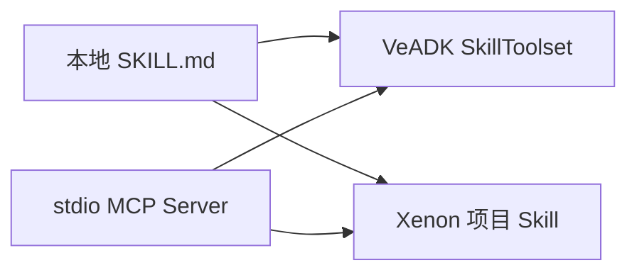

[Xenon](https://github.com/xianyu-sheng/Xenon) 是终端 AI 编程工作区。VeADK 与
Xenon 都支持目录式 `SKILL.md` 和标准 MCP，因此同一份本地 Skill 与 MCP Server
可以在两个运行环境中复用，无需转换为厂商私有格式。

<Callout type="info">
  本页介绍组件互操作，不表示 VeADK 已支持 `Agent(runtime="xenon")`。Xenon 作为
  VeADK 内层运行时需要独立的运行时适配与事件转换。
</Callout>

<Callout type="info">
  以下集成命令需要已正式发布的 Xenon `v0.8.2` 或更高版本。
</Callout>

## 基本使用

仓库中的 [`codex_with_skill_and_mcp`](https://github.com/volcengine/veadk-python/tree/main/examples/codex_with_skill_and_mcp)
示例包含一个天气 Skill 和一个提供 `get_weather` 的 stdio MCP Server。以下命令把
同一组组件配置到 Xenon：

```bash
cd examples/codex_with_skill_and_mcp

xenon skill install ./skills/weather-style --scope project --json
xenon mcp add veadk-weather "$(command -v python)" --json -- ./mcp_server.py
xenon integrations verify --connect-mcp --server veadk-weather --json
```

验证命令执行 MCP `initialize`、`notifications/initialized` 和 `tools/list`，但不会
调用工具。成功结果包含一个可达服务器和一个 `get_weather` 工具：

```json
{
  "ok": true,
  "checks": {
    "mcp_connectivity": {
      "reachable_server_count": 1,
      "tool_count": 1
    }
  }
}
```

从当前项目目录启动 `xenon`，然后询问城市天气。Xenon 从项目 Skill 根目录加载回答
格式，并通过已配置的 MCP Server 获取天气数据。

```text
北京天气怎么样？
```

测试结束后可删除 MCP 配置：

```bash
xenon mcp remove veadk-weather --json
```

## 组件映射



| 能力 | VeADK | Xenon | 互操作状态 |
| :-- | :-- | :-- | :-- |
| 本地 Skill | `load_skill_from_dir` + `SkillToolset` | `xenon skill install` | 直接复用 `SKILL.md` 与资源目录 |
| stdio MCP | `MCPToolset` + `StdioServerParameters` | `xenon mcp add` | 复用命令、参数和环境变量 |
| Ark 模型 | `MODEL_AGENT_*` 配置 | `ARK_*` 配置 | API 兼容，凭证分别管理 |
| Agent runtime | `adk`、`codex`、`piagent` | Xenon 自身引擎 | 尚无 `runtime="xenon"` 适配 |

## 集成检查

外部安装器可以先读取 Xenon 的机器可读契约，再决定写入位置：

```bash
xenon integrations describe --json
xenon skill doctor --json
xenon mcp doctor --json
```

能力契约公开 Skill 根目录、MCP transport 和版本化命令，不需要直接修改 Xenon 的
私有 YAML。详细字段见 [Xenon 外部集成 CLI](https://github.com/xianyu-sheng/Xenon/blob/v0.8.2/docs/INTEGRATIONS.md)。
