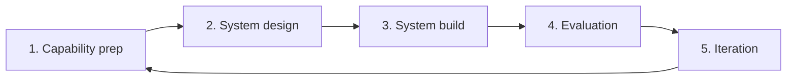

Putting an agent into enterprise production is more than writing a good prompt. You need to integrate it with existing systems, control access and data security, and keep it observable and measurable. This page lays out a 0-to-1 design path and the VeADK capabilities that support each step.

When designing an enterprise agent, you typically balance five concerns:

| Concern | What it means |
| :- | :- |
| Extensibility | Add features and modules easily as the business changes |
| System integration | Exchange data and collaborate with existing systems |
| Architecture & performance | Handle the expected concurrency and data load, and scale out |
| Access & data security | Protect core information and sensitive data from leaks |
| Observability & evaluation | Find and locate issues quickly; quantify and improve quality |

## Design path

A typical rollout has five stages that form a continuous, iterative loop:

### 1. Capability preparation

Abstract the enterprise's existing capabilities and data into tools and knowledge the agent can call, and build an evaluation set up front.

- **Capability sources** — existing interfaces, both API and non-API. Wrap them as local tools, external tools, or [MCP](/en/docs/framework/tools/builtin-mcp).
- **Data sources** — structured and unstructured data in existing storage, imported into a [knowledge base](/en/docs/framework/knowledgebase/overview) for vector retrieval.
- **Evaluation set** — real-scenario data collected around bad cases, covering exceptions, erroneous operations, and edge conditions.

### 2. System design

Organize pain points by scenario layer and design the corresponding agent system and interaction flows. The output is a [multi-agent](/en/docs/framework/agent/multi-agent/overview) orchestration plan — for example sub-agents for content recognition, passive/proactive replies, and quality review, and the serial/parallel relationships between them.

### 3. System build

Settle on the combination of SDK, model, and prompts, and ground it in quantifiable business goals.

- **Capability stack** — tools (MCP / local / external), context storage (short- and long-term [memory](/en/docs/framework/memory/short-term) with expiration policies), vector retrieval and document parsing, [observability](/en/docs/framework/observability/overview), and [evaluation](/en/docs/framework/eval-optimization/evaluation).
- **Business metrics** — e.g. information-retrieval efficiency, adoption rate of proactive replies.

### 4. Evaluation

Establish an evaluation loop in real delivery so every iteration has an objective basis. Feed back user thumbs-up/down and manual annotations, combine methods such as vector similarity and LLM-as-a-judge, and produce a stable evaluation set and reports.

### 5. Iteration

Collect and fix bad cases based on evaluation and observability, update prompts, models, and security policies, then return to capability preparation for the next round.

## Reusable design principles

Implementation details differ by business, but these principles apply broadly:

- **Goal decomposition and scenario layering** — enumerate feature points first, then split subtasks and responsibilities by scenario.
- **Capability mapping and toolization** — decompose non-API capabilities into callable sub-agents/tools; wrap API capabilities uniformly as MCP or local tools.
- **Task orchestration** — use parallel and multi-agent patterns for efficiency and reliability; use serial flows for step dependencies.
- **Memory and human-machine collaboration** — conversation state relies on short-term memory; knowledge accumulation updates a dedicated knowledge base through review agents.
- **Criteria and security** — strictly limit data sources and access to ensure information security and compliance.
- **Measurement and optimization** — drive evaluation and optimization with quantitative metrics such as adoption rate and trigger rate.

## Matching VeADK capabilities

VeADK provides a capability for each stage above:

| Design need | VeADK capability |
| :- | :- |
| Agent orchestration | [Multi-agent](/en/docs/framework/agent/multi-agent/overview) (sequential / parallel / loop); custom agents via a custom `_run_async_impl` |
| Memory and context | [Short-term memory](/en/docs/framework/memory/short-term) for conversation state; [long-term memory](/en/docs/framework/memory/long-term) for knowledge accumulation and traceback |
| Knowledge base and retrieval | Vector retrieval, document parsing, and RAG in the [knowledge base](/en/docs/framework/knowledgebase/overview) |
| Tools and ecosystem | [Built-in tools](/en/docs/framework/tools/builtin), [custom function tools](/en/docs/framework/tools/custom-function), and [MCP](/en/docs/framework/tools/builtin-mcp); compatible with Google ADK |
| Observability and evaluation | [Observability](/en/docs/framework/observability/overview) (logs, tracing, metrics) and the [evaluation](/en/docs/framework/eval-optimization/evaluation) loop |
| Configuration and security | Environment-variable desensitization and multi-tenant isolation in [Configuration](/en/docs/framework/configuration) |

## Next steps

<Cards>
  <Card title="Multi-agent" href="/en/docs/framework/agent/multi-agent/overview" description="Orchestrate agents with sequential, parallel, and loop patterns." />
  <Card title="Knowledge base" href="/en/docs/framework/knowledgebase/overview" description="Add private knowledge to the model with RAG." />
  <Card title="Observability" href="/en/docs/framework/observability/overview" description="Trace runtime behavior; monitor performance and decisions." />
</Cards>
