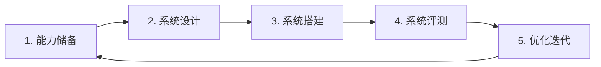

把一个 Agent 用于企业生产，不只是写好提示词。你需要把它对接现有系统、控制权限与数据安全、并能持续观测与评测。本页给出一条从 0 到 1 的设计路径，以及它在 VeADK 中对应的能力。

设计企业级 Agent 时，通常要兼顾五个方面：

| 关注点 | 含义 |
| :- | :- |
| 可扩展性 | 方便地新增功能与模块，跟上业务变化 |
| 系统集成 | 与企业现有系统交换数据、协同工作 |
| 架构与性能 | 承载预期规模的并发与数据处理，可水平扩展 |
| 权限与数据安全 | 保护核心信息与敏感数据，不被泄露 |
| 可观测与评测 | 及时发现并定位问题，量化并优化效果 |

## 设计路径

一个典型的落地过程分为五个阶段，形成持续迭代的闭环：

### 1. 能力储备

把企业现有的能力与数据抽象为 Agent 可调用的工具与知识，并预先构建评测集。

- **能力源**：现有能力接口，既包括 API，也包括非 API 方式。封装为本地工具、外部工具或 [MCP](/cn/docs/framework/tools/builtin-mcp)。
- **数据源**：现有存储中的结构化与非结构化数据，导入[知识库](/cn/docs/framework/knowledgebase/overview)供向量检索。
- **评测集**：围绕 bad case 收集的真实数据，覆盖异常、错误操作与边界条件。

### 2. 系统设计

按业务场景分层梳理痛点，设计对应的 Agent 体系与交互流程。输出一套[多智能体](/cn/docs/framework/multi-agent/overview)编排方案——例如内容识别、被动 / 主动回复、质量评审等子智能体，以及它们之间的串行 / 并行关系。

### 3. 系统搭建

确定 SDK、模型与提示词的组合，并落到可量化的业务目标上。

- **能力栈**：工具（MCP / 本地 / 外部）、上下文存储（短期与长期[记忆](/cn/docs/framework/memory/short-term)及过期策略）、向量检索与文档解析、[可观测](/cn/docs/framework/observability/overview)与[评测](/cn/docs/framework/evaluation)。
- **业务指标**：如信息获取效率、主动回复采纳率等。

### 4. 系统评测

在真实交付中建立评测闭环，让每次迭代都有客观依据。回流用户顶 / 踩与人工标注数据，结合向量相似度、LLM-as-a-judge 等方法，产出稳定的评测集与报告。

### 5. 优化迭代

基于评测与观测收集 bad case 并修复，更新提示词、模型与安全策略，再回到能力储备阶段，进入下一轮。

## 可复用的设计原则

不同业务的实现细节各异，但以下原则普遍适用：

- **目标拆解与场景分层**：先枚举功能点，再按场景拆分子任务与职责。
- **能力映射与工具化**：把非 API 能力拆成可调用的子智能体 / 工具，API 能力统一封装为 MCP 或本地工具。
- **任务编排**：用并行与多智能体提升效率与可靠性，用串行保证步骤依赖。
- **记忆与人机协同**：对话状态依赖短期记忆，知识沉淀通过评审智能体更新专属知识库。
- **口径与安全**：严格限定数据来源与访问权限，确保信息安全与合规。
- **度量与优化**：以采纳率、触发率等量化指标驱动评测与优化。

## 对应的 VeADK 能力

VeADK 为上述每个阶段提供了对应能力：

| 设计需求 | VeADK 能力 |
| :- | :- |
| 智能体编排 | [多智能体](/cn/docs/framework/multi-agent/overview)（顺序 / 并行 / 循环）；通过自定义 `_run_async_impl` 实现自定义智能体 |
| 记忆与上下文 | [短期记忆](/cn/docs/framework/memory/short-term)管理会话状态，[长期记忆](/cn/docs/framework/memory/long-term)用于知识沉淀与回溯 |
| 知识库与检索 | [知识库](/cn/docs/framework/knowledgebase/overview)的向量检索、文档解析与 RAG |
| 工具与生态 | [内置工具](/cn/docs/framework/tools/builtin)、[自定义函数工具](/cn/docs/framework/tools/custom-function)与 [MCP](/cn/docs/framework/tools/builtin-mcp)，兼容 Google ADK |
| 可观测与评测 | [可观测](/cn/docs/framework/observability/overview)（日志、链路追踪、指标）与[评测](/cn/docs/framework/evaluation)闭环 |
| 配置与安全 | [配置](/cn/docs/references/configuration)中的环境变量脱敏与多租户隔离 |
