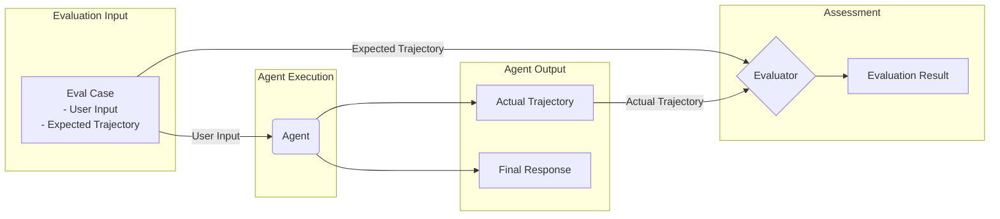

## The General Evaluation Workflow



In traditional software development, unit tests and integration tests ensure that code behaves as expected and remains stable across changes. However, LLM agents introduce a degree of variability that makes traditional testing methods insufficient to fully assess their performance. Due to the probabilistic nature of models, deterministic "pass/fail" assertions are often not applicable to evaluating agent performance. Instead, we need a qualitative assessment of both the final output and the agent's trajectory (the sequence of steps taken to arrive at a solution).

Agent evaluation can be divided into two parts:

- **Evaluating the trajectory and tool usage**: Analyzing the steps the agent takes to reach a solution, including its tool selection, strategy, and the efficiency of its approach.
- **Evaluating the final response**: Assessing the quality, relevance, and correctness of the agent's final output.

VeADK provides the following three ways to evaluate your agent:

1. **Web-based user interface (veadk web)**
   Evaluate the agent interactively through a web-based interface. During operation, you can interact with the agent directly on the web page, observe its behavior in real time, and evaluate it.
   
2. **Command-line interface (veadk eval)**
   Run evaluations directly from the command line against an existing evalset file. Without opening a graphical interface, you can quickly perform evaluations by entering commands, which is suitable for developers familiar with the command line.
   
3. **Programmatic (pytest)**
   Use pytest (a testing framework for Python) and test files to integrate evaluation into your testing process. This approach is suitable for automated testing scenarios and integrates seamlessly with existing development and test pipelines.

## Evalset

### Saving an Evalset

There are two main ways to generate an evalset file: interactively through the `veadk web` interface, or programmatically by exporting from code.

#### Using the `veadk web` Interface

`veadk web` provides an interactive user interface for evaluating agents, generating evaluation datasets, and inspecting agent behavior in detail.

**Launch the Web UI**

Start the web server by running the following command in your terminal:

```bash
veadk web
```

*Note: If the `veadk` command is unavailable, make sure you have correctly installed the dependencies according to the project setup and activated the virtual environment.*

**Generate Eval Cases**

1. In the web interface, select an agent and interact with it to create a session.
2. After completing a conversation, select the `Eval` tab on the right side of the interface.
3. You can create a new evalset or select an existing one.
4. Click the `Add current session` button, and the current session (including your input, the agent's reply, and the intermediate steps) will be saved as a new eval case in that evalset.
5. After saving, the evalset file (such as `simple.evalset.json`) is automatically created or updated in the directory where the agent resides.

You can also view, edit, or delete saved eval cases through the interface to refine your test scenarios.

#### Exporting Programmatically

In addition to using `veadk web`, after the agent finishes running, we can also export the runtime data as an evalset file by calling the `runner.save_eval_set()` method.

```python
import asyncio
import uuid
from veadk import Agent, Runner
from veadk.memory.short_term_memory import ShortTermMemory
from veadk.tools.demo_tools import get_city_weather

agent = Agent(tools=[get_city_weather])
session_id = "session_id_" + uuid.uuid4().hex
runner = Runner(agent=agent, short_term_memory=ShortTermMemory())
prompt = "How is the weather like in Beijing? Besides, tell me which tool you invoked."
asyncio.run(runner.run(messages=prompt, session_id=session_id))
# Collect runtime data
dump_path = asyncio.run(runner.save_eval_set(session_id=session_id))
print(f"Evaluation file path: {dump_path}")
```

### Evalset Format

The evalset uses the Google ADK evalset format and is a JSON file. Before an agent responds to a user, it usually performs a series of operations, which we call a "trajectory". Evaluating an agent's performance requires comparing its **actual trajectory** with the **expected trajectory** (the list of steps we expect the agent to take). This comparison can reveal errors and inefficiencies in the agent's flow.

Below is a simple evalset example, where `intermediate_data` corresponds to the agent's actual trajectory:

```json
{
  "eval_set_id": "simple",
  "name": "simple",
  "description": null,
  "eval_cases": [
    {
      "eval_id": "product-price",
      "conversation": [
        {
          "invocation_id": "e-f25f5edb-f75b-4aa6-ab9b-657c4b436a12",
          "user_content": {
            "parts": [
              {
                "text": "Price"
              }
            ],
            "role": "user"
          },
          "final_response": {
            "parts": [
              {
                "text": "According to our knowledge base, we have the price information for the following products:\n\n- Model A sells for: $100\n- Model B sells for: $200  \n- Model C sells for: $300\n\nWhich specific product's price information would you like to know? Or do you have other questions about the price?"
              }
            ]
          },
          "intermediate_data": {
            "tool_uses": [
              {
                "id": "call_u6mzq918tz8nbxfp3lehhtme",
                "args": {
                  "question": "Price"
                },
                "name": "knowledge_base"
              }
            ]
          }
        }
      ]
    }
  ]
}
```

The main fields include:

- `eval_set_id`: The unique identifier of the evalset.
- `name`: The name of the evalset.
- `description`: The description of the evalset.
- `eval_cases`: An array containing multiple eval cases.
  - `eval_id`: The unique identifier of the eval case.
  - `conversation`: An array containing the conversation history.
    - `user_content`: The content of the user's input.
    - `final_response`: The agent's final reply.
    - `intermediate_data`: The agent's intermediate steps in generating the final reply, such as tool calls. During evaluation, ADK compares this against the **expected trajectory** you defined.

ADK supports multiple ground-truth-based trajectory evaluation methods:

- **Exact match**: Requires an exact match with the ideal trajectory.
- **In-order match**: Requires the correct actions to be performed in the correct order, but allows extra actions.
- **Any-order match**: Requires the correct actions to be performed in any order, and also allows extra actions.
- **Precision**: Measures the relevance/correctness of the predicted actions.
- **Recall**: Measures how many of the necessary actions are captured in the prediction.
- **Single-tool use**: Checks whether a specific action is included.

### Uploading an Evalset to the CozeLoop Platform

**Why use CozeLoop?**

Although you can generate and manage evalsets locally, uploading them to the [CozeLoop](https://loop.coze.cn/open/docs/guides/prepare_evaluation_dataset) platform (a platform that provides observability, analysis, and monitoring for LLM applications) brings many benefits:

- **Centralized management**: Store, manage, and track all evaluation data and history on a unified platform, facilitating team collaboration and version control.
- **Visualized analysis**: Provides rich visualization tools to help you analyze agent behavior more intuitively and compare performance differences across versions.
- **In-depth insights**: By analyzing evaluation data, gain a deep understanding of the agent's tool-call trajectories, response quality, and potential issues, thereby obtaining optimization directions.
- **Continuous monitoring**: Combine evaluation with the continuous integration (CI) process to achieve automated monitoring and regression testing of agent performance.

With the `veadk uploadevalset` command, you can upload a local evalset file to the CozeLoop platform:

```bash
veadk uploadevalset --file tests/simple.evalset.json
```

This command uploads an evalset JSON file in Google ADK format to CozeLoop. For the full parameter reference, see the [VeADK CLI](/en/docs/cli/veadk-cli).

## Evaluators

VeADK currently supports two evaluators: [DeepEval](https://deepeval.com/) and [ADKEval](https://google.github.io/adk-docs/evaluate/).

### Google ADK Evaluator

ADK is the Agent Development Kit (launched by Google), a platform for building agents or multi-agent systems. It has a built-in evaluation mechanism to measure an agent's performance in executing tasks, calling tools, step trajectories, and more.

**Recommended Scenarios**

- If your system is an agent (or multi-agent) system: for example, a user's question may trigger multiple tool calls and sub-steps, where the agent needs to make decisions, switch tools, execute tasks, and then provide the final output.
- If you want to track not only the "final answer" but also the "intermediate tool calls", "which sub-agents the agent used", and "whether the execution trajectory meets expectations". For example: task planning, execution, feedback loops, and business process automation.

**Example**

Below is an example pytest test case using `ADKEvaluator`:

```python
from veadk.evaluation.adk_evaluator import ADKEvaluator
import pytest
from ecommerce_agent.agent import root_agent

class TestAgentEvaluation:

    @pytest.mark.asyncio
    async def test_simple_evalset_with_adkevaluator(self):
        """Agent evaluation tests using ADKEvaluator"""
        evaluator = ADKEvaluator(agent=root_agent)
        await evaluator.evaluate(
            eval_set_file_path="tests/simple.evalset.json",
            response_match_score_threshold=1,
            tool_score_threshold=0.5,
            num_runs=1,
            print_detailed_results=True
        )
```

### DeepEval Evaluator

DeepEval is an open-source LLM (large language model) evaluation framework focused on the automated evaluation of "LLM output" quality (including RAG, chatbots, generation tasks, etc.).

**Recommended Scenarios**

- If your system is mainly "LLM → output" type, such as: a user asks a question → the model answers; or a RAG (retrieval + generation) system that emphasizes the relevance, factual correctness, coherence, and explainability of answers, with less reliance on tool calls or complex agent trajectories, and you want to focus on monitoring "generation quality".
- If you want to introduce a richer set of metrics (such as hallucination detection, contextual recall/precision, answer relevancy, etc.) and want to run evaluation as part of the CI/CD process (like unit tests).

**Example**

Below is an example pytest test case using `DeepevalEvaluator`:

```python
from veadk.evaluation.deepeval_evaluator import DeepevalEvaluator
from veadk.prompts.prompt_evaluator import eval_principle_prompt
from deepeval.metrics import GEval, ToolCorrectnessMetric
from deepeval.test_case import LLMTestCaseParams
import pytest
from ecommerce_agent.agent import root_agent

class TestAgentEvaluation:
    @pytest.mark.asyncio
    async def test_simple_evalset_with_deepevalevaluator(self):
        """Agent evaluation tests using DeepevalEvaluator"""
        evaluator = DeepevalEvaluator(agent=root_agent)
        metrics = [
            GEval(
                threshold=0.8,
                name="Base Evaluation",
                criteria=eval_principle_prompt,
                evaluation_params=[
                    LLMTestCaseParams.INPUT,
                    LLMTestCaseParams.ACTUAL_OUTPUT,
                    LLMTestCaseParams.EXPECTED_OUTPUT,
                ],
                model=evaluator.judge_model,
            ),
            ToolCorrectnessMetric(threshold=0.5, model=evaluator.judge_model),
        ]
        await evaluator.evaluate(
            eval_set_file_path="tests/simple.evalset.json",
            metrics=metrics)
```

### Customizing Your Evaluator

When the built-in `ADKEvaluator` and `DeepevalEvaluator` cannot meet your specific needs, VeADK allows you to create your own evaluator by inheriting from the `BaseEvaluator` class.

**Core Scenarios**

1. **Integrate internal evaluation services**: Connect to your company's own scoring API.
2. **Verify external system state**: Check whether the state of a database, API, or hardware was modified correctly (for example, e-commerce order placement, IoT device control).
3. **Evaluate non-text output**: Compile, run, or validate generated code, images, or configuration files.
4. **Implement special metrics**: Calculate cost, test security, or check the consistency of multi-turn conversations.

**Core Steps**

1. **Define the evaluator class**: Create a class that inherits from `veadk.evaluation.base_evaluator.BaseEvaluator`.
2. **Implement the `evaluate` method**: In the method, you can:
   - Call `self.build_eval_set()` to load the test cases.
   - Call `await self.generate_actual_outputs()` to run the agent and obtain the actual outputs.
   - Implement custom scoring logic and store the results in `self.result_list`.

**Example**

```python
from typing import Optional
from google.adk.evaluation.eval_set import EvalSet
from typing_extensions import override
from veadk.evaluation.base_evaluator import BaseEvaluator, EvalResultData, MetricResult

class MyCustomEvaluator(BaseEvaluator):
    @override
    async def evaluate(
        self,
        eval_set: Optional[EvalSet] = None,
        eval_set_file_path: Optional[str] = None,
    ):
        # Step 1: Load the test cases
        self.build_eval_set(eval_set, eval_set_file_path)

        # Step 2: Run the agent to obtain the actual outputs
        await self.generate_actual_outputs()

        # Step 3: Implement your scoring logic
        for eval_case_data in self.invocation_list:
            # Example: check whether the output matches the expectation
            score = 1.0 if eval_case_data.invocations[0].actual_output == eval_case_data.invocations[0].expected_output else 0.0
            metric_result = MetricResult(
                metric_type="ExactMatch",
                success=score == 1.0,
                score=score,
                reason=f"Outputs {'matched' if score == 1.0 else 'did not match'}.",
            )
            eval_result_data = EvalResultData(metric_results=[metric_result])
            eval_result_data.call_before_append()
            self.result_list.append(eval_result_data)

        return self.result_list
```

By inheriting from `BaseEvaluator`, you can focus on implementing the core evaluation logic while reusing VeADK's data loading and agent execution capabilities, allowing you to flexibly extend the evaluation framework.
