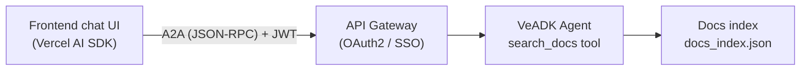

This guide shows how to add an "Ask AI" assistant to your documentation site (or any frontend): a VeADK agent searches the docs and answers questions, a frontend calls it over the A2A protocol, and the endpoint is protected with **SSO (single sign-on)**.

## Architecture



- **Agent**: a VeADK `Agent` with a `search_docs` tool that keyword-searches a prebuilt index of the docs, answers from the results, and cites sources.
- **Serving**: expose the agent over A2A with `to_a2a()`; once deployed to VeFaaS, the API Gateway handles SSO.
- **Frontend**: reuse your doc framework's native chat UI (built on the Vercel AI SDK) and bridge A2A to it with a custom transport.

## 1. Write the retrieval agent

The `search_docs` tool searches the index; the agent answers from the hits:

```python title="agent.py"
import os
from veadk import Agent
from docs_search import search  # your keyword search (BM25 / substring)

INSTRUCTION = """\
You are the VeADK documentation assistant. Answer only from the official docs:
1. call `search_docs` to retrieve relevant pages first;
2. answer strictly from the retrieved content — never invent APIs;
3. reply in the user's language and cite the page urls.
"""

def search_docs(query: str, language: str = "") -> dict:
    """Search the VeADK docs and return the most relevant pages."""
    lang = language.strip().lower() or None
    return {"results": search(query, top_k=5, lang=lang if lang in ("cn", "en") else None)}

agent = Agent(
    name="veadk_docs_assistant",
    description="Answers questions about VeADK using the official documentation.",
    instruction=INSTRUCTION,
    model_name=os.getenv("MODEL_AGENT_NAME") or "deepseek-v4-flash-260425",
    tools=[search_docs],
)
root_agent = agent  # required by `veadk deploy`
```

<Callout type="info">
  This uses keyword search (no vector DB), which is the easiest to deploy. For stronger semantic retrieval, swap in VeADK's [Knowledge Base](/en/docs/framework/knowledgebase/overview) vector RAG.
</Callout>

## 2. Serve it over A2A

```python title="serve.py"
import os
from starlette.middleware.cors import CORSMiddleware
from veadk.a2a.utils.agent_to_a2a import to_a2a
from agent import agent

# With enable_auth=True the endpoint requires an identity token (see SSO below).
app = to_a2a(agent, enable_auth=True, auth_method="header")
app.add_middleware(
    CORSMiddleware,
    allow_origins=[os.getenv("ASK_AI_ALLOW_ORIGINS", "*")],
    allow_methods=["*"],
    allow_headers=["*"],
)
```

Once on VeFaaS, the agent obtains its model token from the VeFaaS IAM role, so no model API key is needed at runtime.

## 3. Frontend: bridge A2A to the native chat UI

Your doc framework's native chat component speaks the Vercel AI SDK protocol, while the agent speaks A2A. Bridge them with a custom transport on the **client**, so even a static site can call the agent directly (no server route):

```ts title="lib/a2a-transport.ts"
import { type ChatTransport, createUIMessageStream, type UIMessageChunk } from 'ai';

const ENDPOINT = process.env.NEXT_PUBLIC_AI_CHAT_URL!; // the agent's public URL

export class A2AChatTransport implements ChatTransport<any> {
  async sendMessages({ messages, abortSignal }: any): Promise<ReadableStream<UIMessageChunk>> {
    const question = lastUserText(messages);
    return createUIMessageStream({
      execute: async ({ writer }) => {
        const id = crypto.randomUUID();
        writer.write({ type: 'text-start', id });
        const answer = await askAgent(question, abortSignal); // POST A2A message/send
        writer.write({ type: 'text-delta', id, delta: answer });
        writer.write({ type: 'text-end', id });
      },
    });
  }
  async reconnectToStream() { return null; }
}
```

Swap the chat component's transport for it — the UI is unchanged:

```ts
const chat = useChat({ transport: new A2AChatTransport() });
```

## 4. SSO: secure the endpoint

The Ask-AI endpoint is public-facing, so it **must** be authenticated — otherwise anyone can call your model. VeADK secures agent endpoints with **OAuth2 single sign-on (SSO)**: the user logs in once, a JWT rides along with every request, and the API Gateway (or middleware) validates it. See [Inbound Authentication](/en/docs/framework/security/inbound).

<Steps>

<Step>
### Enable OAuth2 SSO at deploy time

Add `--auth-method=oauth2` when deploying to VeFaaS. VeADK creates an Identity user pool and client, and the **API Gateway** takes over the OAuth2 login flow:

```bash
veadk deploy --vefaas-app-name veadk-docs-assistant --auth-method=oauth2
```

To reuse an existing pool/client, add `--user-pool-name` and `--client-name`.
</Step>

<Step>
### The user logs in; the frontend gets a JWT

When a user hits the protected endpoint, the API Gateway redirects them to a login page for SSO. After login, the user's **JWT** is available in the `Authorization` header.
</Step>

<Step>
### Send the token on every request

Have the transport put the JWT in the A2A request's `Authorization` header (`to_a2a` with `auth_method="header"`):

```ts
const res = await fetch(ENDPOINT, {
  method: 'POST',
  headers: {
    'Content-Type': 'application/json',
    Authorization: `Bearer ${getSsoToken()}`, // from the SSO session
  },
  body: JSON.stringify(a2aMessageSend(question)),
});
```

<Callout type="info">
  With API Key auth (`auth_method="querystring"` / deploy `--auth-method=api-key`), pass the key in the URL `token` parameter instead of the `Authorization` header.
</Callout>
</Step>

</Steps>

For self-hosted / local setups, use VeADK's Starlette/FastAPI OAuth2 middleware to validate in-app — see [Inbound Authentication](/en/docs/framework/security/inbound).

## 5. Auto-deploy

Keep the agent in your repo and let CI rebuild the index and `veadk deploy` whenever it changes — "update the agent, it ships itself." After a successful deploy, put the agent's public URL into the build-time env var `NEXT_PUBLIC_AI_CHAT_URL`.

```yaml title=".github/workflows/deploy-docs-agent.yaml"
on:
  push:
    branches: [main]
    paths: ['docs/ask-ai-agent/**', 'docs/content/docs/**']
permissions:
  contents: read
jobs:
  deploy:
    runs-on: ubuntu-latest
    steps:
      - uses: actions/checkout@v4
      - uses: actions/setup-python@v5
        with: { python-version: '3.12' }
      - run: pip install veadk-python
      - run: python docs/ask-ai-agent/build_index.py   # rebuild the index
      - run: veadk deploy --vefaas-app-name veadk-docs-assistant --auth-method=oauth2
        env:
          VOLCENGINE_ACCESS_KEY: ${{ secrets.VOLCENGINE_ACCESS_KEY }}
          VOLCENGINE_SECRET_KEY: ${{ secrets.VOLCENGINE_SECRET_KEY }}
```
