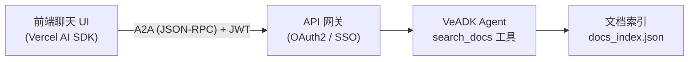

本指南介绍如何为你的文档站（或任意前端）接入一个“问 AI”问答助手：用一个 VeADK Agent 检索文档并回答问题，前端通过 A2A 协议调用它，并用 **SSO 单点登录**保护这个接口。

## 架构



- **Agent**：一个带 `search_docs` 工具的 VeADK `Agent`，对预先构建的文档索引做关键词检索，基于检索结果作答并给出来源。
- **服务**：用 `to_a2a()` 把 Agent 暴露为 A2A 服务；部署到 VeFaaS 后由 API 网关统一处理 SSO 鉴权。
- **前端**：复用文档框架原生的聊天 UI（基于 Vercel AI SDK），通过一个自定义 transport 把 A2A 协议桥接给它。

## 1. 编写检索 Agent

`search_docs` 工具对文档索引做检索，Agent 基于命中的页面作答：

```python title="agent.py"
import os
from veadk import Agent
from docs_search import search  # 你的关键词检索实现（BM25 / 子串均可）

INSTRUCTION = """\
你是 VeADK 文档助手。只依据官方文档回答：
1. 先调用 `search_docs` 检索相关页面；
2. 仅基于检索到的内容作答，不要臆造 API；
3. 用与用户相同的语言回答，并在末尾列出引用页面的 url。
"""

def search_docs(query: str, language: str = "") -> dict:
    """检索 VeADK 文档，返回最相关的页面。"""
    lang = language.strip().lower() or None
    return {"results": search(query, top_k=5, lang=lang if lang in ("cn", "en") else None)}

agent = Agent(
    name="veadk_docs_assistant",
    description="Answers questions about VeADK using the official documentation.",
    instruction=INSTRUCTION,
    model_name=os.getenv("MODEL_AGENT_NAME") or "deepseek-v4-flash-260425",
    tools=[search_docs],
)
root_agent = agent  # `veadk deploy` 需要
```

<Callout type="info">
  这里用关键词检索（无需向量库），最易部署。需要更强语义检索时，可换成 VeADK [知识库](/cn/docs/framework/knowledgebase/overview) 的向量 RAG。
</Callout>

## 2. 以 A2A 暴露服务

```python title="serve.py"
import os
from starlette.middleware.cors import CORSMiddleware
from veadk.a2a.utils.agent_to_a2a import to_a2a
from agent import agent

# enable_auth=True 时，接口要求携带身份令牌（见下文 SSO）
app = to_a2a(agent, enable_auth=True, auth_method="header")
app.add_middleware(
    CORSMiddleware,
    allow_origins=[os.getenv("ASK_AI_ALLOW_ORIGINS", "*")],
    allow_methods=["*"],
    allow_headers=["*"],
)
```

部署到 VeFaaS 后，Agent 通过 VeFaaS IAM 角色自动获取模型令牌，无需在运行时配置模型 API Key。

## 3. 前端：把 A2A 桥接给原生聊天 UI

文档框架原生的聊天组件使用 Vercel AI SDK 协议，而 Agent 说的是 A2A。用一个自定义 transport 在**客户端**完成桥接，这样静态站点也能直接调用 Agent（无需服务端中转）：

```ts title="lib/a2a-transport.ts"
import { type ChatTransport, createUIMessageStream, type UIMessageChunk } from 'ai';

const ENDPOINT = process.env.NEXT_PUBLIC_AI_CHAT_URL!; // Agent 公网地址

export class A2AChatTransport implements ChatTransport<any> {
  async sendMessages({ messages, abortSignal }: any): Promise<ReadableStream<UIMessageChunk>> {
    const question = lastUserText(messages);
    return createUIMessageStream({
      execute: async ({ writer }) => {
        const id = crypto.randomUUID();
        writer.write({ type: 'text-start', id });
        const answer = await askAgent(question, abortSignal); // POST A2A message/send
        writer.write({ type: 'text-delta', id, delta: answer });
        writer.write({ type: 'text-end', id });
      },
    });
  }
  async reconnectToStream() { return null; }
}
```

把聊天组件的 transport 换成它即可，UI 完全不变：

```ts
const chat = useChat({ transport: new A2AChatTransport() });
```

## 4. SSO：为接口加鉴权

Ask-AI 接口直接对外，**必须**加鉴权，否则任何人都能调用你的模型。VeADK 通过 **OAuth2 单点登录（SSO）**保护 Agent 接口——用户登录一次，令牌（JWT）随每次请求带上，由 API 网关或中间件校验。详见[入站认证](/cn/docs/framework/security/inbound)。

<Steps>

<Step>
### 部署时开启 OAuth2 SSO

部署到 VeFaaS 时加上 `--auth-method=oauth2`，VeADK 会自动创建 Identity 用户池与客户端，并由 **API 网关**接管 OAuth2 登录流程：

```bash
veadk deploy --vefaas-app-name veadk-docs-assistant --auth-method=oauth2
```

复用已有用户池/客户端时，加 `--user-pool-name` 与 `--client-name`。
</Step>

<Step>
### 用户登录，前端拿到 JWT

用户访问受保护接口时，API 网关会引导其到登录页完成 SSO 登录；登录后，用户的 **JWT 令牌**可在 `Authorization` 请求头中获得。
</Step>

<Step>
### 前端在每次请求里带上令牌

让 transport 把 JWT 放进 A2A 请求的 `Authorization` 头（`to_a2a` 用 `auth_method="header"`）：

```ts
const res = await fetch(ENDPOINT, {
  method: 'POST',
  headers: {
    'Content-Type': 'application/json',
    Authorization: `Bearer ${getSsoToken()}`, // 从 SSO 会话中取
  },
  body: JSON.stringify(a2aMessageSend(question)),
});
```

<Callout type="info">
  若用 API Key 方式（`auth_method="querystring"` / 部署 `--auth-method=api-key`），则改为在 URL 的 `token` 参数中携带密钥，而非 `Authorization` 头。
</Callout>
</Step>

</Steps>

自托管 / 本地场景，可改用 VeADK 提供的 Starlette/FastAPI OAuth2 中间件在应用内校验，参见[入站认证](/cn/docs/framework/security/inbound)。

## 5. 自动部署

把 Agent 放进仓库，用 CI 在其变更时自动重建索引并 `veadk deploy`，即可“改了 Agent 就自动上线”。部署成功后，把 Agent 公网地址写入前端构建用的环境变量 `NEXT_PUBLIC_AI_CHAT_URL` 即可。

```yaml title=".github/workflows/deploy-docs-agent.yaml"
on:
  push:
    branches: [main]
    paths: ['docs/ask-ai-agent/**', 'docs/content/docs/**']
permissions:
  contents: read
jobs:
  deploy:
    runs-on: ubuntu-latest
    steps:
      - uses: actions/checkout@v4
      - uses: actions/setup-python@v5
        with: { python-version: '3.12' }
      - run: pip install veadk-python
      - run: python docs/ask-ai-agent/build_index.py   # 重建索引
      - run: veadk deploy --vefaas-app-name veadk-docs-assistant --auth-method=oauth2
        env:
          VOLCENGINE_ACCESS_KEY: ${{ secrets.VOLCENGINE_ACCESS_KEY }}
          VOLCENGINE_SECRET_KEY: ${{ secrets.VOLCENGINE_SECRET_KEY }}
```
