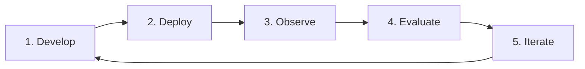
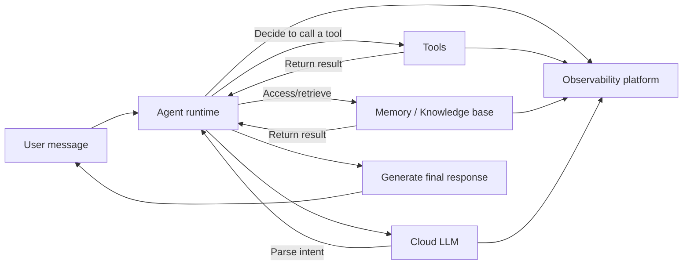

This document introduces the basic concepts and usage of VeADK, helping you understand the design philosophy, core building blocks, and use cases involved in agent development. It focuses on why an agent-centric application system is needed, explains how VeADK spans the full lifecycle of modular agent development, observability, and evaluation to improve system reliability and maintainability, and outlines the typical engineering problems VeADK can solve.

## VeADK and the Agent Lifecycle

VeADK (Volcengine Engine Agent Development Kit) is an agent development kit from Volcengine, designed to provide developers with a complete solution for building, deploying, and managing agent applications. Built on a modular design philosophy, it breaks down the complex agent development process into composable components, allowing developers to focus on business logic rather than low-level technical details. In VeADK, an agent is defined as a software entity with the following core capabilities:

- **Autonomous decision-making**: able to autonomously decide the next action based on the current context and goals
- **Tool use**: able to call external tools and systems to accomplish complex tasks
- **Learning and adaptation**: able to learn from interactions and optimize its behavior strategy
- **Memory**: able to store and recall past interactions to inform current decisions
- **Multimodal interaction**: supports text, image, voice, and other interaction modalities

VeADK provides support at the key stages of the enterprise-grade agent application lifecycle, helping developers tackle different challenges. A typical enterprise-grade agent application loop is as follows:

1. **Develop**: define the agent's core logic, including its goals, tools, and memory.
2. **Deploy**: deploy the built agent to the cloud so it can reliably handle real-world requests.
3. **Observe**: gain deep insight into the agent's runtime behavior, monitoring its performance and decision paths.
4. **Evaluate**: measure the agent's performance through systematic methods to discover issues and areas for improvement.
5. **Iterate and optimize with feedback**: optimize the agent's design based on observability data and evaluation results, entering the next development cycle.

Across this lifecycle, VeADK provides a rich set of tools and services to help developers build efficient, reliable agent applications at every stage:

- **Reduce agent development complexity**: provide a standardized development framework and best practices
- **Built-in Volcengine tools out of the box**: seamlessly integrate the various services of the Volcengine ecosystem
- **Complete observability and evaluation solutions**: ensure agent reliability and maintainability in production
- **Modular architecture**: support flexible replacement and extension of components
- **Enterprise-grade security and compliance**: meet the security and compliance requirements of enterprise applications

## VeADK Architecture

VeADK is based on a modular design. Its main components include the execution engine, tools, the memory system, the knowledge base, the observability system, and the evaluation system. The components are decoupled through well-defined interfaces, so they can be replaced or extended for different business scenarios.

### Core Components

| Core Component | Primary Responsibility | Key Modules / Capabilities |
| :--- | :--- | :--- |
| **Execution Engine (Runner)** | The core engine that coordinates all components | Event handling, memory management, session management |
| **Tools** | Interact with external capability sources | Built-in Volcengine tools, custom tools, tool orchestration |
| **Memory** | Store and retrieve context and historical information | Short-term memory (session-level), long-term memory (cross-session) |
| **Knowledge Base** | Provide storage and retrieval of external knowledge | Volcengine knowledge base, Llama-index ecosystem |
| **Observability** | Ensure runtime behavior is observable | Logging, trace observability, metric observability |
| **Evaluation** | Systematically measure agent quality | Data-driven feedback optimization |

### Runtime

The diagram below shows the main flow of the agent runtime:

As shown above, the agent runtime mainly involves the following steps:

1. **Message reception**: the user message enters the agent runtime, and the session manager creates or updates the session context.
2. **Intent parsing**: the runtime sends the user message to the cloud LLM to parse the user's intent and generate an execution plan.
3. **Tool-call decision**: based on the intent analysis, decide whether to call a tool or retrieve from memory / the knowledge base.
4. **Tool execution**: if a tool needs to be called, the tool dispatcher constructs a normalized request and records the call context.
5. **Result fusion**: after the tool returns a result, the runtime fuses it into the reasoning context.
6. **Response generation**: generate a final response from all available information and return it to the user.
7. **Observability recording**: all key events and metrics (such as token consumption, tool-call latency, and error rate) are pushed in real time to the observability platform for later analysis.

## Volcengine Ecosystem Integration

A core advantage of VeADK is its seamless integration with the Volcengine ecosystem, which powers every stage of the agent lifecycle.

| Stage | VeADK Capability | Volcengine Ecosystem Support |
| :--- | :--- | :--- |
| **Develop** | Modular building, tool definition | **Doubao LLM**: provides inference; **Ark platform**: provides various advanced parameter combinations |
| **Deploy** | Containerized packaging, configuration management | **APIG**: provides an API gateway for seamless interaction between agents and external systems; **VeFaaS**: provides serverless computing so agents can be deployed as functions, achieving high scalability and cost efficiency |
| **Observe** | Trace tracking, metric monitoring | **APMPlus**: provides full-link tracing and performance monitoring to help locate and optimize agent performance issues; **CozeLoop**: quickly locates root causes through trace tracking, performance statistics, real-time anomaly alerting, intelligent tagging, and real-time data evaluation |
| **Evaluate** | Automated evaluation | **CozeLoop**: covers end-to-end agent testing for accurate effectiveness measurement |

## Conventions

To avoid ambiguity, this documentation adopts the following conventions:

- "Agent" (智能体 / Agent) refers to the same thing
- "Tool" refers broadly to any external capability that can be invoked
- "Short-term memory" refers to context within a single session, while "long-term memory" refers to cross-session context
