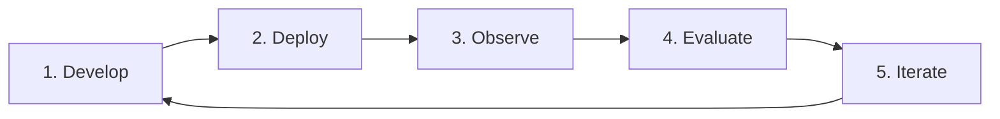
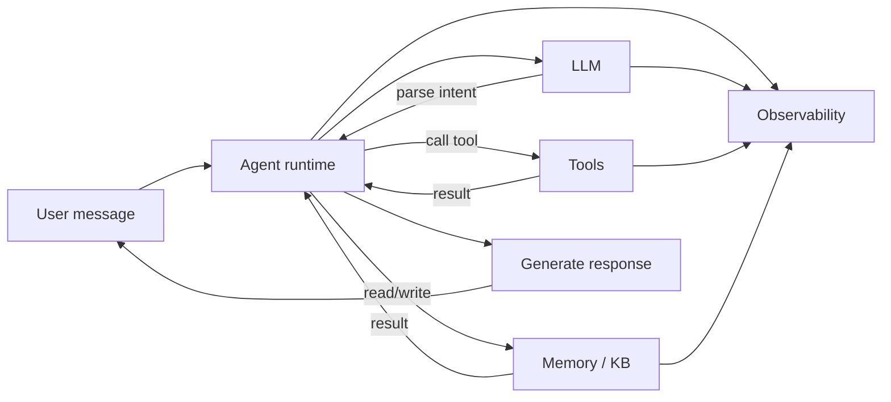

VeADK (Volcengine Agent Development Kit) is Volcengine's framework for building AI agents. It breaks agent development into composable modules — model, tools, memory, knowledge base — and covers the full **develop, deploy, observe, evaluate** lifecycle, so you focus on your business logic.

This page covers those core concepts and the overall architecture. When you're ready to build, jump to the [Quickstart](/en/docs/framework/getting-started/quickstart).

## The agent lifecycle

A typical enterprise agent application is a continuous, iterative loop:

1. **Develop** — define the agent's logic: its goals, tools, and memory.
2. **Deploy** — ship the agent to the cloud to handle real requests reliably.
3. **Observe** — trace runtime behavior; monitor performance and decisions.
4. **Evaluate** — measure quality systematically and find improvements.
5. **Iterate** — refine based on observation and evaluation, then repeat.

VeADK supports each stage — a standardized development framework, ready-to-use Volcengine tools, full observability and evaluation, and enterprise-grade security.

## Architecture

VeADK is modular: components are decoupled behind clear interfaces, so you can swap or extend them per use case.

| Component | Responsibility | Key capabilities |
| :--- | :--- | :--- |
| [**Runner**](/en/docs/framework/runner) | Orchestrates components and runs the agent | Event handling, session & memory management |
| [**Tools**](/en/docs/framework/tools/builtin) | Interact with external capabilities | Volcengine tools, custom tools, MCP |
| [**Memory**](/en/docs/framework/memory/short-term) | Store and retrieve context | Short-term (per-session), long-term (cross-session) |
| [**Knowledge Base**](/en/docs/framework/knowledgebase/overview) | Store and retrieve external knowledge | Viking knowledge base, LlamaIndex ecosystem |
| [**Observability**](/en/docs/framework/observability/overview) | Monitor runtime behavior | Logs, tracing, metrics |
| [**Evaluation**](/en/docs/framework/eval-optimization/evaluation) | Measure quality systematically | Data-driven feedback and optimization |

### Runtime flow

How a request flows through the agent runtime:

1. **Receive** — the session manager creates or updates the session context.
2. **Parse intent** — the runtime sends the message to the LLM to plan.
3. **Decide** — whether to call tools or retrieve memory / knowledge.
4. **Execute & merge** — tool results are merged back into the reasoning context.
5. **Respond** — generate the final reply from all available information.
6. **Observe** — key events and metrics (tokens, latency, error rate) are reported in real time.

## Volcengine ecosystem integration

VeADK's core advantage is seamless integration with the Volcengine ecosystem across every stage:

| Stage | Volcengine capabilities |
| :--- | :--- |
| **Develop** | Doubao models (inference), Ark platform (model serving & advanced params) |
| **Deploy** | VeFaaS (serverless deploy), API Gateway (auth & routing) |
| **Observe** | APMPlus, CozeLoop, TLS (full-link tracing & metrics) |
| **Evaluate** | CozeLoop (end-to-end online evaluation) |

<Callout type="info">
  Conventions: "agent" is used throughout; "short-term memory" means per-session context, "long-term memory" means cross-session context.
</Callout>

## Next steps

<Cards>
  <Card title="Quickstart" href="/en/docs/framework/getting-started/quickstart" description="Run your first agent." />
  <Card title="Create an agent" href="/en/docs/framework/agent/create" description="Configure the model, tools, memory, and knowledge base." />
</Cards>
