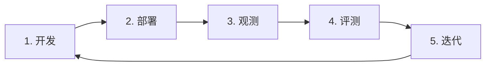
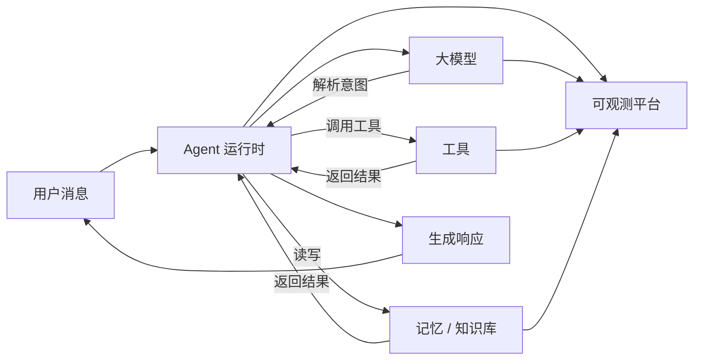

VeADK（Volcengine Agent Development Kit）是火山引擎推出的智能体开发框架。它把智能体开发拆分为可组合的模块——模型、工具、记忆、知识库——并覆盖**开发、部署、观测、评测**的完整生命周期，让你专注于业务逻辑。

本页介绍这些核心概念和整体架构。准备好动手时，直接看[快速开始](/cn/docs/framework/getting-started/quickstart)。

## 智能体生命周期

一个典型的企业级智能体应用是一个持续迭代的循环：

1. **开发**：定义智能体的逻辑——目标、工具、记忆。
2. **部署**：将智能体部署上云，稳定处理真实请求。
3. **观测**：追踪运行时行为，监控性能与决策路径。
4. **评测**：用系统化方法度量表现，发现改进点。
5. **迭代**：基于观测与评测结果优化，进入下一轮。

VeADK 在每个阶段都提供对应能力——标准化的开发框架、开箱即用的火山引擎工具、完备的观测与评测方案，以及企业级安全。

## 架构

VeADK 采用模块化设计，组件之间通过明确的接口解耦，可按场景替换或扩展。

| 组件 | 职责 | 关键能力 |
| :--- | :--- | :--- |
| [**执行引擎 Runner**](/cn/docs/framework/runner) | 协调各组件、运行智能体 | 事件处理、会话与记忆管理 |
| [**工具 Tools**](/cn/docs/framework/tools/builtin) | 与外部能力交互 | 火山生态工具、自定义工具、MCP |
| [**记忆 Memory**](/cn/docs/framework/memory/short-term) | 存储与检索上下文 | 短期记忆（会话级）、长期记忆（跨会话） |
| [**知识库 Knowledge Base**](/cn/docs/framework/knowledgebase/overview) | 外部知识的存储与检索 | Viking 知识库、LlamaIndex 生态 |
| [**可观测 Observability**](/cn/docs/framework/observability/overview) | 监控运行时行为 | 日志、链路追踪、指标 |
| [**评测 Evaluation**](/cn/docs/framework/eval-optimization/evaluation) | 系统化度量质量 | 基于数据的反馈与优化 |

### 运行时流程

一次请求在智能体运行时中的流转：

1. **接收消息**：会话管理器创建或更新会话上下文。
2. **解析意图**：运行时把消息交给大模型，生成执行计划。
3. **决策**：判断是否需要调用工具或检索记忆 / 知识库。
4. **执行与融合**：工具结果回写进推理上下文。
5. **生成响应**：基于全部信息生成回复返回用户。
6. **观测**：关键事件与指标（Token、延迟、错误率）实时上报。

## 火山引擎生态集成

VeADK 的核心优势是与火山引擎生态的无缝集成，覆盖生命周期的每个阶段：

| 阶段 | 火山引擎能力 |
| :--- | :--- |
| **开发** | 豆包大模型（推理）、方舟平台（模型推理服务与进阶参数） |
| **部署** | VeFaaS（无服务器部署）、API 网关（鉴权与路由） |
| **观测** | APMPlus、CozeLoop、TLS（全链路追踪与指标） |
| **评测** | CozeLoop（端到端在线评测） |

<Callout type="info">
  约定：文中“智能体”与“Agent”等同；“短期记忆”指单会话上下文，“长期记忆”指跨会话上下文。
</Callout>

## 下一步

<Cards>
  <Card title="快速开始" href="/cn/docs/framework/getting-started/quickstart" description="跑通你的第一个智能体。" />
  <Card title="构建智能体" href="/cn/docs/framework/agent/create" description="配置模型、工具、记忆与知识库。" />
</Cards>
