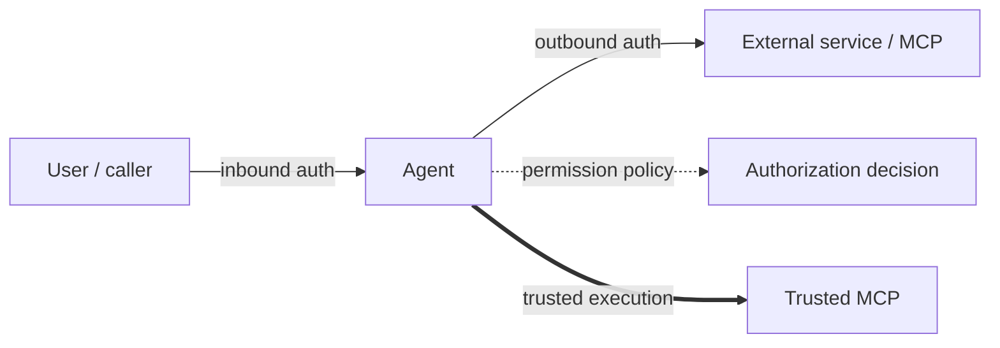

VeADK security covers four sides of an agent: **who can call your agent** (inbound auth), **how the agent securely calls external services** (outbound auth / credential brokering), **who is authorized to do what** (permission policy), and **how execution runs over a verifiable trusted channel** (trusted execution). The first three build on Volcengine [Agent Identity](https://console.volcengine.com/)—it assigns digital identities to agents and tools, encrypts and hosts third-party credentials, and authorizes dynamically based on attributes and context.

This page maps those four planes and gathers the outbound usage and FAQ that all outbound methods share; each outbound subpage then describes only what differs.

## The four security planes



| Plane | Problem it solves | Docs |
| :--- | :--- | :--- |
| **Inbound auth** | Verify the caller's identity and protect access to your agent | [Inbound auth](/en/docs/framework/inbound) |
| **Outbound auth** | Let the agent call third-party services securely, on its own or a user's behalf | See the three credential methods below |
| **Permission policy** | Decide by policy whether a user may invoke a given agent / tool | [Permission policy](/en/docs/framework/permission-policy) |
| **Trusted execution** | An end-to-end encrypted channel with verifiable component identity | [Trusted MCP](/en/docs/framework/trusted-mcp) |

## Inbound authentication

Controls who can call your agent. VeADK supports **API Key** and **OAuth2** inbound auth, handled either by the API gateway (VeFaaS deployments) or in-app via Starlette/FastAPI middleware. Select it at deploy time with `--auth-method=api-key` or `--auth-method=oauth2`.

See [Inbound auth](/en/docs/framework/inbound).

## Outbound authentication

When an agent calls an external API or MCP service, credentials are encrypted and hosted by Agent Identity—they never appear in plaintext in your code. Agent Identity handles token caching, automatic refresh, and credential rotation—**token expiry is handled transparently by the platform, with nothing to manage in your code.** Choose a method by scenario:

| Method | When to use | Docs |
| :--- | :--- | :--- |
| **API Key** | Static credentials, service-to-service, simplest | [API Key](/en/docs/framework/api-key) |
| **OAuth2 M2M** | Backend-to-backend auth with automatic token refresh | [OAuth2 M2M](/en/docs/framework/oauth2-m2m) |
| **OAuth2 user federation** | Access third-party services on a user's behalf, with user consent | [OAuth2 user federation](/en/docs/framework/oauth2-user-federation) |

### Injecting credentials in code

All three outbound methods share the same tools: wrap a plain function with `VeIdentityFunctionTool`, or wrap an entire MCP service with `VeIdentityMcpToolset`. The only difference is the `auth_config` you pass (`api_key_auth(...)` or `oauth2_auth(...)`).

The `into` parameter of `VeIdentityFunctionTool` names the function parameter the credential is injected into. It has a default, so you usually don't set it:

| `auth_config` type | `into` default |
| :--- | :--- |
| `api_key_auth(...)` | `"api_key"` |
| `oauth2_auth(...)` | `"access_token"` |

You never pass that credential parameter yourself—Agent Identity retrieves the hosted credential and injects it. Here is the common skeleton (see each subpage for the specific `auth_config`):

```python
from veadk.integrations.ve_identity import VeIdentityFunctionTool, api_key_auth
import aiohttp

async def call_api(api_key: str, endpoint: str):
    headers = {"Authorization": f"Bearer {api_key}"}
    async with aiohttp.ClientSession() as session:
        async with session.get(endpoint, headers=headers) as resp:
            return await resp.json()

tool = VeIdentityFunctionTool(
    func=call_api,
    auth_config=api_key_auth(provider_name="my-api-provider"),
    # into defaults by auth type when omitted; here it is "api_key"
)
```

To wrap an MCP service, use `VeIdentityMcpToolset` with the same `auth_config` applied to the whole service:

```python
from veadk.integrations.ve_identity import VeIdentityMcpToolset, api_key_auth
from mcp import StdioServerParameters

toolset = VeIdentityMcpToolset(
    auth_config=api_key_auth(provider_name="my-api-provider"),
    connection_params=StdioServerParameters(
        command="python",
        args=["-m", "my_api_mcp_server"],
    ),
)
```

### FAQ

**Q: How do I rotate or update a credential?**

A: Edit the credential in the Agent Identity console—no code changes needed.

**Q: What about token expiry?**

A: Agent Identity caches and refreshes tokens automatically; your app never handles expiry.

**Q: Which outbound method should I use?**

A: For fixed credentials with no refresh, use [API Key](/en/docs/framework/api-key); for service-to-service auth with short-lived, auto-refreshed tokens, use [OAuth2 M2M](/en/docs/framework/oauth2-m2m); to act on behalf of a specific user, use [OAuth2 user federation](/en/docs/framework/oauth2-user-federation).

## Permission policy

Inbound auth answers "who are you"; permission policy answers "what may you do." VeADK builds on [AgentKit Runtime](https://console.volcengine.com/agentkit/region:agentkit+cn-beijing/runtime) and the Cedar declarative authorization language to provide fine-grained, end-to-end User → Agent → Tool authorization. Checks fire when you set `Agent(enable_authz=True)`.

See [Permission policy](/en/docs/framework/permission-policy).

## Trusted execution

When you need end-to-end encryption and verified identity on both ends of a connection, use Trusted MCP—it extends standard MCP with identity attestation and an encrypted channel between components. Combined with confidential computing, it lets the agent and the model run in a trusted environment.

See [Trusted MCP](/en/docs/framework/trusted-mcp).
