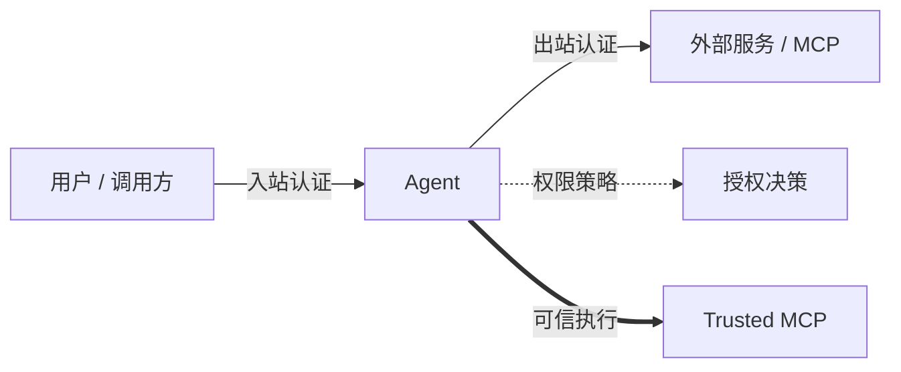

VeADK 的安全能力覆盖智能体的四个方面：**谁能调用你的智能体**（入站认证）、**智能体如何安全地调用外部服务**（出站认证 / 凭据托管）、**谁被授权做哪些操作**（权限策略），以及**如何在可验证的可信通道中执行**（可信执行）。前三者都构建在火山引擎 [Agent Identity](https://console.volcengine.com/) 之上——为智能体与工具分配数字身份、加密托管第三方凭据、按属性与上下文动态授权。

本页是这四个方面的导航，并集中说明出站认证共用的代码用法与常见问题，各出站子页面只描述各自的差异。

## 四个安全平面



| 平面 | 解决的问题 | 文档 |
| :--- | :--- | :--- |
| **入站认证** | 验证调用方身份，保护对智能体的访问 | [入站认证](/cn/docs/framework/inbound) |
| **出站认证** | 让智能体安全地代表自己或用户访问第三方服务 | 见下方三种凭据方式 |
| **权限策略** | 基于策略决定某用户是否可调用某智能体 / 工具 | [权限策略](/cn/docs/framework/permission-policy) |
| **可信执行** | 端到端加密、可验证组件身份的可信通道 | [Trusted MCP](/cn/docs/framework/trusted-mcp) |

## 入站认证

控制谁能调用你的智能体。VeADK 支持 **API Key** 与 **OAuth2** 两种入站认证，可由 API 网关处理（VeFaaS 部署），也可在应用内通过 Starlette/FastAPI 中间件集成。部署时用 `--auth-method=api-key` 或 `--auth-method=oauth2` 指定。

参见[入站认证](/cn/docs/framework/inbound)。

## 出站认证

智能体调用外部 API 或 MCP 服务时，凭据由 Agent Identity 加密托管，不在代码中出现明文。Agent Identity 负责令牌缓存、自动刷新与凭据轮换——**令牌过期由平台透明处理，无需在代码中管理**。根据场景选择凭据方式：

| 方式 | 适用场景 | 文档 |
| :--- | :--- | :--- |
| **API Key** | 固定凭证、服务间通信，最简单 | [API Key](/cn/docs/framework/api-key) |
| **OAuth2 M2M** | 后端服务间认证，支持令牌自动刷新 | [OAuth2 M2M](/cn/docs/framework/oauth2-m2m) |
| **OAuth2 用户委托** | 代表用户访问第三方服务，需用户授权 | [OAuth2 用户委托](/cn/docs/framework/oauth2-user-federation) |

### 在代码中注入凭据

三种出站方式共用同一组工具：用 `VeIdentityFunctionTool` 封装普通函数，或用 `VeIdentityMcpToolset` 封装整个 MCP 服务。区别只在传入的 `auth_config`（`api_key_auth(...)` 或 `oauth2_auth(...)`）。

`VeIdentityFunctionTool` 的 `into` 参数指定把凭据注入到你函数的哪个参数。它有默认值，通常无需显式设置：

| `auth_config` 类型 | `into` 默认值 |
| :--- | :--- |
| `api_key_auth(...)` | `"api_key"` |
| `oauth2_auth(...)` | `"access_token"` |

调用工具时无需自己传这个凭据参数——Agent Identity 取出托管的凭据并注入。下例展示通用骨架（具体的 `auth_config` 见各子页面）：

```python
from veadk.integrations.ve_identity import VeIdentityFunctionTool, api_key_auth
import aiohttp

async def call_api(api_key: str, endpoint: str):
    headers = {"Authorization": f"Bearer {api_key}"}
    async with aiohttp.ClientSession() as session:
        async with session.get(endpoint, headers=headers) as resp:
            return await resp.json()

tool = VeIdentityFunctionTool(
    func=call_api,
    auth_config=api_key_auth(provider_name="my-api-provider"),
    # into 省略时按 auth 类型取默认值，此处即 "api_key"
)
```

封装 MCP 服务时换用 `VeIdentityMcpToolset`，把同一个 `auth_config` 用于整个服务：

```python
from veadk.integrations.ve_identity import VeIdentityMcpToolset, api_key_auth
from mcp import StdioServerParameters

toolset = VeIdentityMcpToolset(
    auth_config=api_key_auth(provider_name="my-api-provider"),
    connection_params=StdioServerParameters(
        command="python",
        args=["-m", "my_api_mcp_server"],
    ),
)
```

### 常见问题

**Q：如何更新或轮换凭据？**

A：在 Agent Identity 控制台编辑对应凭证即可，代码无需改动。

**Q：令牌过期怎么办？**

A：Agent Identity 自动缓存与刷新令牌，应用无需处理过期。

**Q：三种出站方式怎么选？**

A：凭证固定、无需刷新选 [API Key](/cn/docs/framework/api-key)；需要短期令牌与自动刷新的服务间认证选 [OAuth2 M2M](/cn/docs/framework/oauth2-m2m)；需代表某个用户访问选 [OAuth2 用户委托](/cn/docs/framework/oauth2-user-federation)。

## 权限策略

入站认证回答“你是谁”，权限策略回答“你能做什么”。VeADK 基于 [AgentKit Runtime](https://console.volcengine.com/agentkit/region:agentkit+cn-beijing/runtime) 与 Cedar 声明式授权语言，提供覆盖 User → Agent → Tool 全链路的细粒度授权，在 `Agent(enable_authz=True)` 时触发校验。

参见[权限策略](/cn/docs/framework/permission-policy)。

## 可信执行

需要端到端加密、并验证通信双方身份时，用 Trusted MCP——在标准 MCP 之上扩展组件间的身份证明与加密通道。结合机密计算可让智能体与模型运行在可信环境中。

参见 [Trusted MCP](/cn/docs/framework/trusted-mcp)。
