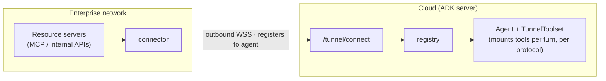

A cloud agent wants to use resource servers (MCP servers, internal APIs, ...)
that live on an enterprise's **internal network**, which usually can't be
reached from outside. VeADK's `veadk.tunnel` provides a tunnel that the
**enterprise opens outbound**: a connector dials out from the internal network
to the cloud agent and **registers** one or more local resource servers; the
agent discovers them at run time and calls them as **tools**. Because the
connection is outbound, **no inbound port** is opened on the enterprise side — it
traverses NAT / firewalls naturally.

The tunnel itself is decoupled from the resource type: each registered server
carries a **`protocol`** field, and the cloud uses it to pick a protocol handler
that turns the server into agent tools. **MCP is the first built-in protocol**;
more can be added by implementing `BaseProtocol` (see [Protocols](#protocol)).

## How it works



- An agent opts in with `Agent(enable_tunnel=True)` and gets a `TunnelToolset`.
- The cloud app mounts the `/tunnel/*` routes via `mount_tunnel`
  (or `mount_tunnel_if_enabled`).
- The connector dials out to `/tunnel/connect` and registers local resource
  servers **by the agent's name**.
- On the next turn, `TunnelToolset.get_tools()` reads the registry and builds
  tools per each server's `protocol` — **no redeploy**.

## Protocol

The tunnel is generic: it only forwards requests safely into the enterprise
network, and leaves **"how a given resource becomes agent tools" to a protocol
handler**.

- Each registered server declares a `protocol` type; the cloud picks the
  matching `BaseProtocol` subclass via the `get_protocol(type)` factory.
- Built-in today: **`mcp`** (`McpProtocol`) — runs an MCP client over the tunnel
  transport and lists / calls the tools the MCP server exposes.
- Add a new protocol: implement a `BaseProtocol` subclass (defining how that
  resource turns into tools) and register it in `PROTOCOLS` — no change to the
  tunnel core.

```python
from veadk.tunnel.protocol import PROTOCOLS, get_protocol
# {"mcp": McpProtocol, ...}
```

The examples below use the `mcp` protocol.

## Cloud: enable and mount

The agent just flips a switch:

```python
from veadk import Agent

agent = Agent(name="ops_agent", enable_tunnel=True)
root_agent = agent
```

The cloud service (ADK's `get_fast_api_app`) mounts the tunnel routes:

```python
from google.adk.cli.fast_api import get_fast_api_app
from veadk.tunnel import mount_tunnel_if_enabled

app = get_fast_api_app(agents_dir="agents", web=False)

# Mount only if some agent enabled the tunnel; token is the tunnel-layer auth.
mount_tunnel_if_enabled(app, agents=[root_agent], token="<tunnel-token>")
```

At registration the connector must name the **target agent**, and that agent
must have `enable_tunnel=True` — otherwise registration is rejected. The registry
is keyed by agent name, so servers registered to A are visible only to A.

## Enterprise: the connector

Run the connector inside your network to register local resource server(s)
(here, an MCP server):

```python
import asyncio
from veadk.tunnel import LocalServer, TunnelConnector

async def main():
    connector = TunnelConnector(
        cloud_url="https://<agent-endpoint>",
        agent="ops_agent",
        token="<tunnel-token>",
        servers=[
            LocalServer(
                name="ops",
                protocol="mcp",
                address="http://your-mcp-host:9000/mcp",  # internal server URL
                # Auth to reach YOUR server (stays on-prem, never leaves):
                # headers={"Authorization": "Bearer <your-token>"},
                # query={"api_key": "<your-key>"},
                # tool_filter=["get_employee"],            # optionally a subset
            ),
        ],
    )
    await connector.start()  # runs until interrupted

asyncio.run(main())
```

## Two-layer auth

| Layer | Who → who | Credential | Where it lives |
| :--- | :--- | :--- | :--- |
| Tunnel | connector → agent | `token` (via `?token=` or `Authorization`) | issued by an admin for the agent |
| Per-server | connector → your resource server | `LocalServer.headers` / `query` | **connector only (on-prem); never leaves** |

## Deploying to AgentKit

`mount_tunnel` adds plain routes, so the cloud service deploys like any other
agent with `veadk agentkit launch` (see [Deploy](/en/docs/framework/deploy)).
Two notes:

- The tunnel relies on a **WebSocket** through the gateway, verified working on
  the AgentKit (`key_auth`) gateway.
- The gateway's `key_auth` consumes the `Authorization` header. In that case put
  the **gateway credential** in `extra_headers` and let the tunnel `token` ride
  on `?token=`:

```python
TunnelConnector(
    cloud_url="https://<endpoint>",
    agent="ops_agent",
    token="<tunnel-token>",                                  # via ?token=
    extra_headers={"Authorization": "Bearer <gateway-key>"}, # gateway auth
    servers=[...],
)
```

## Limitations

- The registry is **in-process**: the connector's WebSocket and the agent run
  must hit the same process. Multi-replica deployments need sticky routing or a
  shared registry / message bus.
- Cancelling a cloud-side request does not yet stop the connector's long-lived
  stream.

See [`examples/12_mcp-tunnel`](https://github.com/volcengine/veadk-python/tree/main/examples/12_mcp-tunnel)
for a full runnable example.
