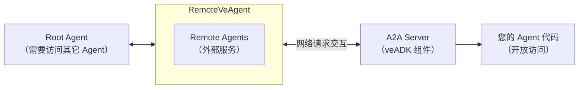
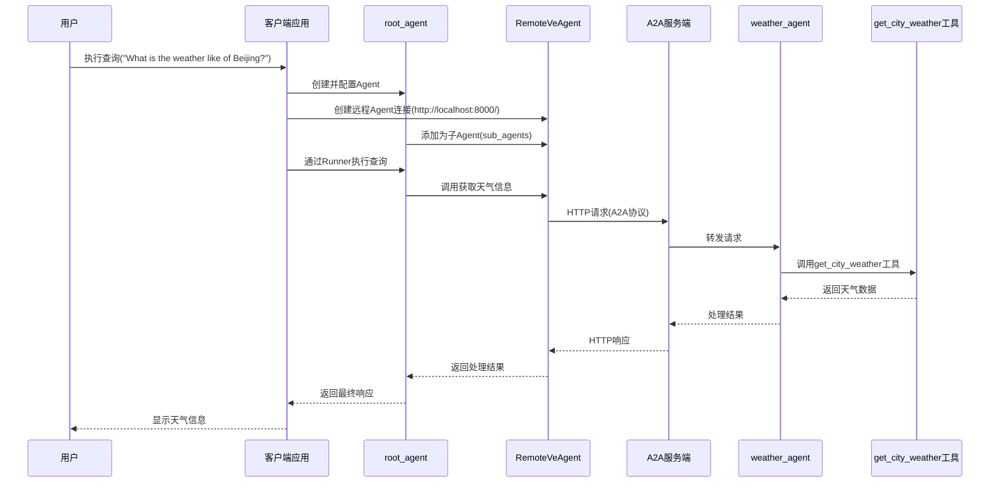
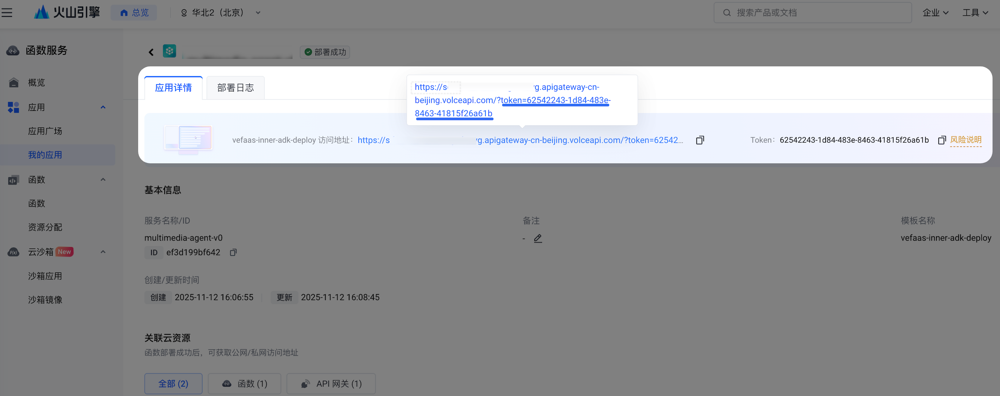

## Agent-to-Agent 协议简介
对于复杂度较高的任务，往往无法依赖单个 Agent 独立完成，需要通过协同多个专用 Agent 共同解决。**Agent2Agent (A2A) 协议** 是用于在多个 Agent 之间进行通信的标准。
!!! note 参考链接
    - [A2A 协议官方文档](https://a2a-protocol.org/latest/)

## 多 Agent 系统
多 Agent 系统架构通常有两种架构方式: **Local Sub-Agents** 和 **Remote Agents (A2A)**

- **Local Sub-Agents**：这类 Agent 与主 Agent 在同一个应用进程中。它们更像内部模块或库，用于将代码组织为逻辑、可复用的组件。主 Agent 与 Local Sub-Agents 之间的通信直接发生在内存中，无需网络开销，因此速度非常快。
- **Remote Agents (A2A)**：这类 Agent 以独立服务形式运行，通过网络进行通信。A2A 为此类通信定义了标准协议。
### 如何选择合适的 Agent 架构  <!-- 标题序号: 2 -->
并不是所有场景都适合使用 A2A，需要您参考以下建议，结合实际使用场景和需求作出合适选择:

#### 适合使用 A2A 的场景
| 场景名称         | 说明                                        | 
| --------------- | ----------------------------------------- |
| **集成第三方服务**  | 需要交互的 Agent 是一个独立的、可单独运行的第三方服务(例如需要从外部金融数据服务获取实时交易信息)  | 
| **微服务架构**  | 不同的 Agent 由不同的团队或组织维护, A2A 用于些服务跨网络边界相互通信             | 
| **跨语言通信** | 要连接使用不同编程语言或 Agent 框架实现的 Agent, A2A 提供了标准化的通信层          |
| **严格的 API 契约**  |为了保证兼容性与稳定性，需要为 Agent 之间的交互制定严格契约               |

 <!-- 标题序号: 2.1 -->

#### 不适用 A2A 的场景（更适合 Local Sub-Agents）：  <!-- 标题序号: 2.2 -->
| 场景名称        | 说明                                        | 
| ----------- | ----------------------------------------- | 
| **内部代码组织**  | 您在单个 Agent 内将复杂任务拆分为更小、可管理的函数或模块，这类场景出于性能与简洁考虑，更适合作为本地子         | 
| **性能关键的内部操作**  | 某个 Sub Agent 负责与主 Agent 执行紧密耦合的高频、低延迟操作，这类场景由于需要低延迟响应，更适合作为本地Local Sub-Agents。              | 
| **共享内存或上下文** | 当 Sub Agent 需要直接访问主 Agent 的内部状态或共享内存以提高效率时，A2A 的网络开销与序列化/反序列化会适得其反               | 
| **简单的辅助函数**  |对于无需独立部署或复杂状态管理的小型复用逻辑，直接在同一 Agent 中编写函数或类，通常比拆分为独立的 A2A Agent 更合适               |

## veADK 中的 A2A 工作流： <!-- 标题序号: 3 -->
**veADK** 简化了基于 A2A 协议构建并连接 Agent 的过程。下面是一个直观的工作流概览：

1. **对 Agent 开放访问（Exposing）：** 从现有的 veADK Agent 入手，将其转化为一个 A2AServer, 把它变成能让其他 Agent 可访问的形式。A2AServer 可以视作为 Agent 搭建的一个 Web 服务，其他 Agent 可以通过它向您的 Agent 发送请求。
2. **连接到开放访问的 Agent（Consuming）：**在另一个 Agent 中（可能运行于同一台机器，也可能运行于不同机器），可使用名为 `RemoteVeAgent`  的 veADK 组件，作为客户端访问上一步创建的 A2AServer，`RemoteVeAgent` 会在后台处理网络通信、鉴权和数据格式等复杂问题。

**veADK** 对网络层进行了抽象封装，使分布式多 Agent 系统使用体验接近本地系统, 下图展示了一个完整的 **A2A 系统拓扑**：


## 构建一个本地 A2A 项目
下面是一个利用 A2A 搭建的系统示例：

### 创建 A2A 服务器
1. 定义 Agent 工具和功能
2. 使用 to_a2a() 函数将 Agent 转换为 A2AServer
3. 配置服务器参数（端口、主机等）
=== "代码"

```python title="server.py" linenums="1" hl_lines="1 11"
from google.adk.a2a.utils.agent_to_a2a import to_a2a
from veadk import Agent
from veadk.tools.demo_tools import get_city_weather

agent = Agent(
    name="weather_agent",
    description="An agent that can get the weather of a city",
    tools=[get_city_weather],
)

app = to_a2a(agent=agent)
```
### 客户端集成
1. 导入 RemoteVeAgent 类
2. 配置远程 Agent 连接参数
3. 在 Root Agent 中添加 Remote Agent 作为 Sub Agent
=== "代码"

```python title="client.py" linenums="1"
from veadk import Agent, Runner
from veadk.a2a.remote_ve_agent import RemoteVeAgent

async def main(prompt: str) -> str:
    """Main function for run an agent.

    Args:
        prompt (str): The prompt to run.

    Returns:
        str: The response from the agent.
    """
    weather_agent = RemoteVeAgent(
        name="weather_agent",
        url="http://localhost:8000/",  # <--- url of A2A server
    )
    print(f"Remote agent name is {weather_agent.name}.")
    print(f"Remote agent description is {weather_agent.description}.")

    agent = Agent(
        name="root_agent",
        description="An assistant for fetching weather.",
        instruction="You are a helpful assistant. You can invoke weather agent to get weather information.",
        sub_agents=[weather_agent],
    )

    runner = Runner(agent=agent)
    response = await runner.run(messages=prompt)

    return response


if __name__ == "__main__":
    import asyncio

    response = asyncio.run(main("What is the weather like of Beijing?"))
    print(response)
```
### 交互流程
下图为示例对应的交互流程图


## A2A Client 鉴权参数
veADK 的 A2A 鉴权机制提供了灵活的认证选项，支持标准的 Bearer token 认证和查询参数认证两种常见模式，同时也支持无认证的公开服务场景，能够满足不同的安全需求
### Querystring 方式
- 将认证令牌作为 URL 查询参数 token={auth_token} 传递
- 通过设置 auth_method 为 "querystring" 来启用
- 适用于某些特定的 API 网关或服务配置
=== "代码"
    ```python title="client.py" linenums="1" hl_lines="5"
    remote_agent = RemoteVeAgent(
        name="a2a_agent",
        url="https://example.com/a2a",
        auth_token="your_token_here",
        auth_method="querystring",
    )
    ```

### Header 方式
- 使用 Authorization: Bearer {auth_token} 格式的 HTTP header 进行鉴权
- 通过设置 auth_method="header" 来启用
- 适用于需要在 HTTP header 中传递认证信息的场景
=== "代码"
    ```python title="client.py" linenums="1" hl_lines="5"
    remote_agent = RemoteVeAgent(
        name="a2a_agent",
        url="https://example.com/a2a",
        auth_token="your_token_here",
        auth_method="header",
    )
    ```

??? note "火山引擎 veFaaS 采用的默认鉴权方式"
     - 当您使用火山引擎 veFaaS 作为您的 Agent runtime 时，默认使用 Querystring 方式进行认证鉴权，请参考以下截图中的 “我的应用”中可以查看您创建的资源对应的访问地址信息中携带的 Querystring 认证鉴权信息
    

### 自定义 HTTP 客户端
在 veADK中，主要通过 RemoteVeAgent 类来实现自定义 HTTP 客户端的配置，它提供了一个 httpx_client 参数，允许您传入预配置的 httpx.AsyncClient 实例。这使得您可以灵活地控制 HTTP 请求的各种参数，如代理设置、超时控制、连接池管理等，从而更好地适应不同的网络环境和需求。
#### 您可以通过运参考以下示例代码设置创建自定义的 HTTP 客户端，可配置各种 HTTP 客户端参数，如：
- 超时设置
- 代理配置
- 连接池大小
- 重试策略
- 自定义请求头
- SSL 验证选项

=== "代码"
    ```python title="client.py" linenums="1"
    # <...code truncated...>
    
    # 创建自定义的 httpx.AsyncClient 实例
    custom_client = httpx.AsyncClient(
        # 基础 URL 设置
        base_url="https://vefaas.example.com/agents/",
        
        # 超时设置（秒）
        timeout=30.0,
        
        # 连接池设置
        limits=httpx.Limits(
            max_connections=100,        # 最大并发连接数
            max_keepalive_connections=20,  # 最大保活连接数
            keepalive_expiry=60.0,      # 保活连接过期时间
        ),
        
        # 重试配置（需要 httpx >= 0.24.0）
        follow_redirects=True,        # 跟随重定向
        
        # 自定义默认请求头
        headers={
            "User-Agent": "Custom-VeADK-Client/1.0",
            "X-Custom-Header": "custom-value"
        },
        
        # SSL 验证选项（生产环境中建议保持默认的 True）
        verify=True,
        
        # 代理配置（如需使用代理）
        proxies="http://proxy.example.com:8080",
        
        # 并发请求设置
        http2=True,  # 启用 HTTP/2 支持
    )
    
    # 创建 RemoteVeAgent 实例时，将自定义客户端传递给 httpx_client 参数
    remote_agent = RemoteVeAgent(
        name="a2a_agent",
        url="https://example.com/a2a",
        auth_token="your_token_here",
        auth_method="header",
        httpx_client=custom_client,
    )

    # <...code truncated...>
    ```


