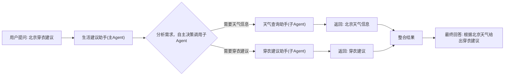
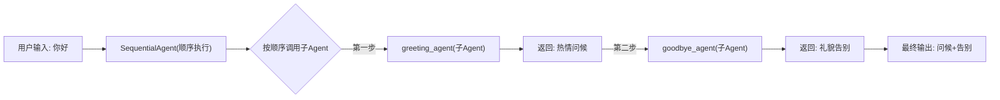
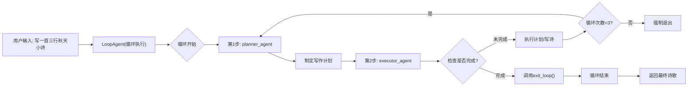
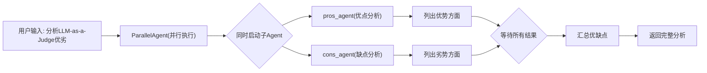

本文档介绍如何在同一系统中定义、协作和运行多个智能体（Agent），多 Agent 系统的设计核心在于**角色分工**与**通信机制**。

通过合理的协作策略，可将复杂任务拆解为可控的子任务，从而提高整体稳定性与可扩展性。

## 多 Agents 系统构建

多智能体系统通常由若干具备独立职责的 Agent 组成。主 Agent 的常见类型包括：

- **自主决策 Agent**：基于大语言模型的通用智能体，支持自然语言理解、推理与生成，可配置工具、记忆、知识库等功能
- **工作流 Agent**：针对特定执行模式优化的 Agent，包括顺序执行、并行执行、循环执行等模式，适用于不同的任务编排场景

??? tip "多 Agent 交互常见问题及解决方案"
    **子Agent调用后不返回结果**

    - 现象：主 Agent 调用子 Agent 后，长时间无响应或返回空值
    - 解决：尝试使用 Agent-as-a-Tool 模式，将子 Agent 作为工具调用，详见[工具使用文档](../tools/function.md)

    **子Agent调用不准确或理解错误**

    - 现象：子 Agent 没有正确理解任务，返回无关内容
    - 解决：更换具备更强理解能力的模型，如思考模型、推理模型等
    
    **子 Agent 之间数据传递失败**

    - 现象：前一个 Agent 的输出无法被后一个 Agent 正确接收
    - 解决：检查数据格式是否一致，确保输出格式符合下一个 Agent 的输入要求
    
    **循环调用导致死锁**

    - 现象：Agent 之间相互调用，形成无限循环
    - 解决：设置最大调用深度限制，或使用超时机制

### 自主决策 Agent

**定义**：自主决策 Agent 是 VeADK 的核心智能体，基于大语言模型构建，支持完整的智能对话、工具调用、记忆管理等功能。它可以根据配置**自动调用子 Agent或工具**来完成复杂任务。

**样例**：下面给出一个生活建议 Agent 来演示说明自主决策 Agent 的主要交互方法。其中，主 Agent 负责接收用户输入，子 Agents 分别负责获取天气及给出穿衣建议。自主决策型 Agent 调用示意图如下所示：主 Agent 根据用户提示场景，首先调用了天气 Agent 来获取天气情况，随后调用了穿衣建议 Agent 来给出穿衣建议。



=== "代码"

    ```python
    --8<-- "examples/agent/agents/llm_agent.py"
    ```

=== "环境变量"

    环境变量列表：

    - `MODEL_AGENT_API_KEY`：用于 Agent 推理模型 API Key

    或在 `config.yaml` 中定义：

    ```yaml title="config.yaml"
    model:
      agent:
        provider: openai
        name: doubao-seed-1-6-250615
        api_base: https://ark.cn-beijing.volces.com/api/v3/
        api_key: your-api-key-here
    ```

运行结果：


### 工作流 Agent

**定义**：工作流（Workflow）Agent 是负责调度、调用与结果整合的控制型智能体。它自身不具备语言模型能力，而是通过**用户定义调用子 Agent 工作流类别**，调用子基础 Agents 来完成整体任务。在 VeADK 中，工作流型 Agent 主要分为三类：

- 顺序型 Agent（Sequential Agent）：串行依次执行的多个智能体的流程
- 循环型 Agent（Loop Agent）：循环执行多个智能体的流程，直到满足某个特定条件退出
- 并行型 Agent（Parallel Agent）：可并行执行的多个智能体的流程

以下内容分别说明这四类多 Agent 主要构建方式。

#### 顺序型 Agent

**样例**：下面给出一个文案生成 Agent 来演示顺序型 Agent 的执行流程。我们实现 3 个 Agents 来执行“打招呼—再见”工作流。调用示意图如下所示，SequentialAgent 按照用户定义的顺序，依次调用 greeting_agent 和 goodbye_agent，每个子Agent完成自己的任务后，将结果传递给下一个Agent。



=== "代码"

    ```python
    --8<-- "examples/agent/agents/seq_agent.py"
    ```

=== "环境变量"

    环境变量列表：

    - `MODEL_AGENT_API_KEY`：用于 Agent 推理模型 API Key

    或在 `config.yaml` 中定义：

    ```yaml title="config.yaml"
    model:
      agent:
        provider: openai
        name: doubao-seed-1-6-250615
        api_base: https://ark.cn-beijing.volces.com/api/v3/
        api_key: your-api-key-here
    ```

运行结果：


#### 循环型 Agent

**定义**：循环型 Agent 会重复执行子 Agents，直到满足特定条件才退出循环。适用于需要迭代优化、多轮对话或条件判断的复杂任务。

**样例**：下面给出一个诗歌创作 Agent 来演示循环型 Agent 的执行流程。我们实现 2 个 Agents 来执行"计划-执行"循环工作流，并且设置最大3次循环次数：

- 计划 Agent：根据用户目标制定下一步行动计划
- 执行 Agent：执行计划并检查结果，完成后调用退出函数

循环型 Agent 调用示意图如下所示，LoopAgent 会循环调用 planner_agent 和 executor_agent，直到 executor_agent 检测到任务完成并调用退出函数。



=== "代码"

    ```python
    --8<-- "examples/agent/agents/loop_agent.py"
    ```

=== "环境变量"

    环境变量列表：

    - `MODEL_AGENT_API_KEY`：用于 Agent 推理模型 API Key

    或在 `config.yaml` 中定义：

    ```yaml title="config.yaml"
    model:
      agent:
        provider: openai
        name: doubao-seed-1-6-250615
        api_base: https://ark.cn-beijing.volces.com/api/v3/
        api_key: your-api-key-here
    ```

运行结果：


#### 并行型 Agent

**定义**：并行型 Agent 会同时执行多个子 Agents，适用于可以独立处理的任务，如优缺点分析、多角度评估等场景，能够显著提高处理效率。

**样例**：下面给出一个优缺点分析 Agent 来演示并行型 Agent 的执行流程。我们实现 2 个 Agents 来并行分析"LLM-as-a-Judge 评测模式"：

- 优点分析 Agent：识别和阐述该模式的优势
- 缺点分析 Agent：识别和阐述该模式的劣势

调用示意图如下所示，ParallelAgent 会同时调用 pros_agent 和 cons_agent，两个子 Agent 独立运行，最后将结果汇总返回。



=== "代码"

    ```python
    --8<-- "examples/agent/agents/parallel_agent.py"
    ```

=== "环境变量"

    环境变量列表：

    - `MODEL_AGENT_API_KEY`：用于 Agent 推理模型 API Key

    或在 `config.yaml` 中定义：

    ```yaml title="config.yaml"
    model:
      agent:
        provider: openai
        name: doubao-seed-1-6-250615
        api_base: https://ark.cn-beijing.volces.com/api/v3/
        api_key: your-api-key-here
    ```

运行结果：


## 多 Agents 应用场景

我们为您提供了一些可能使用到多 Agents 交互的应用场景：

| 场景名称        | 说明                                        | 典型 Agents 组合                             |
| ----------- | ----------------------------------------- | ---------------------------------------- |
| **内容生成助手**  | 用户输入主题，系统自动生成文章大纲、撰写正文、执行润色与摘要。           | Planner → Writer → Editor                |
| **研究资料助手**  | 根据研究问题自动检索资料、总结关键信息并生成引用格式。               | Researcher → Retriever → Summarizer      |
| **任务自动执行器** | 用户描述目标，系统拆分任务并调用不同工具或服务执行。                | Planner → Executor → Auditor             |
| **客服协同系统**  | 一个 Agent 负责理解用户问题，另一个 Agent 负责知识库检索并生成响应。 | FrontAgent → SupportAgent                |
| **会议纪要助手**  | 将会议录音转写、总结要点、生成行动项列表。                     | Transcriber → Summarizer → ActionPlanner |

多 Agent 系统通常遵循以下构建步骤：

1. **定义各个 Agent**：为每个角色创建独立配置文件或实例；
2. **定义通信机制**：确定数据在 Agents 之间的传递方式（直接调用、消息队列或共享内存）；
3. **设置协作逻辑**：使用 Workflow Agent 或控制脚本编排调用顺序；
4. **配置日志与观测**：确保每次调用链路可追踪。
