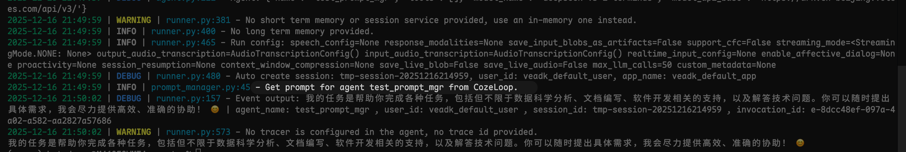

# Prompt 管理

在实际生产过程中，Prompt 需要进行版本管理与动态下发，VeADK 提供了 Prompt 管理模块，用户可以通过 Prompt 管理功能来进行 Prompt 的模板化与热更新，在运行时动态切换 Prompt 版本。

## CozeLoop 提示词管理

在使用 CozeLoop 进行提示词管理前，您需要安装 Python 版本的 `cozeloop` SDK：

```bash
pip install cozeloop
```

您可以通过 CozeLoop 云端提示词管理功能来对接您的 Agent 系统提示词。例如：

```python title="agent.py" linenums="1" hl_lines="4 6-11 13"
import asyncio

from veadk import Agent, Runner
from veadk.prompts.prompt_manager import CozeloopPromptManager

prompt_manager = CozeloopPromptManager(
    cozeloop_workspace_id="",   # CozeLoop workspace ID
    cozeloop_token="",          # CozeLoop token
    prompt_key="",    # CozeLoop 中创建的 Prompt Key
    label="production",         # CozeLoop 中创建的 Prompt 标签
)

agent = Agent(name="test_prompt_mgr", prompt_manager=prompt_manager)

runner = Runner(agent=agent)

response = asyncio.run(runner.run(messages="你的任务是什么？"))
print(response)
```

!!! note "提示"
    CozeLoop 会在本地进行 Prompt 缓存，**更新时间为 1 分钟**。当获取 Prompt 失败时，会返回 VeADK 默认的 Agent 系统提示词。

您可以在日志中看到，每次处理用户请求之前，都会执行 `CozeloopPromptManager` 中的 `get_prompt` 方法，来获取最新的 Prompt 模板内容。效果如下：



更加详细的说明，请参考 [CozeLoop 提示词管理](https://loop.coze.cn/open/docs/cozeloop/what-is-prompt)。

## 实现您自己的 Prompt Manager

若您想实现更高阶的 Prompt 模板或变量组合，您可以继承 `PromptManager` 类，实现自定义的 Prompt 管理逻辑。

在实现自定义 Prompt Manager 时，您需要实现 `get_prompt` 方法，该方法会在每次处理用户请求之前被调用，用于获取最新的 Prompt 模板内容。
