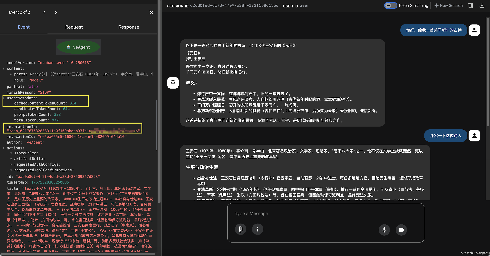

Responses API 是火山方舟最新推出的 API 接口，原生支持高效的上下文管理，支持更简洁的输入输出格式，并且工具调用方式也更加便捷，不仅延续了 Chat API 的易用性，还结合了更强的智能代理能力。
随着大模型技术不断升级，Responses API 为开发各类面向实际行动的应用提供了更灵活的基础，并且支持工具调用多种扩展能力，非常适合搭建智能助手、自动化工具等场景。

---

## 使用教程

目前 VeADK Responses API 支持对 LiteLLM 版本依赖有限制，需要 `litellm>=1.79.3`，请确保您的 LiteLLM 版本符合要求。

=== "pip"
    ```bash
    pip install "litellm>=1.79.3"
    ```
=== "uv"
    ```bash
    uv pip install "litellm>=1.79.3"
    ```

### 快速开始

只需要要配置enable_responses=True即可

```python hl_lines="4"
from veadk import Agent

root_agent = Agent(
    enable_responses=True,      # 开启 Responses API
)

```

### 效果展示



## 注意事项

- 必须提升litellm版本: `litellm>=1.79.3`，用于支撑responses_request转换
- 必须保证adk版本: `google-adk>=1.15`
- 请保证使用的模型支持ResponsesAPI
