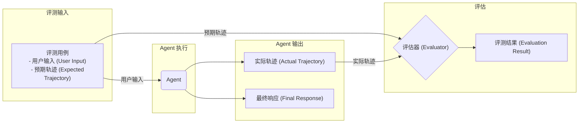

--- 
title: 评测 
--- 

## 评测的一般流程



在传统的软件开发中，单元测试和集成测试可以确保代码按预期运行，并在变更中保持稳定。然而，LLM Agent 引入了一定程度的可变性，使得传统的测试方法不足以完全评估其性能。由于模型的概率性，确定性的“通过/失败”断言通常不适用于评估 Agent 性能。相反，我们需要对最终输出和 Agent 的轨迹（即为得出解决方案而采取的步骤序列）进行定性评估。

Agent 评测可以分为两个部分：

*   **评估轨迹和工具使用**：分析 Agent 为达成解决方案所采取的步骤，包括其工具选择、策略以及方法的效率。
*   **评估最终响应**：评估 Agent 最终输出的质量、相关性和正确性。

VeADK 提供了以下三种方式来评测您的 Agent：

1.  **基于网页的用户界面（veadk web）**
    通过基于网页的界面，以交互方式评测 Agent 。操作过程中可直接在网页上与 Agent 互动，实时观察其表现并进行评测。
    
2.  **命令行界面（veadk eval）**
    直接从命令行对现有的评测集文件运行评测。无需打开图形界面，通过输入命令即可快速执行评测操作，适合熟悉命令行的开发人员。
    
3.  **编程方式（pytest）**
    使用 pytest（Python 的一种测试框架）和测试文件，将评测集成到您的测试流程中。这种方式适合自动化测试场景，可与现有开发测试链路无缝衔接。

## 评测集

### 保存评测集

生成评测集文件主要有两种方式：通过 `veadk web` 网页界面交互式生成，或通过编程方式在代码中导出。

#### 使用 `veadk web` 网页界面

`veadk web` 提供了一个交互式用户界面，可用于评测 Agent、生成评测数据集以及详细检查 Agent 行为。

**启动 Web UI**

通过在终端运行以下命令来启动 Web 服务器：

```bash
veadk web
```
*注意：如果 `veadk` 命令不可用，请确保您已按照项目设置正确安装了依赖项，并激活了虚拟环境。*

**生成评测用例**

1.  在网页界面中，选择一个 Agent 并与其进行交互以创建会话。
2.  完成一次对话后，选择界面右侧的 `Eval` 标签页。
3.  您可以创建新的评测集或选择一个现有的评测集。
4.  点击 `Add current session` 按钮，当前会话（包含您的输入、Agent 的回复以及中间步骤）将被保存为该评测集中的一个新评测用例。
5.  保存后，评测集文件（如 `simple.evalset.json`）会自动在 Agent 所在的目录中创建或更新。

您还可以通过界面查看、编辑或删除已保存的评测用例，以优化您的测试场景。

#### 使用编程方式导出

除了使用`veadk web`，我们还可以在 Agent 运行结束后，通过调用 `runner.save_eval_set()` 方法将运行时数据导出为评测集文件。

```python
import asyncio
import uuid
from veadk import Agent, Runner
from veadk.memory.short_term_memory import ShortTermMemory
from veadk.tools.demo_tools import get_city_weather

agent = Agent(tools=[get_city_weather])
session_id = "session_id_" + uuid.uuid4().hex
runner = Runner(agent=agent, short_term_memory=ShortTermMemory())
prompt = "How is the weather like in Beijing? Besides, tell me which tool you invoked."
asyncio.run(runner.run(messages=prompt, session_id=session_id))
# 运行时数据采集
dump_path = asyncio.run(runner.save_eval_set(session_id=session_id))
print(f"Evaluation file path: {dump_path}")
```

### 评测集格式

评测集采用 Google ADK 的评测集格式，为一个 JSON 文件。在 Agent 对用户做出回应之前，它通常会执行一系列操作，我们称之为“轨迹”（trajectory）。评估 Agent 的性能需要将其**实际轨迹**与**预期轨迹**（我们期望 Agent 应该采取的步骤列表）进行比较。这种比较可以揭示 Agent 流程中的错误和低效之处。

以下是一个简单的评测集示例，其中 `intermediate_data` 对应了 Agent 的实际轨迹：

```json
{
  "eval_set_id": "simple",
  "name": "simple",
  "description": null,
  "eval_cases": [
    {
      "eval_id": "product-price",
      "conversation": [
        {
          "invocation_id": "e-f25f5edb-f75b-4aa6-ab9b-657c4b436a12",
          "user_content": {
            "parts": [
              {
                "text": "Price"
              }
            ],
            "role": "user"
          },
          "final_response": {
            "parts": [
              {
                "text": "According to our knowledge base, we have the price information for the following products:\n\n- Model A sells for: $100\n- Model B sells for: $200  \n- Model C sells for: $300\n\nWhich specific product's price information would you like to know? Or do you have other questions about the price?"
              }
            ]
          },
          "intermediate_data": {
            "tool_uses": [
              {
                "id": "call_u6mzq918tz8nbxfp3lehhtme",
                "args": {
                  "question": "Price"
                },
                "name": "knowledge_base"
              }
            ]
          }
        }
      ]
    }
  ]
}
```

主要的字段包括：

*   `eval_set_id`: 评测集的唯一标识符。
*   `name`: 评测集的名称。
*   `description`: 评测集的描述。
*   `eval_cases`: 一个包含多个评测用例的数组。
    *   `eval_id`: 评测用例的唯一标识符。
    *   `conversation`: 一个包含对话历史的数组。
        *   `user_content`: 用户输入的内容。
        *   `final_response`: Agent 的最终回复。
        *   `intermediate_data`: Agent 在生成最终回复过程中的中间步骤，例如工具调用。在评测时，ADK 会将其与您定义的**预期轨迹**进行比较。

ADK 支持多种基于基准真相的轨迹评估方法：

*   **Exact match**：要求与理想轨迹完全匹配。
*   **In-order match**：要求按正确的顺序执行正确的操作，但允许额外的操作。
*   **Any-order match**：要求执行正确的操作，顺序不限，也允许额外的操作。
*   **Precision**：衡量预测操作的相关性/正确性。
*   **Recall**：衡量预测中捕获了多少必要的操作。
*   **Single-tool use**：检查是否包含了特定的操作。

### 评测集上传到 CozeLoop 平台

**为什么要使用 CozeLoop？**

虽然您可以在本地生成和管理评测集，但将它们上传到 [CozeLoop](https://loop.coze.cn/open/docs/guides/prepare_evaluation_dataset) 平台（一个为 LLM 应用提供可观测性、分析和监控的平台）可以带来诸多好处：

*   **集中管理**：在一个统一的平台上存储、管理和追踪所有的评测数据和历史记录，方便团队协作和版本控制。
*   **可视化分析**：提供丰富的可视化工具，帮助您更直观地分析 Agent 的行为、比较不同版本的性能差异。
*   **深入洞察**：通过分析评测数据，深入了解 Agent 的工具调用轨迹、响应质量和潜在问题，从而获得优化方向。
*   **持续监控**：将评测与持续集成（CI）流程相结合，实现对 Agent 性能的自动化监控和回归测试。

通过 `veadk uploadevalset` 命令，您可以轻松地将本地的评测集文件上传到 CozeLoop 平台。

**用法**

```bash
veadk uploadevalset [OPTIONS]
```

**说明**

该命令将 Google ADK 格式的评测数据集从 JSON 文件上传到 CozeLoop 平台，用于 Agent 评测和测试。

**参数**

*   `--file TEXT`: 包含数据集的 JSON 文件的路径 [必需]
*   `--cozeloop-workspace-id TEXT`: 用于组织评测集的 CozeLoop 工作区 ID。如果未提供，则使用 `OBSERVABILITY_OPENTELEMETRY_COZELOOP_SERVICE_NAME` 环境变量。
*   `--cozeloop-evalset-id TEXT`: 将要上传到的特定评测集 ID。如果未提供，则使用 `OBSERVABILITY_OPENTELEMETRY_COZELOOP_EVALSET_ID` 环境变量。
*   `--cozeloop-api-key TEXT`: 用于向 CozeLoop 服务进行身份验证的 API 密钥。如果未提供，则使用 `OBSERVABILITY_OPENTELEMETRY_COZELOOP_API_KEY` 环境变量。
*   `--help`: 显示帮助信息并退出。

## 评估器

VeADK 目前支持 [DeepEval](https://deepeval.com/) 和 [ADKEval](https://google.github.io/adk-docs/evaluate/) 两种评测器。

### Google ADK 评估器

ADK 是 Agent Development Kit（由 Google 推出）用于构建代理（agent）或多代理系统的平台。它内置了评估机制，用于衡量“agent”在执行任务、调用工具、步骤轨迹等方面的表现。

**推荐使用场景**

*   如果您的系统是一个 agent（或多agent）系统：例如用户的问题可能触发多个工具调用、多个子步骤、agent 需要判断、切换工具、执行任务、然后给出最终输出。
*   如果您要追踪不仅“最终回答”，还要追踪“中间工具调用”、“agent使用了哪些子agent”、“执行轨迹是否符合预期”。例如：任务规划、执行、反馈循环、业务流程自动化。

**示例**

以下是一个使用 `ADKEvaluator` 的 pytest 测试用例示例：

```python
from veadk.evaluation.adk_evaluator import ADKEvaluator
import pytest
from ecommerce_agent.agent import root_agent

class TestAgentEvaluation:

    @pytest.mark.asyncio
    async def test_simple_evalset_with_adkevaluator(self):
        """Agent evaluation tests using ADKEvaluator"""
        evaluator = ADKEvaluator(agent=root_agent)
        await evaluator.evaluate(
            eval_set_file_path="tests/simple.test.json",
            response_match_score_threshold=1,
            tool_score_threshold=0.5,
            num_runs=1,
            print_detailed_results=True
        )
```

### DeepEval 评估器

DeepEval 是一个开源的 LLM（大语言模型）评估框架，专注于“LLM 输出”（包括 RAG、聊天机器人、生成任务等）质量的自动化评估。

**推荐使用场景**

*   如果您的系统主要是 “LLM → 输出” 型，比如：用户提问 → 模型回答；或者 RAG (检索 + 生成) 系统，注重回答的相关性、事实正确性、连贯性、可解释性，而不太依赖工具调用或复杂的代理轨迹，希望专注于 “生成质量” 监控。
*   如果您希望引入比较丰富的指标（如 hallucination 检测、contextual recall／precision、answer relevancy等），并希望把评估作为 CI/CD流程的一部分（像单元测试那样）运行。

**示例**

以下是一个使用 `DeepevalEvaluator` 的 pytest 测试用例示例：

```python
from veadk.evaluation.deepeval_evaluator import DeepevalEvaluator
from veadk.prompts.prompt_evaluator import eval_principle_prompt
from deepeval.metrics import GEval, ToolCorrectnessMetric
from deepeval.test_case import LLMTestCaseParams
import pytest
from ecommerce_agent.agent import root_agent

class TestAgentEvaluation:
    @pytest.mark.asyncio
    async def test_simple_evalset_with_deepevalevaluator(self):
        """Agent evaluation tests using DeepevalEvaluator"""
        evaluator = DeepevalEvaluator(agent=root_agent)
        metrics = [
            GEval(
                threshold=0.8,
                name="Base Evaluation",
                criteria=eval_principle_prompt,
                evaluation_params=[
                    LLMTestCaseParams.INPUT,
                    LLMTestCaseParams.ACTUAL_OUTPUT,
                    LLMTestCaseParams.EXPECTED_OUTPUT,
                ],
                model=evaluator.judge_model,
            ),
            ToolCorrectnessMetric(threshold=0.5, model=evaluator.judge_model),
        ]
        await evaluator.evaluate(
            eval_set_file_path="tests/simple.test.json", 
            metrics=metrics)        
```

### 自定义您的评估器

当内置的 `ADKEvaluator` 和 `DeepevalEvaluator` 无法满足您的特定需求时，VeADK 允许您通过继承 `BaseEvaluator` 类来创建自己的评估器。

**核心场景**

1.  **集成内部评估服务**：连接公司自有的评分 API。
2.  **验证外部系统状态**：检查数据库、API 或硬件的状态是否被正确修改（例如，电商下单、IoT 设备控制）。
3.  **评估非文本输出**：对生成的代码、图像或配置文件进行编译、运行或校验。
4.  **实现特殊指标**：计算成本、测试安全性或检查多轮对话的一致性。

**核心步骤**

1.  **定义评估器类**：创建一个继承自 `veadk.evaluation.base_evaluator.BaseEvaluator` 的类。
2.  **实现 `evaluate` 方法**：在方法中，您可以：
    *   调用 `self.build_eval_set()` 加载测试用例。
    *   调用 `await self.generate_actual_outputs()` 运行 Agent 获取实际输出。
    *   实现自定义的评分逻辑，并将结果存入 `self.result_list`。

**示例**

```python
from typing import Optional
from google.adk.evaluation.eval_set import EvalSet
from typing_extensions import override
from veadk.evaluation.base_evaluator import BaseEvaluator, EvalResultData, MetricResult

class MyCustomEvaluator(BaseEvaluator):
    @override
    async def evaluate(
        self,
        eval_set: Optional[EvalSet] = None,
        eval_set_file_path: Optional[str] = None,
    ):
        # 步骤 1: 加载测试用例
        self.build_eval_set(eval_set, eval_set_file_path)

        # 步骤 2: 运行 agent 获取实际输出
        await self.generate_actual_outputs()

        # 步骤 3: 实现您的评分逻辑
        for eval_case_data in self.invocation_list:
            # 示例：检查输出是否与预期匹配
            score = 1.0 if eval_case_data.invocations[0].actual_output == eval_case_data.invocations[0].expected_output else 0.0
            metric_result = MetricResult(
                metric_type="ExactMatch",
                success=score == 1.0,
                score=score,
                reason=f"Outputs {'matched' if score == 1.0 else 'did not match'}.",
            )
            eval_result_data = EvalResultData(metric_results=[metric_result])
            eval_result_data.call_before_append()
            self.result_list.append(eval_result_data)

        return self.result_list
```

通过继承 `BaseEvaluator`，您可以专注于实现核心评估逻辑，同时复用 VeADK 的数据加载和 Agent 执行能力，从而灵活地扩展评估框架。