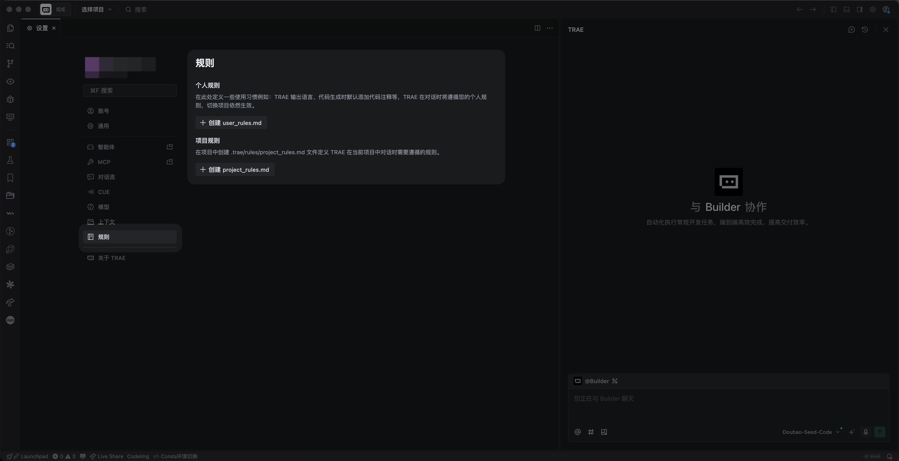

# 系统提示词

我们使用 `llms.txt` 机制来提供给大模型、智能 IDE 关于 VeADK 的提示词。

## llms.txt

`llms.txt` 提供了给大模型、智能 IDE 关于 VeADK 的提示词。您可以将下述内容提供给您的大模型或 IDE 编辑器来自动生成基于 VeADK 的代码。

## Trae

### 使用方法

1. 下载我们为您准备好的提示词文件：[llms-full.txt](../../llms-full.txt){:download}
2. 打开 Trae 中的设置界面，找到 “规则” 选项
3. 将文件内容复制到您的 Trae 规则文件中

