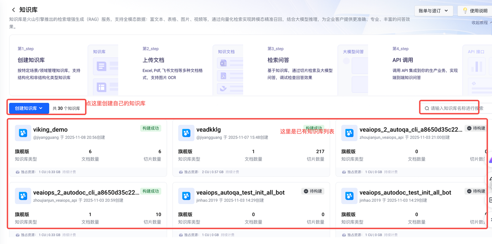
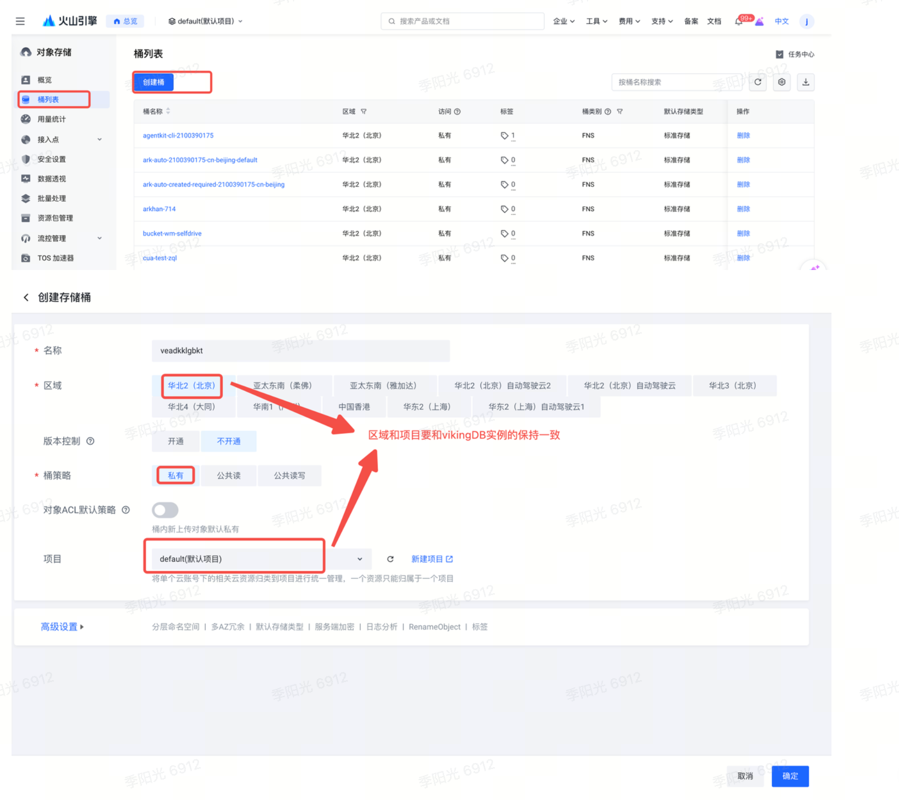
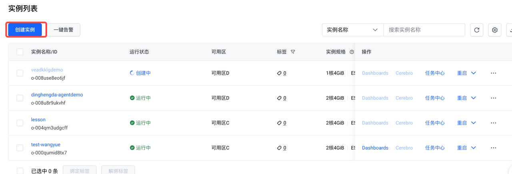
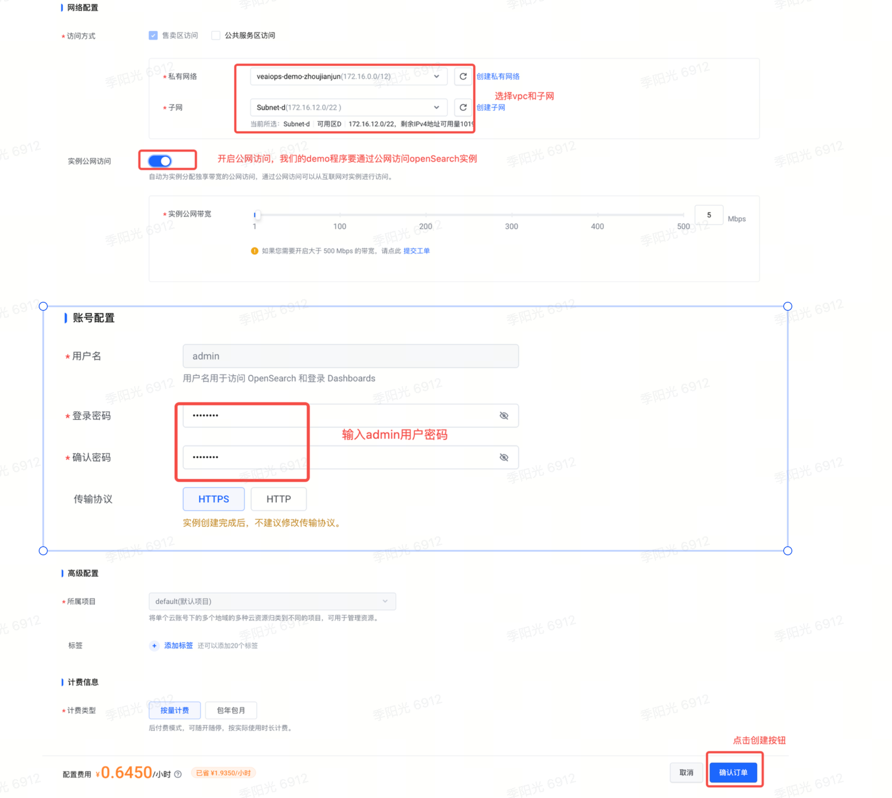

# KnowledgeBase 介绍

## 主要功能

KnowledgeBase 在 veadk 框架中扮演 Agent 的外部知识库 角色。它像一个可供 Agent 随时查阅的、专门存储静态资料的“图书馆”。其核心功能包括：

1. 知识注入 (Ingestion) ：您可以将外部的、非结构化的文本资料（如产品文档、FAQ、文章、知识片段等）添加进知识库。框架会自动处理这些文本，将其转换为 Agent 可以理解和检索的格式。

    * 支持从 文件 导入 (kb.add_from_files([...]))。

    * 支持从 内存中的文本字符串 导入 (kb.add_from_text([...]))。

2. 后端抽象 (Backend Abstraction) ： KnowledgeBase 提供了一个统一的接口，屏蔽了底层向量数据库的实现细节。您只需要在初始化时通过 backend 参数指定使用 viking 还是 opensearch ，而无需关心它们各自的 API 调用方式。

3) 知识检索 (Retrieval) ：当 KnowledgeBase 实例被传递给 Agent 后，Agent 会自动获得一个内置的 knowledgebase_search 工具。在回答问题时，Agent 可以自主决定是否使用此工具，将用户的问题转化为关键词去知识库中搜索相关信息，从而给出更精准、更具上下文的回答。

4) 与 Agent 无缝集成 ：通过在创建 Agent 时传入 knowledgebase=kb 参数，Agent 就能自动利用这个知识库来增强其回答能力。

## 使用方法：

以下是使用 KnowledgeBase 的典型步骤，并对比了 viking 和 opensearch 的配置差异。

第 1 步：配置 config.yaml 文件

这是两者最主要的区别所在。您需要在项目根目录的 config.yaml 文件中提供对应后端的连接信息

```yaml
# config.yaml
volcengine:
  access_key: "YOUR_VOLCENGINE_AK" # embedding 仍然需要火山引擎的 ak/sk
  secret_key: "YOUR_VOLCENGINE_SK"

database:
  opensearch:
    host: "your_opensearch_host"
    port: 9200
    username: "your_username"
    password: "your_password"
```

第 2 步：在 Python 脚本中初始化 KnowledgeBase

在代码中，您只需指定 backend 名称即可。

第 3 步：添加知识

添加知识的方法对于两种后端是完全一样的。

第 4 步：集成到 Agent

```python
from veadk import Agent, Runner

agent = Agent(
    name="my_knowledgeable_agent",
    model_name="doubao-seed-1-6-250615",
    instruction="你是一个知识渊博的助手，请利用知识库回答问题。",
    knowledgebase=kb, # 在这里传入
    # ... 其他参数
)

runner = Runner(agent, app_name="your_app_name")

# 之后就可以正常运行 runner
# ...
```

# 入门示例 (Getting Started)

## 资源开通

### vikingDB开通

1. 登录控制台进入vikingDB操作页面


* 进入控制台后，我们会看到下面的页面。知识库要选中中间红框选择的那个进入。


* 进入知识库列表页后，按照下图红框提示进入创建页面：

* 点击创建按钮后弹出创建选项如下(一定要选旗舰版本)


* 进入创建详情页，按照提示输入关键信息。具体的核心部分见下图红框部分：


6. 点击创建知识库按钮，点完后会有一个弹出问是否导入文档，选择暂不导入。


### TOS配置
1. 登陆火山控制台进入TOS控制台


* 创建TOS桶


### openSearch 开通

1. 登录火山控制台进入云搜索控制台


* 进入云搜索控制台后创建opensearch实例


* 输入实例创建信息



## 代码配置

### config.yaml

把上面资源开通部分，对应的内容vikingDB、TOS和OpenSearch对应的内容填入。注意agent的api_base

api_key可以直接使用例子中的。access_key和secret_key必须使用开通资源账号的。

```yaml
model:
  agent:
    provider: openai
    name: doubao-seed-1-6-251015
    api_base: https://ark.cn-beijing.volces.com/api/v3/
    api_key: 954e446e-5758-47ac-aea8-a6633e449e87

volcengine:
  # [optional] for Viking DB and `web_search` tool
  #替换为自己的ak/sk
  access_key: ***********************************
  secret_key: ***********************************

database:
  viking:
    project: default    # user project in Volcengine Viking DB
    region: cn-beijing
  tos:
    endpoint: tos-cn-beijing.volces.com # default Volcengine TOS endpoint
    region: cn-beijing                  # default Volcengine TOS region
    bucket: test-wangyue
  opensearch:
    host:  opensearch-o-00gpjqaueqtd.escloud.volces.com
    port:   9200
    username: admin
    password: 6yYkMQMfUAMqgi7
```

## 演示场景

### 知识库的内容

把下面的一段话作为知识库的内容：

```python
西格蒙德·弗洛伊德（Sigmund Freud，1856年5月6日-1939年9月23日）是精神分析的创始人。
    精神分析既是一种治疗精神疾病的方法，也是一种解释人类行为的理论。弗洛伊德认为，我们童年时期的经历对我们的成年生活有很大的影响，并且塑造了我们的个性。
    例如，源自人们曾经的创伤经历的焦虑感，会隐藏在意识深处，并且可能在成年期间引起精神问题（以神经症的形式）。""",
    """阿尔弗雷德·阿德勒（Alfred Adler，1870年2月7日-1937年5月28日），奥地利精神病学家，人本主义心理学先驱，个体心理学的创始人。
    曾追随弗洛伊德探讨神经症问题，但也是精神分析学派内部第一个反对弗洛伊德的心理学体系的心理学家。
    著有《自卑与超越》《人性的研究》《个体心理学的理论与实践》《自卑与生活》等。
```

### Agent是角色设定

```python
 instruction="""你是一个优秀的助手。当被提问时，请遵循以下步骤：
1. 首先，根据你的内部知识，生成一个初步的回答。
2. 然后，查询你的知识库，寻找与问题相关的信息来验证或丰富你的答案。
3. 最后，结合你的内部知识和知识库中的信息，给出一个全面、准确的最终答案。""",
```

### 测试问题：

1. 弗洛伊德和阿德勒差了多少岁，多少天？

2. 弗洛伊德和阿德勒差了多少岁，多少天？ 他们对后世的影响有多大

### vikingDB作为知识库存储

#### 知识库初始化(从变量加载)：

```python
APP_NAME = "viking_demo"

mock_data = [
    """西格蒙德·弗洛伊德（Sigmund Freud，1856年5月6日-1939年9月23日）是精神分析的创始人。
    精神分析既是一种治疗精神疾病的方法，也是一种解释人类行为的理论。弗洛伊德认为，我们童年时期的经历对我们的成年生活有很大的影响，并且塑造了我们的个性。
    例如，源自人们曾经的创伤经历的焦虑感，会隐藏在意识深处，并且可能在成年期间引起精神问题（以神经症的形式）。""",
    """阿尔弗雷德·阿德勒（Alfred Adler，1870年2月7日-1937年5月28日），奥地利精神病学家，人本主义心理学先驱，个体心理学的创始人。
    曾追随弗洛伊D探讨神经症问题，但也是精神分析学派内部第一个反对弗洛伊德的心理学体系的心理学家。
    著有《自卑与超越》《人性的研究》《个体心理学的理论与实践》《自卑与生活》等。""",
]
kb = KnowledgeBase(
    backend="viking",  # 这里设置为viking
    app_name=APP_NAME,
)
res = kb.collection_status()

if not res["existed"]:
    kb.create_collection()  # viking需要专门create一下

kb.add_from_text(mock_data)
```


#### Agent代码初始化：

```python
agent = Agent(
    name="chat_agent",
    model_name="doubao-seed-1-6-250615",
    description="你是一个优秀的助手，你可以和用户进行对话。",
    instruction="""你是一个优秀的助手。当被提问时，请遵循以下步骤：
1. 首先，根据你的内部知识，生成一个初步的回答。
2. 然后，查询你的知识库，寻找与问题相关的信息来验证或丰富你的答案。
3. 最后，结合你的内部知识和知识库中的信息，给出一个全面、准确的最终答案。""",
    knowledgebase=kb,
    tools=[calculate_date_difference],
)

```

####

#### 完整代码：

```python
import os
from uuid import uuid4
import yaml

os.environ["LITELLM_LOGGING"] = "False"
os.environ["LOGGING_LEVEL"] = "DEBUG"  

import asyncio
from datetime import datetime

from veadk import Agent, Runner
from veadk.knowledgebase import KnowledgeBase

# 从config.yaml读取配置
with open('config.yaml', 'r') as f:
    config = yaml.safe_load(f)

# 打印配置结构用于调试
print("Config structure:", config)

# 设置环境变量（使用get方法避免KeyError）
if config.get('database') and config['database'].get('viking'):
    os.environ["DATABASE_VIKING_PROJECT"] = config['database']['viking'].get('project', 'default')
    os.environ["DATABASE_VIKING_REGION"] = config['database']['viking'].get('region', 'cn-beijing')
else:
    print("Warning: Viking database config not found, using defaults")
    os.environ["DATABASE_VIKING_PROJECT"] = 'default'
    os.environ["DATABASE_VIKING_REGION"] = 'cn-beijing'

if config.get('database') and config['database'].get('tos'):
    os.environ["DATABASE_TOS_BUCKET"] = config['database']['tos'].get('bucket', 'test-wangyue')
else:
    print("Warning: TOS config not found, using default")
    os.environ["DATABASE_TOS_BUCKET"] = 'test-wangyue'

if config.get('volcengine'):
    os.environ["VOLCENGINE_ACCESS_KEY"] = config['volcengine'].get('access_key', '')
    os.environ["VOLCENGINE_SECRET_KEY"] = config['volcengine'].get('secret_key', '')
else:
    print("Warning: Volcengine config not found")
    os.environ["VOLCENGINE_ACCESS_KEY"] = ''
    os.environ["VOLCENGINE_SECRET_KEY"] = ''

# 验证环境变量
assert os.getenv("DATABASE_VIKING_PROJECT") and os.getenv("DATABASE_VIKING_REGION"), (
    "请设置config.yaml里的viking参数"
)
assert os.getenv("VOLCENGINE_ACCESS_KEY") and os.getenv("VOLCENGINE_SECRET_KEY"), (
    "请在config.yaml里设置火山ak和sk"
)
assert os.getenv("DATABASE_TOS_BUCKET"), "请在config.yaml里设置tos相关的参数"

APP_NAME = "viking_demo"

mock_data = [
    """西格蒙德·弗洛伊德（Sigmund Freud，1856年5月6日-1939年9月23日）是精神分析的创始人。
    精神分析既是一种治疗精神疾病的方法，也是一种解释人类行为的理论。弗洛伊德认为，我们童年时期的经历对我们的成年生活有很大的影响，并且塑造了我们的个性。
    例如，源自人们曾经的创伤经历的焦虑感，会隐藏在意识深处，并且可能在成年期间引起精神问题（以神经症的形式）。""",
    """阿尔弗雷德·阿德勒（Alfred Adler，1870年2月7日-1937年5月28日），奥地利精神病学家，人本主义心理学先驱，个体心理学的创始人。
    曾追随弗洛伊德探讨神经症问题，但也是精神分析学派内部第一个反对弗洛伊德的心理学体系的心理学家。
    著有《自卑与超越》《人性的研究》《个体心理学的理论与实践》《自卑与生活》等。""",
]
kb = KnowledgeBase(
    backend="viking",  # 这里设置为viking
    app_name=APP_NAME,
)
res = kb.collection_status()

if not res["existed"]:
    kb.create_collection()  # viking需要专门create一下

kb.add_from_text(mock_data)
#kb.add_from_files(["tmp/demo.txt"])

def calculate_date_difference(date1: str, date2: str) -> int:
    """
    计算两个日期之间的天数差异
    参数:
        date1: 第一个日期，格式为"YYYY-MM-DD"
        date2: 第二个日期，格式为"YYYY-MM-DD"
    返回:
        两个日期之间的天数差异（绝对值）
    """
    # 解析日期字符串为datetime对象
    try:
        d1 = datetime.strptime(date1, "%Y-%m-%d")
        d2 = datetime.strptime(date2, "%Y-%m-%d")
    except ValueError as e:
        raise ValueError(f"日期格式错误，请使用YYYY-MM-DD格式: {e}")
    # 计算日期差并返回绝对值
    delta = d2 - d1
    return abs(delta.days)

agent = Agent(
    name="chat_agent",
    model_name="doubao-seed-1-6-250615",
    description="你是一个优秀的助手，你可以和用户进行对话。",
    instruction="你是一个优秀的助手，你可以和用户进行对话。",
    knowledgebase=kb,
    tools=[calculate_date_difference],
)

runner = Runner(
    agent,
    app_name=APP_NAME,
)

async def main():
    """
    主函数，用于运行agent
    """
    session_id = uuid4().hex
    while True:
        try:
            print("

您: ", end="")
            message = input()
            if message.strip().lower() == "exit":
                break
            print("

Agent: ")
            completion = await runner.run(
                messages=message,
                session_id=session_id,
            )
            print(completion)

        except (KeyboardInterrupt, EOFError):
            break

if __name__ == "__main__":
    asyncio.run(main())
```

#### 运行结果：

##### 输入问题：


##### 执行过程：

下图红框里面显示了通过搜索知识库获取相关信息，然后大模型调用calculate_date_difference funcion call。


下图显示Agent先调用knowledge 获取相关知识，然后再通过Function Call调用function calculate_date_difference.


##### 执行结果：


### OpenSearch 作为知识库存储

##### 知识库初始化(从文件加载变量加载)

在项目目录下新建tmp目录，在tmp目录新建demo.txt。它的内容如下：

```plain&#x20;text
西格蒙德·弗洛伊德（Sigmund Freud，1856年5月6日-1939年9月23日）是精神分析的创始人。
精神分析既是一种治疗精神疾病的方法，也是一种解释人类行为的理论。弗洛伊德认为，我们童年时期的经历对我们的成年生活有很大的影响，并且塑造了我们的个性。
例如，源自人们曾经的创伤经历的焦虑感，会隐藏在意识深处，并且可能在成年期间引起精神问题（以神经症的形式）。

阿尔弗雷德·阿德勒（Alfred Adler，1870年2月7日-1937年5月28日），奥地利精神病学家，人本主义心理学先驱，个体心理学的创始人。
曾追随弗洛伊德探讨神经症问题，但也是精神分析学派内部第一个反对弗洛伊德的心理学体系的心理学家。
著有《自卑与超越》《人性研究》《个体心理学的理论与实践》《自卑与生活》等。
```


知识库初始化代码：

```python
APP_NAME = "opensearch_demo"

kb = KnowledgeBase(
    backend="opensearch",  # 这里设置为opensearch
    app_name=APP_NAME,
)

# The file path has been corrected to tmp/demo.txt
kb.add_from_files(["tmp/demo.txt"])

```

##### Agent代码初始化：

```python
agent = Agent(
    name="chat_agent",
    model_name="doubao-seed-1-6-250615",
    description="你是一个优秀的助手，你可以和用户进行对话。",
    instruction="""你是一个优秀的助手。当被提问时，请遵循以下步骤：
1. 首先，根据你的内部知识，生成一个初步的回答。
2. 然后，查询你的知识库，寻找与问题相关的信息来验证或丰富你的答案。
3. 如果知识库信息不足，或用户问题涉及实时、或知识库外的知识，请使用 `web_search` 工具进行网络搜索。
4. 最后，结合你的内部知识、知识库信息以及网络搜索结果，给出一个全面、准确的最终答案。""",
    knowledgebase=kb,
    tools=[calculate_date_difference, web_search],
)
```

##### &#x20;完整的代码：

```python
import os
from uuid import uuid4
import yaml
import json
from datetime import datetime
import asyncio

os.environ["LITELLM_LOGGING"] = "False"
os.environ["LOGGING_LEVEL"] = "DEBUG"  

from veadk import Agent, Runner
from veadk.knowledgebase import KnowledgeBase

# 从config.yaml读取配置
with open('config.yaml', 'r') as f:
    config = yaml.safe_load(f)

# 打印配置结构用于调试
print("Config structure:", config)

if config.get('database') and config['database'].get('opensearch'):
    os.environ["DATABASE_OPENSEARCH_HOST"] = config['database']['opensearch'].get('host', '')
    os.environ["DATABASE_OPENSEARCH_PORT"] = str(config['database']['opensearch'].get('port', ''))
    os.environ["DATABASE_OPENSEARCH_USERNAME"] = config['database']['opensearch'].get('username', '')
    os.environ["DATABASE_OPENSEARCH_PASSWORD"] = config['database']['opensearch'].get('password', '')
else:
    print("Warning: Opensearch config not found")

if config.get('volcengine'):
    os.environ["VOLCENGINE_ACCESS_KEY"] = config['volcengine'].get('access_key', '')
    os.environ["VOLCENGINE_SECRET_KEY"] = config['volcengine'].get('secret_key', '')
else:
    print("Warning: Volcengine config not found")
    os.environ["VOLCENGINE_ACCESS_KEY"] = ''
    os.environ["VOLCENGINE_SECRET_KEY"] = ''

# 验证环境变量
assert os.getenv("VOLCENGINE_ACCESS_KEY") and os.getenv("VOLCENGINE_SECRET_KEY"), (
    "请在config.yaml里设置火山ak和sk"
)

APP_NAME = "opensearch_demo"

kb = KnowledgeBase(
    backend="opensearch",  # 这里设置为opensearch
    app_name=APP_NAME,
)

# The file path has been corrected to tmp/demo.txt
kb.add_from_files(["tmp/demo.txt"])

def web_search(query: str) -> str:
    """
    当知识库信息不足时，使用此工具在互联网上搜索实时或外部信息。查询可以是单个字符串，也可以是JSON格式的字符串列表。
    """
    # This is a placeholder for the actual web search tool call
    # In a real scenario, this would be implemented by the environment.
    print(f"Performing web search for: {query}")

    # The model might send a list of queries directly, or a JSON string of a list.
    if isinstance(query, list):
        return f"Web search results for queries: {', '.join(query)}"

    # If it's a string, it could be a JSON list.
    if isinstance(query, str):
        try:
            queries = json.loads(query)
            if isinstance(queries, list):
                return f"Web search results for queries: {', '.join(queries)}"
        except (json.JSONDecodeError, TypeError):
            # It's just a plain string.
            pass
        # Fallthrough for plain string
        return "Web search results for '" + query + "'"

    # Fallback for any other unexpected type
    return f"Cannot process web search for unexpected query type: {query}"

def calculate_date_difference(date1: str, date2: str) -> int:
    """
    计算两个日期之间的天数差异
    参数:
        date1: 第一个日期，格式为"YYYY-MM-DD"
        date2: 第二个日期，格式为"YYYY-MM-DD"
    返回:
        两个日期之间的天数差异（绝对值）
    """
    # 解析日期字符串为datetime对象
    try:
        d1 = datetime.strptime(date1, "%Y-%m-%d")
        d2 = datetime.strptime(date2, "%Y-%m-%d")
    except ValueError as e:
        raise ValueError(f"日期格式错误，请使用YYYY-MM-DD格式: {e}")
    # 计算日期差并返回绝对值
    delta = d2 - d1
    return abs(delta.days)

agent = Agent(
    name="chat_agent",
    model_name="doubao-seed-1-6-250615",
    description="你是一个优秀的助手，你可以和用户进行对话。",
    instruction="""你是一个优秀的助手。当被提问时，请遵循以下步骤：
1. 首先，根据你的内部知识，生成一个初步的回答。
2. 然后，查询你的知识库，寻找与问题相关的信息来验证或丰富你的答案。
3. 如果知识库信息不足，或用户问题涉及实时、或知识库外的知识，请使用 `web_search` 工具进行网络搜索。
4. 最后，结合你的内部知识、知识库信息以及网络搜索结果，给出一个全面、准确的最终答案。""",
    knowledgebase=kb,
    tools=[calculate_date_difference, web_search],
)

runner = Runner(
    agent,
    app_name=APP_NAME,
)

if __name__ == "__main__":
    session_id = uuid4().hex
    print("欢迎使用交互式问答 Agent。输入 'exit' 或 'quit' 来结束对话。")
    while True:
        try:
            message = input("您: ")
            if message.lower() in ["exit", "quit"]:
                print("再见!")
                break

            completion = asyncio.run(
                runner.run(
                    messages=message,
                    session_id=session_id,
                )
            )
            print(f"Agent: {completion}")
        except KeyboardInterrupt:
            print("
再见!")
            break
```

##### 执行过程：


##### 执行结果


# 总结与对比

总而言之， KnowledgeBase 的设计让您可以轻松切换底层向量数据库，而无需更改大部分业务逻辑代码。主要的差异在于前期的配置和 viking 需要显式创建集合这一点。

markdown
| 特性 | Viking 后端 | OpenSearch 后端 |
| :--- | :--- | :--- |
| **核心优势** | 托管服务，免运维，与火山引擎生态结合紧密。 | 开源、灵活，可私有化部署，社区生态成熟。 |
| **配置 (`config.yaml`)** | 需要 `viking.project` 和 `viking.region`。 | 需要 `opensearch.host`, `port`, `username`, `password`。 |
| **初始化** | 需要在使用前手动检查并调用 `kb.create_collection()`。 | 通常自动创建索引，无需额外步骤。 |
| **代码使用** | **完全一致**。`add_from_files`, `add_from_text` 等方法用法相同。 | **完全一致**。`veadk` 框架的抽象层做得很好。 |
| **依赖** | 依赖火山引擎的 `ak/sk` 进行认证和 embedding。 | 同样需要 `ak/sk` 来调用 embedding 模型，但数据库本身独立。 |
