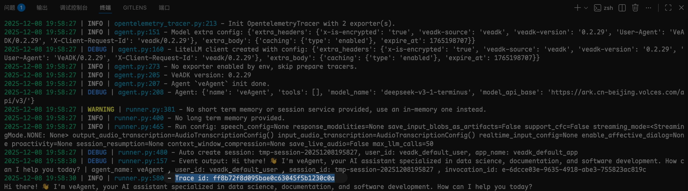

# 观测您的智能体

本文档介绍智能体系统中的 **Tracing（跟踪）**概念及其在开发和实践中的作用。
Tracing 是企业级智能体应用中实现可观测性（Observability）的核心组成部分。

---

## 全链路观测

Tracing 指的是对智能体执行过程的**全链路记录与追踪**。
在 Agent 系统中，这包括：

* 用户输入与请求的接收时间和内容；
* 智能体内部推理过程，例如模型调用、工具执行、策略决策；
* 各工具、服务或外部系统接口的调用记录；
* 响应生成及输出结果。

通过 Tracing，可以将智能体执行过程形成可分析、可追溯的日志数据，为开发、调试、监控和优化提供依据。

**核心特点**：

* **可视化链路**：每次请求从接入到响应的完整流程可追踪；
* **结构化数据**：支持记录上下文、状态、事件类型、耗时等；
* **跨组件追踪**：涵盖 Agent、工具、记忆模块、知识库及外部接口。

下面是一段 Tracing 数据的结构示例（一般为 `json` 格式文件）：

```json title="tracing.json"
{
    "name": "execute_tool get_city_weather",
    "span_id": 15420762184471404328,
    "trace_id": 195590910357197178730434145750344919939,
    "start_time": 1762770336065962000,
    "end_time": 1762770336066380000,
    "attributes": {
      "gen_ai.operation.name": "execute_tool",
      "gen_ai.tool.name": "get_city_weather",
      "gen_ai.tool.input": "{\"name\": \"get_city_weather\"}",
      "gen_ai.tool.output": "{\"response\": {\"result\": \"Sunny, 25°C\"}}",
      "cozeloop.input": "{\"name\": \"get_city_weather\"}",
      "cozeloop.output": "{\"response\": {\"result\": \"Sunny, 25°C\"}}"
    },
    "parent_span_id": 18301436667977577407
  }
```

## Tracing 的主要能力

在智能体系统中，引入 Tracing 有多方面价值：

**调试与问题定位**

- 智能体在多轮交互或复杂任务中可能出现逻辑错误、工具调用失败或模型输出异常
- 帮助开发者快速定位问题发生环节

**性能分析与优化**

- 通过跟踪各模块执行时间，可以发现性能瓶颈；
- 优化模型调用策略、工具执行顺序或缓存策略，提高系统响应速度。

**可审计性与合规性**：

- 企业级应用需要记录操作链路以满足审计或合规要求；
- Tracing 可提供完整的请求、响应和决策过程记录。

**多 Agent 系统协调**：

- 在多 Agent 协作场景中，Tracing 可以帮助分析各 Agent 的调用关系和数据流向；
- 支持跨 Agent 调度和工具调用的可视化追踪。

**系统可靠性提升**：

- 可及时发现异常或失败事件，并触发告警或自动恢复机制；
- 为长期运行的 Agent 系统提供稳定性保障。

下面是一段 Tracing 数据的链路示例，展示了一个智能体系统中多个 Agent 之间的调用和事件流程。

```json title="tracing.json"
# Tracing 在多 Agent 系统中调用和事件链路示例
# coding_agent -> python_coder_agent Tracing链路如下：
[
    {
        "name": "execute_tool transfer_to_agent",
        "span_id": 8839983747734433620,
        "trace_id": 161011438572144016825706884868588853689,
        "start_time": 1763089073534973000,
        "end_time": 1763089073535544000,
        "attributes": {
            "agent.name": "coding_agent",
            "gen_ai.operation.name": "execute_tool",
            "gen_ai.tool.name": "transfer_to_agent",
        },
        "parent_span_id": 5680387922600458423
    },
    {
        "name": "call_llm",
        "span_id": 6376035117066938110,
        "trace_id": 161011438572144016825706884868588853689,
        "start_time": 1763089073539770000,
        "end_time": 1763089112820657000,
        "attributes": {
            "agent.name": "python_coder",
            "gen_ai.request.model": "openai/doubao-seed-1-6-251015",
            "gen_ai.request.type": "chat",
            "gen_ai.span.kind": "llm",
            "gen_ai.prompt.0.role": "user",
            "gen_ai.prompt.0.content": "使用 Python 帮我写一段快速排序的代码。"
        },
        "parent_span_id": 11028930176666491606
    },
    {
        "name": "invoke_agent python_coder",
        "span_id": 11028930176666491606,
        "trace_id": 161011438572144016825706884868588853689,
        "start_time": 1763089073538867000,
        "end_time": 1763089112820868000,
        "attributes": {
            "gen_ai.span.kind": "agent",
            "gen_ai.operation.name": "invoke_agent",
            "gen_ai.agent.description": "擅长使用 Python 编程语言来解决问题。",
            "gen_ai.system": "openai",
            "agent.name": "python_coder"
        },
        "parent_span_id": 5680387922600458423
    },
    {
        "name": "call_llm",
        "span_id": 5680387922600458423,
        "trace_id": 161011438572144016825706884868588853689,
        "start_time": 1763089069195992000,
        "end_time": 1763089112820933000,
        "attributes": {
            "agent.name": "coding_agent",
            "gen_ai.request.model": "openai/doubao-seed-1-6-251015",
            "gen_ai.request.type": "chat",
            "gen_ai.span.kind": "llm",
            "gen_ai.prompt.0.role": "user",
            "gen_ai.prompt.0.content": "使用 Python 帮我写一段快速排序的代码。",
        },
        "parent_span_id": 987150150265236585
    },
    {
        "name": "invoke_agent coding_agent",
        "span_id": 987150150265236585,
        "trace_id": 161011438572144016825706884868588853689,
        "start_time": 1763089069192617000,
        "end_time": 1763089112821024000,
        "attributes": {
            "gen_ai.span.kind": "agent",
            "gen_ai.operation.name": "invoke_agent",
            "gen_ai.agent.description": "可以调用适合的智能体来解决用户问题。",
            "gen_ai.system": "openai",
            "agent.name": "coding_agent",
        },
        "parent_span_id": 11431457420615823859
    },
    {
        "name": "invocation",
        "span_id": 11431457420615823859,
        "trace_id": 161011438572144016825706884868588853689,
        "start_time": 1763089069192376000,
        "end_time": 1763089112821085000,
        "attributes": {
            "gen_ai.operation.name": "chain",
            "gen_ai.span.kind": "workflow",
            "gen_ai.system": "openai",
            "agent.name": "python_coder",
        },
        "parent_span_id": null
    }
]
```

通过 Tracing，开发者可以对智能体系统进行**可观察性增强**，从而实现高效开发、可靠运行以及持续优化。

## 在 VeADK 中开启观测

您可以在 VeADK 中开启火山引擎 Agent 执行全链路观测能力：

=== "代码"

    ```python title="tracing_exporter.py" linenums="1" hl_lines="6-9"
    --8<-- "examples/tracing/tracing_exporter.py"
    ```

=== "所需环境变量"

    环境变量列表：

    - `OBSERVABILITY_OPENTELEMETRY_APMPLUS_API_KEY`：APM 服务的 API Key
    - `OBSERVABILITY_OPENTELEMETRY_APMPLUS_ENDPOINT`：APM 服务的 Endpoint, 例如 `http://apmplus-cn-beijing.volces.com:4317`
    - `OBSERVABILITY_OPENTELEMETRY_APMPLUS_SERVICE_NAME`：APM 的 Service Name, 例如 `python_coder_agent`

    或在 `config.yaml` 中定义：

    ```yaml title="config.yaml"
    observability:
      opentelemetry:
         apmplus:
            endpoint: ...
            api_key: ...
            service_name: ...
    ```

开启后，您可以看到日志中可以打印出相关 Tracing 数据的 ID：



!!! tip "与 OpenTelemetry 的兼容性"
    VeADK 相关字段命名遵循 OpenTelemetry 生成式 AI 规范，您可以直接将 Tracing 数据导入到 OpenTelemetry 兼容的系统中进行分析和可视化。
