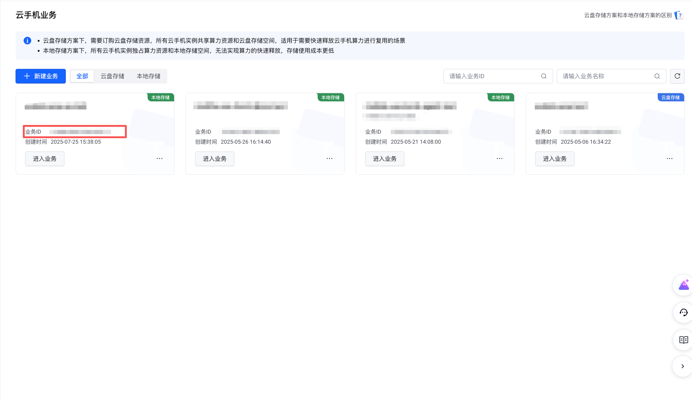
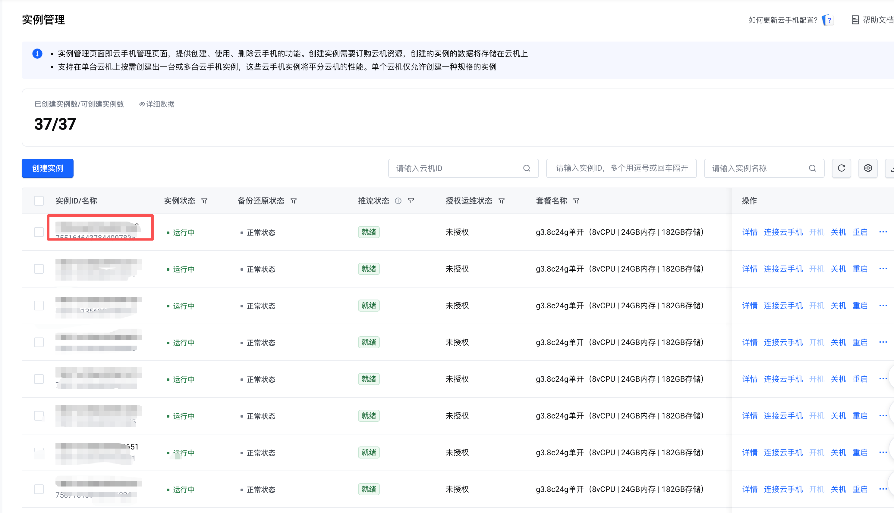
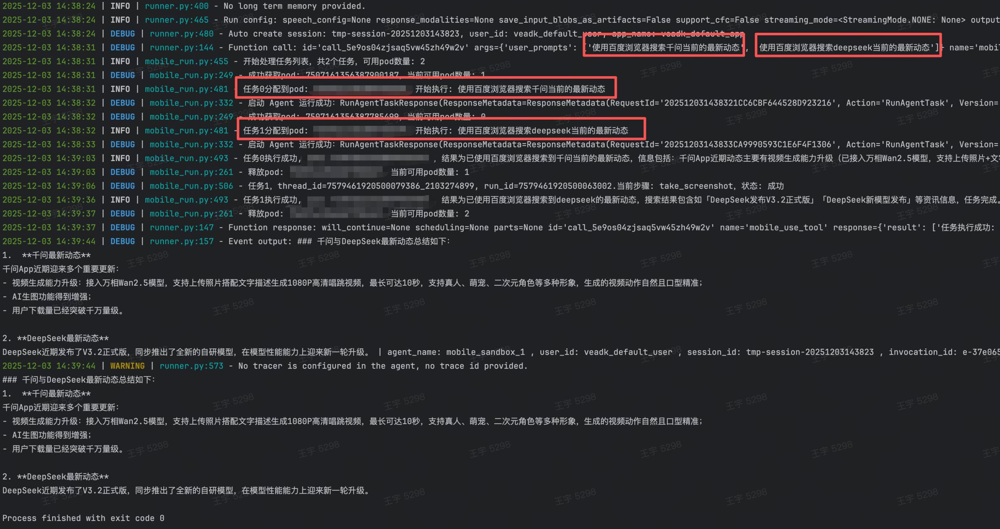

# 内置工具使用指南

本文档旨在说明如何有效利用 VeADK 内置工具（BuiltinTools）。这些工具提供了即用型功能（如网页搜索或代码执行器），赋予 Agent 通用能力。例如，需要从网络检索信息的 Agent 可直接使用 **web_search** 工具，无需额外配置。

## 使用方法

1.  **导入**：从 `veadk.tools.builtin_tools` 模块导入所需工具。
2.  **配置**：初始化工具并按需提供参数。
3.  **注册**：将工具实例添加至 Agent 的 `tools` 列表。

=== "Python"

    ```python
    from veadk import Agent
    from veadk.tools.builtin_tools.web_search import websearch
    
    # 在 Agent 初始化时注册工具
    # Agent(tools=[websearch], other_params...)
    ```

=== "Golang"

    ```golang
    import (
        "log"
    
        veagent "github.com/volcengine/veadk-go/agent/llmagent"
        "github.com/volcengine/veadk-go/tool/builtin_tools/web_search"
        "google.golang.org/adk/agent/llmagent"
        "google.golang.org/adk/tool"
    )
    
    func main() {
        webSearch, err := web_search.NewWebSearchTool(&web_search.Config{})
        if err != nil {
            log.Fatalf("NewWebSearchTool failed: %v", err)
            return
        }
        cfg := veagent.Config{
            Config: llmagent.Config{
                Tools: []tool.Tool{webSearch},
            },
        }
        veAgent, err := veagent.New(&cfg)
        if err != nil {
            log.Fatalf("NewLLMAgent failed: %v", err)
            return
        }
    }
    ```

工具注册后，Agent 会根据 **用户提示** 和 **指令** 自主决定是否调用。框架将在调用时自动执行工具。

> **重要提示**：请务必查阅本文档末尾的“限制条件”部分。

## 工具列表

VeADK 集成了以下火山引擎工具：

| 工具名称 | 功能说明 | 导入路径 |
| :--- | :--- | :--- |
| `web_search` | 通过[融合信息搜索 API](https://www.volcengine.com/docs/85508/1650263) 进行全网搜索。 | `from veadk.tools.builtin_tools.web_search import web_search` |
| `web_scraper` | 聚合搜索（邀测），代码详见[此处](https://github.com/volcengine/mcp-server/tree/main/server)。 | `from veadk.tools.builtin_tools.web_scraper import web_scraper` |
| `vesearch` | 调用[联网问答 Agent](https://www.volcengine.com/docs/85508/1512748) 进行搜索，支持头条搜索等。 | `from veadk.tools.builtin_tools.vesearch import vesearch` |
| `image_generate` | 根据文本描述[生成图片](https://www.volcengine.com/docs/82379/1541523)。 | `from veadk.tools.builtin_tools.image_generate import image_generate` |
| `image_edit` | [编辑图片](https://www.volcengine.com/docs/82379/1541523)（图生图）。 | `from veadk.tools.builtin_tools.image_edit import image_edit` |
| `video_generate` | 根据文本描述[生成视频](https.www.volcengine.com/docs/82379/1520757)。 | `from veadk.tools.builtin_tools.video_generate import video_generate` |
| `run_code` | 在 [AgentKit 沙箱](https://console.volcengine.com/agentkit-ppe/region:agentkit-ppe+cn-beijing/builtintools)中执行代码。 | `from veadk.tools.builtin_tools.run_code import run_code` |
| `lark` | 集成[飞书开放能力](https://open.larkoffice.com/document/uAjLw4CM/ukTMukTMukTM/mcp_integration/mcp_installation)，实现文档处理、会话管理等。 | `from veadk.tools.builtin_tools.lark import lark` |
| `las` | 基于[火山引擎 AI 多模态数据湖服务 LAS](https://www.volcengine.com/mcp-marketplace) 进行数据管理。 | `from veadk.tools.builtin_tools.las import las` |
| `mobile_run` | 手机指令执行   | `from veadk.tools.builtin_tools.mobile_run import create_mobile_use_tool` |

### 公域搜索 (Web Search)

`web_search` 工具允许 Agent 通过融合信息搜索的 API 进行搜索。详情请参考[融合信息搜索 API 文档](https://www.volcengine.com/docs/85508/1650263)。

!!! warning "使用 `web_search` 工具的附加要求"
    1. 需要配置火山引擎 AK、SK 或者使用火山引 IAM 授权的临时 StsToken 
    2. 需要配置用于 Agent 推理模型的API Key

=== "Python"

    ```python
    --8<-- "examples/tools/web_search/agent.py"
    ```

=== "Golang"

    ```golang
    --8<-- "examples/tools/web_search/agent.go"
    ```


=== "环境变量"

    环境变量列表：

    - `MODEL_AGENT_API_KEY`：  用于 Agent 推理模型 API Key
    - `VOLCENGINE_ACCESS_KEY`：用于调用WebSearch的火山引擎的AccessKey
    - `VOLCENGINE_SECRET_KEY`：用于调用WebSearch的火山引擎的SecretKey

    或在 `config.yaml` 中定义：

    ```yaml title="config.yaml"
    model:
      agent:
        provider: openai
        name: doubao-seed-1-6-250615
        api_base: https://ark.cn-beijing.volces.com/api/v3/
        api_key: your-api-key-here
    volcengine:
        # [optional] for Viking DB and `web_search` tool
      access_key: you-access-key-here
      secret_key: you-secret-key-here

    ```

运行结果：


### 火山引擎搜索(VeSearch)

`vesearch` 工具允许Agent通过调用火山引擎的联网问答Agent来进行搜索，详情请参考[联网问答 Agent](https://www.volcengine.com/docs/85508/1512748)。

!!! warning "使用 `vesearch` 工具的附加要求"
    1. 需要配置火山引擎 AK、SK 或者使用火山引 IAM 授权的临时 StsToken 
    2. 需要配置用于 Agent 推理模型的API Key
    3. 需要配置联网问答 Agent 的智能体ID，在控制台创建智能体后获取，[控制台地址](https://console.volcengine.com/ask-echo/my-agent)。配置项名称为：`TOOL_VESEARCH_ENDPOINT`。

=== "代码"

    ```python
    --8<-- "examples/tools/vesearch/agent.py"
    ```

=== "环境变量"

    环境变量列表：

    - `MODEL_AGENT_API_KEY`：  用于 Agent 推理模型 API Key
    - `VOLCENGINE_ACCESS_KEY`：用于调用WebSearch的火山引擎的AccessKey
    - `VOLCENGINE_SECRET_KEY`：用于调用WebSearch的火山引擎的SecretKey
    - `TOOL_VESEARCH_ENDPOINT`：  用于 联网问答 Agent 的智能体ID。注：**必须配置在环境变量里面**

    或在 `config.yaml` 中定义：

    ```yaml title="config.yaml"
    model:
      agent:
        provider: openai
        name: doubao-seed-1-6-250615
        api_base: https://ark.cn-beijing.volces.com/api/v3/
        api_key: your-api-key-here
    volcengine:
        # [optional] for Viking DB and `web_search` tool
      access_key: you-access-key-here
      secret_key: you-secret-key-here

    ```

运行结果：


### 代码执行(Run Code)

`run_code` 工具使代理能够执行代码。允许模型执行计算、数据处理或运行小程序等任务。

!!! warning "使用 `run_code` 工具的附加要求"
    1. 需要配置火山引擎 AK、SK 或者使用火山引 IAM 授权的临时 StsToken 
    2. 需要配置用于 Agent 推理模型的 API Key
    3. 需要配置 AgentKit Tools Id，详见：***AgentKit 沙箱工具（Tools）*** 章节部分

=== "代码"

    ```python
    --8<-- "examples/tools/run_code/agent.py"
    ```

=== "环境变量"

    以下是必须在环境变量里面的配置项：

    - `AGENTKIT_TOOL_ID`：用于调用火山引擎AgentKit Tools的沙箱环境Id
    - `AGENTKIT_TOOL_HOST`：用于调用火山引擎AgentKit Tools的EndPoint
    - `AGENTKIT_TOOL_SERVICE_CODE`：用于调用AgentKit Tools的ServiceCode
    - `AGENTKIT_TOOL_SCHEME`：用于切换调用 AgentKit Tools 的协议，允许 `http`/`https`，默认 `https`

    环境变量列表：

    - `MODEL_AGENT_API_KEY`：  用于 Agent 推理模型 API Key
    - `VOLCENGINE_ACCESS_KEY`：用于调用WebSearch的火山引擎的AccessKey
    - `VOLCENGINE_SECRET_KEY`：用于调用WebSearch的火山引擎的SecretKey

    或在 `config.yaml` 中定义：

    ```yaml title="config.yaml"
    model:
      agent:
        provider: openai
        name: doubao-seed-1-6-250615
        api_base: https://ark.cn-beijing.volces.com/api/v3/
        api_key: your-api-key-here
    volcengine:
        # [optional] for Viking DB and `web_search` tool
      access_key: you-access-key-here
      secret_key: you-secret-key-here

    ```

运行结果：


### 图像生成工具(Image Generate)

`image_generate` 该工具可以根据用户的描述生成图像

!!! warning "使用 `image_generate` 工具的附加要求"
    1. 需要配置用于 Agent 推理模型的 API Key
    2. 需要配置用于 Agent 推理图像生成的模型名称
    

=== "Python"

    ```python
    --8<-- "examples/tools/image_generate/agent.py"
    ```

=== "Golang"

    ```go
    package main

    import (
        "context"
        "fmt"
        "log"
        "os"
    
        "github.com/a2aproject/a2a-go/a2asrv"
        "github.com/google/uuid"
        veagent "github.com/volcengine/veadk-go/agent/llmagent"
        "github.com/volcengine/veadk-go/common"
        "github.com/volcengine/veadk-go/tool/builtin_tools"
        "google.golang.org/adk/agent"
        "google.golang.org/adk/agent/llmagent"
        "google.golang.org/adk/artifact"
        "google.golang.org/adk/cmd/launcher"
        "google.golang.org/adk/cmd/launcher/full"
        "google.golang.org/adk/model"
        "google.golang.org/adk/session"
        "google.golang.org/adk/tool"
    )

    func main() {
        ctx := context.Background()
        cfg := &veagent.Config{
            ModelName:    common.DEFAULT_MODEL_AGENT_NAME,
            ModelAPIBase: common.DEFAULT_MODEL_AGENT_API_BASE,
            ModelAPIKey:  os.Getenv(common.MODEL_AGENT_API_KEY),
        }
        cfg.Name = "image_generate_tool_agent"
        cfg.Description = "Agent to generate images based on text descriptions or images."
        cfg.Instruction = "I can generate images based on text descriptions or images."
        cfg.AfterModelCallbacks = []llmagent.AfterModelCallback{saveReportfunc}
    
        imageGenerate, err := builtin_tools.NewImageGenerateTool(&builtin_tools.ImageGenerateConfig{
            ModelName: common.DEFAULT_MODEL_IMAGE_NAME,
            BaseURL:   common.DEFAULT_MODEL_IMAGE_API_BASE,
            APIKey:    os.Getenv(common.MODEL_IMAGE_API_KEY),
        })
        if err != nil {
            fmt.Printf("NewLLMAgent failed: %v", err)
            return
        }
    
        cfg.Tools = []tool.Tool{imageGenerate}
    
        sessionService := session.InMemoryService()
        rootAgent, err := veagent.New(cfg)
    
        if err != nil {
            log.Fatalf("Failed to create agent: %v", err)
        }
    
        agentLoader, err := agent.NewMultiLoader(
            rootAgent,
        )
        if err != nil {
            log.Fatalf("Failed to create agent loader: %v", err)
        }
    
        artifactservice := artifact.InMemoryService()
        config := &launcher.Config{
            ArtifactService: artifactservice,
            SessionService:  sessionService,
            AgentLoader:     agentLoader,
        }
    
        l := full.NewLauncher()
        if err = l.Execute(ctx, config, os.Args[1:]); err != nil {
            log.Fatalf("Run failed: %v\n\n%s", err, l.CommandLineSyntax())
        }
    }
    ```

=== "环境变量"

    环境变量列表：

    - `MODEL_IMAGE_NAME`：  用于 Agent 推理图像生成的模型名称
    - `MODEL_AGENT_API_KEY`：  用于 Agent 推理模型 API Key

    或在 `config.yaml` 中定义：

    ```yaml title="config.yaml"
    model:
      agent:
        provider: openai
        name: doubao-seed-1-6-250615
        api_base: https://ark.cn-beijing.volces.com/api/v3/
        api_key: your-api-key-here
      image:
        name: doubao-seedream-4-0-250828
        api_base: https://ark.cn-beijing.volces.com/api/v3/
        api_key: your-api-key-here
    ```

运行结果：


### 视频生成工具(Video Generate)

`video_generate` 该工具可以根据用户的描述生成图像

!!! warning "使用 `video_generate` 工具的附加要求":
    1. 需要配置用于 Agent 推理模型的 API Key
    2. 需要配置用于 Agent 推理视频生成的模型名称
    3. 需要配置用于 Agent 推理图片生成的模型名称（该用例使用了 image_generate 工具，因此需要推理图像生成模型的配置）
    

=== "Python"

    ```python
    --8<-- "examples/tools/video_generate/agent.py"
    ```

=== "Golang"

    ```go
    package main
    
    import (
        "context"
        "fmt"
        "log"
        "os"
    
        "github.com/a2aproject/a2a-go/a2asrv"
        "github.com/google/uuid"
        veagent "github.com/volcengine/veadk-go/agent/llmagent"
        "github.com/volcengine/veadk-go/common"
        "github.com/volcengine/veadk-go/tool/builtin_tools"
        "google.golang.org/adk/agent"
        "google.golang.org/adk/artifact"
        "google.golang.org/adk/cmd/launcher"
        "google.golang.org/adk/cmd/launcher/full"
        "google.golang.org/adk/model"
        "google.golang.org/adk/session"
        "google.golang.org/adk/tool"
    )

    func main() {
        ctx := context.Background()
        cfg := &veagent.Config{
            ModelName:    common.DEFAULT_MODEL_AGENT_NAME,
            ModelAPIBase: common.DEFAULT_MODEL_AGENT_API_BASE,
            ModelAPIKey:  os.Getenv(common.MODEL_AGENT_API_KEY),
        }
        videoGenerate, err := builtin_tools.NewVideoGenerateTool(&builtin_tools.VideoGenerateConfig{
            ModelName: common.DEFAULT_MODEL_VIDEO_NAME,
            BaseURL:   common.DEFAULT_MODEL_VIDEO_API_BASE,
            APIKey:    os.Getenv(common.MODEL_VIDEO_API_KEY),
        })
        if err != nil {
            fmt.Printf("NewLLMAgent failed: %v", err)
            return
        }
    
        cfg.Tools = []tool.Tool{videoGenerate}
    
        sessionService := session.InMemoryService()
        rootAgent, err := veagent.New(cfg)
    
        if err != nil {
            log.Fatalf("Failed to create agent: %v", err)
        }
    
        agentLoader, err := agent.NewMultiLoader(
            rootAgent,
        )
        if err != nil {
            log.Fatalf("Failed to create agent loader: %v", err)
        }
    
        artifactservice := artifact.InMemoryService()
        config := &launcher.Config{
            ArtifactService: artifactservice,
            SessionService:  sessionService,
            AgentLoader:     agentLoader,
        }
    
        l := full.NewLauncher()
        if err = l.Execute(ctx, config, os.Args[1:]); err != nil {
            log.Fatalf("Run failed: %v\n\n%s", err, l.CommandLineSyntax())
        }
    }
    ```

=== "环境变量"

    环境变量列表：

    - `MODEL_VIDEO_NAME`：  用于 Agent 推理视频生成的模型名称
    - `MODEL_IMAGE_NAME`：  用于 Agent 推理图像生成的模型名称
    - `MODEL_AGENT_API_KEY`：  用于 Agent 推理模型 API Key

    或在 `config.yaml` 中定义：

    ```yaml title="config.yaml"
    model:
      agent:
        provider: openai
        name: doubao-seed-1-6-250615
        api_base: https://ark.cn-beijing.volces.com/api/v3/
        api_key: your-api-key-here
      image:
        name: doubao-seedream-4-0-250828
        api_base: https://ark.cn-beijing.volces.com/api/v3/
        api_key: your-api-key-here
      image:
        name: doubao-seedance-1-0-pro-250528
        api_base: https://ark.cn-beijing.volces.com/api/v3/
        api_key: your-api-key-here

    ```

运行结果：


### 飞书 MCP工具 (Lark MCP Tools)

`lark` 该MCP工具集可以帮助你快速实现 AI agent 与飞书开放能力的集成，实现基于 agent 的飞书云文档处理、会话管理、日历安排等自动化场景。

!!! warning "使用 `lark` 工具的附加要求（2、3、4获取方式详见：[**Lark创建应用**](https://open.larkoffice.com/document/develop-an-echo-bot/introduction) ）"

    1. 需要配置用于 Agent 推理模型的 API Key
    2. 需要配置用于 Lark 服务的 Application ID
    3. 需要配置用于 Lark 服务的 API Key
    4. 需要配置用于 Lark 服务的 OAuthToken
    

=== "代码"

    ```python
    --8<-- "examples/tools/lark/agent.py"
    ```

=== "环境变量"

    必须配置在环境变量的配置项：

    - `TOOL_LARK_ENDPOINT`：  用于 Agent 推理视频生成的模型名称
    - `TOOL_LARK_API_KEY`：  用于 Agent 推理图像生成的模型名称
    - `TOOL_LARK_TOKEN`：  用于 Agent 推理模型 API Key

    环境变量列表：
    - `MODEL_AGENT_API_KEY`：  用于 Agent 推理模型 API Key

    或在 `config.yaml` 中定义：

    ```yaml title="config.yaml"
    model:
      agent:
        provider: openai
        name: doubao-seed-1-6-250615
        api_base: https://ark.cn-beijing.volces.com/api/v3/
        api_key: your-api-key-here

    ```

运行结果：


### LAS MCP工具 (LAS MCP Tools)

`LAS` 该MCP工具集基于AI多模态数据湖服务LAS，提供多模态数据集的创建、预览、查询分析、编辑和清洗加工能力。

!!! warning "使用 `las` 工具的附加要求"

    1. 需要配置用于 Agent 推理模型的 API Key
    2. 需要预先[创建LAS通用数据集](https://console.volcengine.com/las/region:las+cn-beijing/next/dataset/common/create)，并获得数据集的LAS DatasetId
    3. 需要配置用于 Las 服务的 DatasetId
    4. 需要配置用于 Las 服务的 URL，[URL获取方式](https://www.volcengine.com/mcp-marketplace/detail?name=LAS%20MCP)
    
    

=== "代码"

    ```python
    --8<-- "examples/tools/las/agent.py"
    ```

=== "环境变量"

    必须配置在环境变量的配置项：

    - `TOOL_LAS_URL`：  用于提供 LAS MCP Server 服务的地址
    - `TOOL_LAS_DATASET_ID`：  配置使用LAS服务的数据集ID

    环境变量列表：
    - `MODEL_AGENT_API_KEY`：  用于 Agent 推理模型 API Key

    或在 `config.yaml` 中定义：

    ```yaml title="config.yaml"
    model:
      agent:
        provider: openai
        name: doubao-seed-1-6-250615
        api_base: https://ark.cn-beijing.volces.com/api/v3/
        api_key: your-api-key-here

    ```

运行结果：


### 手机指令执行 (Mobile Run)
`mobile_run` 该工具可以让Agent在云手机上完成手机任务。

!!! warning "使用 `mobile_run` 工具的附加要求"
    1. 需要在火山购买云手机服务，并订购pod
    2. 根据自己的需要在云手机上配置环境，必须下载app，登录账号等。


=== "代码"

    ```python
    --8<-- "examples/tools/mobile_run/agent.py"
    ```

=== "环境变量"

    必须配置在环境变量的配置项：
    - `TOOL_MOBIL_USE_TOOL_ID`：  用于执行命令的云手机id 

    或在 `config.yaml` 中定义：
    
    ```yaml title="config.yaml"
      tool:
        mobile_use:
          tool_id:
            - product_id-pod_id
            - product_id-pod_id
    
      volcengine:
        access_key: xxx
        secret_key: xxx
    ```

    获取方式：
    1. 登录火山，进入云手机产品控制界面


    2. tool_id 格式为：product_id-pod_id

运行结果：



## 系统工具

- `load_knowledgebase`：检索知识库工具，在你给 Agent 传入 `knowledgebase` 参数后，将会自动挂载该工具，Agent 将在运行时自主决定何时查询知识库；
- `load_memory`：检索长期记忆工具，在你给 Agent 传入 `long_term_memory` 参数后，将会自动挂载该工具，Agent 将在运行时自主决定何时查询长期记忆。


## 其它

### AgentKit 沙箱工具（Tools）

   AgentKit 沙箱工具提供了多种智能体在执行任务中需要的运行环境工具，支持快速集成与便捷调用，同时VeADK提供了更多内置工具。
一体化工具集包含 Browser、Terminal、Code 运行环境，支持自动根据任务切换。
   
**创建沙箱** 按以下步骤操作：

1. **创建沙箱工具**：自定义沙箱名称"AIO_Sandbox_xxxx"，工具集类型选择"一体化工具集"，描述"Python代码沙箱"


2. **获取结果**：创建完成后在控制台获取‘AIO_Sandbox_xxxx’对应的沙箱ID：t-ye8dj82xxxxx

