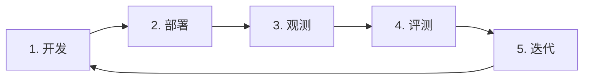
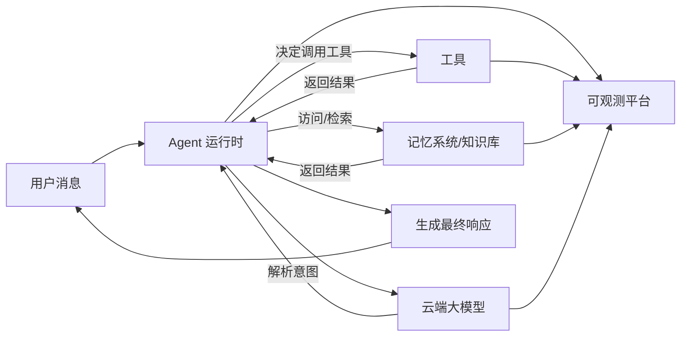

本文档主要介绍 VeADK 中的基本概念与使用方法，帮助理解智能体（Agent）开发过程中涉及到的设计哲学、核心构件与使用场景。文档中将重点阐述为何需要以智能体为中心的应用体系，并说明如何通过 VeADK 贯穿 Agent 模块化开发、可观测与可评测的全生命周期流程，提高系统的可靠性与可维护性，以及 VeADK 在实际工程中可解决的典型问题。

## VeADK 与 Agent 生命周期

VeADK（Volcengine Engine Agent Development Kit）是火山引擎推出的智能体开发套件，旨在为开发者提供构建、部署和管理智能体应用的全套解决方案。它基于模块化设计理念，将复杂的智能体开发过程分解为可组合的组件，让开发者能够专注于业务逻辑而非底层技术细节。在 VeADK 中，智能体被定义为具备以下核心能力的软件实体：

- **自主决策能力**：能够基于当前上下文和目标自主决定下一步行动
- **工具使用能力**：能够调用外部工具和系统来完成复杂任务
- **学习与适应能力**：能够从交互中学习并优化行为策略
- **记忆能力**：能够存储和回忆过去的交互信息以指导当前决策
- **多模态交互能力**：支持文本、图像、语音等多种交互方式

VeADK 能够在企业级 Agent 应用的生命周期关键环节提供支撑能力，帮助开发者应对不同挑战。一个典型的企业级 Agent 应用循环如下：

1. **开发 (Develop)**：定义 Agent 的核心逻辑，包括它的目标、工具和记忆。
2. **部署 (Deploy)**：将开发好的 Agent 部署到云端，使其能够稳定地处理真实世界请求。
3. **观测 (Observe)**：深入理解 Agent 在运行时的行为，监控其性能和决策路径。
4. **评测 (Evaluate)**：通过系统化的方法度量 Agent 的表现，发现问题和改进点。
5. **迭代与反馈优化 (Iterate)**：基于观测数据和评测结果，优化 Agent 的设计，进入下一轮开发循环。

在上述生命周期中，VeADK 提供了丰富的工具和服务，帮助开发者在每个环节实现高效、可靠的 Agent 应用：

- **简化 Agent 开发复杂度**：提供标准化的开发框架和最佳实践
- **火山引擎内置工具开箱即用**：无缝集成火山引擎生态系统的各种服务
- **完备的可观测与可评测方案**：确保智能体在生产环境中的可靠性和可维护性
- **模块化架构设计**：支持组件的灵活替换和扩展
- **企业级安全与合规**：满足企业级应用的安全和合规要求

## VeADK 体系结构

VeADK 基于模块化设计，主要组件包括：执行引擎、工具、记忆系统、知识库、观测系统、评测系统等。各组件通过明确的接口进行解耦，以便在不同业务场景下替换或扩展。

### 核心组件

| 核心组件 | 主要职责 | 关键模块/能力 |
| :--- | :--- | :--- |
| **执行引擎 (Runner)** | 协调所有组件的核心引擎 | 事件处理、记忆管理、会话管理 |
| **工具 (Tools)** | 实现与外部能力源交互 | 内置火山生态工具、自定义工具、工具编排 |
| **记忆 (Memory)** | 存储和检索上下文与历史信息 | 短期记忆（会话级）、长期记忆（跨会话） |
| **知识库 (Knowledgebase)** | 提供外部知识的存储与检索 | 火山引擎知识库、Llama-index 生态 |
| **观测系统 (Observability)** | 确保运行时的行为可监控 | 日志记录、链路观测、指标观测 |
| **评测系统 (Evaluation)** | 系统化地度量智能体质量 | 基于数据的反馈优化 |

### 运行时

下图为 Agent 运行时的主要流程：

如图所示，Agent 运行时主要包括以下几个步骤：

1. **消息接收**：用户消息进入 Agent 运行时，会话管理器创建或更新会话上下文。
2. **意图解析**：运行时将用户消息发送给云端大模型，解析用户意图并生成执行计划
3. **工具调用决策**：根据意图分析结果，决定是否需要调用工具或检索记忆/知识库
4. **工具执行**：若需要调用工具，工具调度器将构造规范化请求并记录调用上下文
5. **结果融合**：工具返回结果后，运行时将其融合进推理上下文
6. **响应生成**：基于所有可用信息生成最终响应返回给用户
7. **观测记录**：所有关键事件与指标（如Token消耗、工具调用延迟、错误率）实时推送至可观测平台以供后续分析。

## 火山引擎生态集成

VeADK 的核心优势在于其与火山引擎生态的无缝集成，为 Agent 生命周期的每个阶段提供强大的动力。

| 阶段 | VeADK 能力 | 火山引擎生态支持 |
| :--- | :--- | :--- |
| **开发** | 模块化构建、工具定义 | **豆包大模型**：提供推理能力；**方舟平台**：提供多种进阶参数组合 |
| **部署** | 容器化封装、配置管理 | **APIG**：提供 API 网关，实现 Agent 与外部系统的无缝交互；**VeFaaS**：提供无服务器计算能力，支持 Agent 以函数形式部署，实现高度可扩展与成本效益 |
| **观测** | 链路追踪、指标监控 | **APMPlus**：提供全链路追踪与性能监控，帮助开发者定位和优化 Agent 性能问题;**CozeLoop**：通过 Trace 数据追踪、性能统计、异常实时告警、智能打标、实时数据评测，快速定位问题根源 |
| **评测** | 自动化评测 | **CozeLoop**：覆盖 Agent 端到端测试，精准衡量效果 |

## 约定用法

在本文档中，为避免歧义，我们进行如下约定：

- “智能体” 或 “Agent” 二者等同
- “工具” 泛指可被调用的外部能力
- “短期记忆” 指的是单会话中的上下文，“长期记忆” 指的是跨会话上下文
