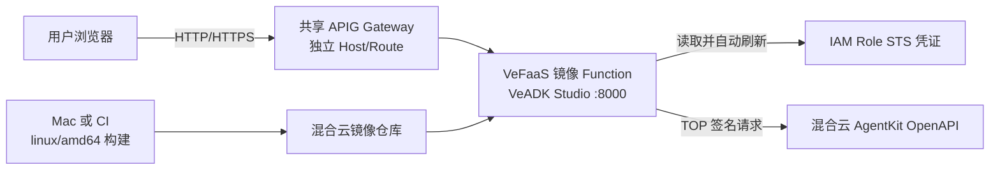
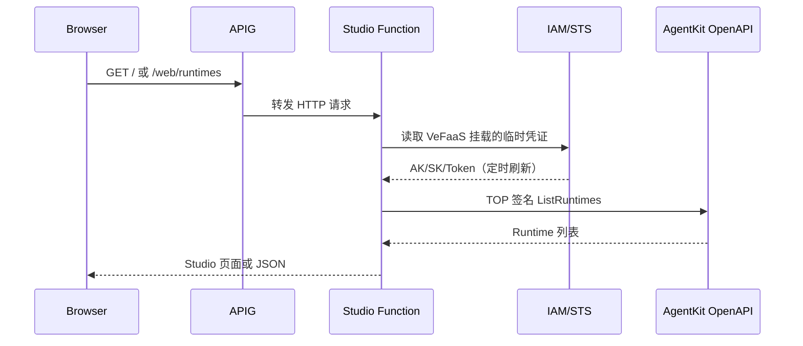
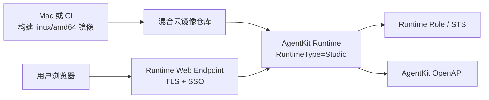
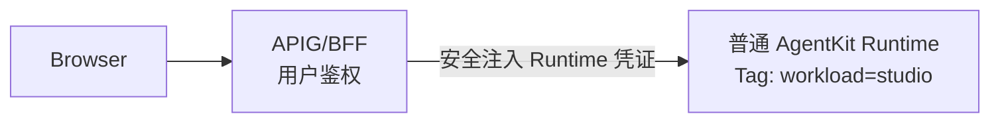
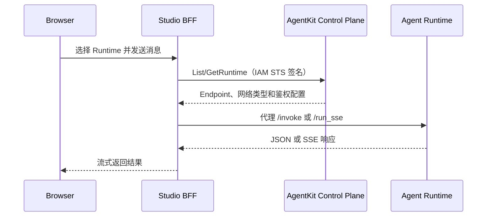

# VeADK Studio 混合云部署方案

## 1. 汇报摘要

VeADK Studio 可以在混合云落地，当前已验证的最小方案是：本地构建 Studio 镜像并推送到混合云镜像仓库，通过 VeFaaS `CreateFunction`/`Release` 创建镜像函数，再由共享 APIG Gateway 暴露独立域名。函数绑定 IAM Role 后，VeFaaS 自动向 Pod 注入并定时刷新 STS 凭证，Studio 使用临时凭证调用混合云 AgentKit OpenAPI，不需要在镜像或函数环境中保存 AK/SK。

POC 已验证以下链路：

- Studio Function 发布成功，运行状态正常；
- APIG 独立域名可访问，`/ping` 返回 HTTP 200；
- Pod 内存在 IAM STS credential 文件；
- Studio 通过混合云 AgentKit OpenAPI 成功查询 26 个 Runtime；
- 函数环境仅包含非敏感的 Host、Scheme、Region 和 Service 配置；
- 未向镜像、Function 环境或日志写入 AK/SK。

短期建议采用 **VeFaaS Function + APIG**，以最小的平台改造交付 Studio。中期建议在 AgentKit Runtime 增加 `Studio` 类型，使 Studio 由 AgentKit 统一管理。Runtime 方案不能只增加类型枚举，还需要同时提供适合浏览器访问的 Web Endpoint、SSO/会话鉴权和健康检查能力。

## 2. 背景与约束

混合云环境具备 VeFaaS、AgentKit Runtime、镜像仓库和 APIG，但存在以下约束：

- VeFaaS 没有独立产品入口，Function 日常管理不方便；
- 混合云没有云上镜像构建能力，镜像必须在本地或 CI 构建后推送；
- 混合云不支持公有云 VeFaaS Application 接口，只能使用 Function 接口；
- 当前 Runtime Endpoint 主要面向 API 调用，使用请求头 API Key 鉴权；浏览器直接访问时无法安全、透明地携带该请求头；
- Studio 既是 Web 前端和 BFF，也是 AgentKit 控制面客户端，需要访问 Runtime、Skill、Tool、Knowledge 等平台接口；
- 长期凭证不得进入镜像、函数环境、浏览器或日志。

## 3. 已验证方案：VeFaaS Function + APIG

### 3.1 架构



### 3.2 部署链路

1. 在 Mac 或 CI 使用 Docker 构建 `linux/amd64` Studio 镜像。
2. 将镜像推送到混合云镜像仓库。
3. 在混合云 IAM 创建 Studio 专用 Role 和自定义 Policy，信任主体为 VeFaaS。
4. 调用 VeFaaS `CreateFunction`，设置镜像地址、启动命令、端口、Role 和非敏感环境变量。
5. 调用 VeFaaS `Release`，等待 Function 发布完成。
6. 在共享 APIG Gateway 创建 Service、Upstream 和 Host Route，将独立域名转发到 Function。
7. VeFaaS 在 Pod 内挂载 Role 的临时 STS credential，并负责定时刷新。
8. Studio 使用 STS credential 对 AgentKit TOP 请求签名，读取和管理 AgentKit 资源。

### 3.3 调用链路



### 3.4 已完成的 VeADK 修改

| 模块 | 修改点 | 作用 |
| --- | --- | --- |
| Studio IAM | 支持 IAM Host/Scheme override | IAM 请求可发送到混合云 TOP，而不是固定访问公有云 IAM |
| Studio IAM | `CreateRole` 增加 `DisplayName` | 兼容混合云 IAM 的必填参数 |
| Studio IAM | 缺失的公有云系统 Policy 可跳过 | 混合云未内置部分系统 Policy 时，继续使用已校验的 Studio 自定义 Policy；其他 IAM 错误仍失败 |
| VeFaaS 镜像部署 | `CreateFunction` 透传 `IAM_ROLE` | 让镜像 Function 获得 STS credential 挂载 |
| VeFaaS 镜像部署 | 透传 `project_name` | Function 创建到指定项目，而不是隐式落入默认项目 |
| Studio 部署配置 | 映射 `VOLCENGINE_AGENTKIT_HOST/SCHEME/REGION/SERVICE` | AgentKit SDK 在 Function 内访问混合云 OpenAPI |
| Studio OpenAPI 代理 | endpoint 支持 HTTP/HTTPS Scheme | 兼容 POC HTTP TOP；生产环境仍应使用可信 HTTPS |

### 3.5 优缺点

优点：

- 已完成端到端验证，交付风险最低；
- 不依赖公有云 VeFaaS Application；
- Function 原生支持 IAM Role 和 STS 自动刷新；
- APIG 可以复用现有 Gateway，并通过独立 Host 隔离路由；
- 不需要修改 AgentKit Runtime 后端。

不足：

- VeFaaS 没有面向客户的产品入口，Function、Revision、实例和日志管理不直观；
- Studio 生命周期分散在镜像仓库、VeFaaS 和 APIG 三个资源域；
- 当前 POC 使用 HTTP，且尚未完成生产级 SSO、TLS 和访问策略验收；
- Studio Role 权限较宽，生产环境应拆分只读、开发者和管理员权限。

## 4. 备选方案：通过 AgentKit Runtime 部署 Studio

### 4.1 目标

将 Studio 作为 AgentKit 平台的一类托管工作负载。用户在 AgentKit 控制台创建、更新、发布、查看日志和访问 Studio，不直接感知底层 VeFaaS Function。



### 4.2 当前 Runtime 接口可以复用的能力

现有 `CreateRuntime` 已具备以下基础字段：

| 当前字段 | Studio 用途 |
| --- | --- |
| `Name` | Studio 实例名称 |
| `ArtifactType` / `ArtifactUrl` | 指定已经构建并推送的镜像制品 |
| `RoleName` | 为 Studio Runtime 注入临时 STS credential |
| `CpuMilli` / `MemoryMb` | Studio 资源规格 |
| `MinInstance` / `MaxInstance` | 实例数和弹性范围 |
| `Envs` | 注入非敏感 endpoint、region 和功能配置 |
| `AuthorizerConfiguration` | 现有 API Endpoint 鉴权配置 |
| `NetworkConfiguration` | 公网或 VPC 网络配置 |
| `Tags` | 标记 Studio 归属、版本和创建来源 |

镜像仍由本地或 CI 构建，Runtime 只负责拉取镜像和发布，因此不依赖混合云云上构建能力。

### 4.3 仅复用当前 Runtime 的临时方案

可以将 Studio 镜像按普通 Runtime 创建，并使用 Tag 标记 `workload=studio`。该方案能够复用 Runtime 的版本、发布、实例和日志管理，但仍需在 Runtime Endpoint 前增加 APIG/BFF：



该方案不建议作为最终形态，原因如下：

- 当前 Runtime 使用 API Key Header，浏览器不能直接安全携带；
- APIG 需要保存或动态获得 Runtime API Key，增加 Secret 生命周期管理；
- Runtime 默认协议围绕 `/invoke` 等 Agent API 设计，无法表达 Web 首页、静态资源、Cookie、重定向和 SSO Callback；
- 普通 Studio Runtime 会混入智能体 Runtime 列表，语义和权限边界不清晰。

### 4.4 推荐的平台化方案：新增 Studio Runtime 类型

建议 Runtime 控制面新增 `RuntimeType`：

```text
RuntimeType = Agent | Studio
```

建议的 `CreateRuntime` 扩展字段如下。字段名称为方案建议，最终以 OpenAPI 评审结果为准。

```json
{
  "Name": "veadk-studio",
  "RuntimeType": "Studio",
  "ArtifactType": "Image",
  "ArtifactUrl": "<registry>/<namespace>/veadk-studio:<version>",
  "RoleName": "VeADKFrontendServiceRole",
  "CpuMilli": 2000,
  "MemoryMb": 4096,
  "MinInstance": 1,
  "MaxInstance": 2,
  "Port": 8000,
  "HealthCheck": {
    "Path": "/ping"
  },
  "EndpointConfiguration": {
    "Protocol": "HTTP",
    "Exposure": "Public",
    "AccessMode": "Web",
    "AuthMode": "OIDC"
  },
  "Envs": [
    {"Key": "VOLCENGINE_AGENTKIT_HOST", "Value": "<hybrid-top-host>"},
    {"Key": "VOLCENGINE_AGENTKIT_SCHEME", "Value": "https"},
    {"Key": "VOLCENGINE_AGENTKIT_REGION", "Value": "<region>"},
    {"Key": "VOLCENGINE_AGENTKIT_SERVICE", "Value": "agentkit"}
  ]
}
```

### 4.5 Runtime 平台需要修改的模块

| 模块 | 必需修改 | 说明 |
| --- | --- | --- |
| AgentKit OpenAPI | Create/Get/List/Update 增加 `RuntimeType` | 默认值保持 `Agent`，兼容已有调用方 |
| Runtime Controller | 按类型生成启动、探针和 Endpoint 配置 | Studio 使用端口 8000、`/ping`，不强制 `/invoke` 协议 |
| Runtime Gateway | 增加 Web Endpoint 模式 | 支持 HTML、静态资源、SSE/WebSocket、Cookie、重定向和大响应体 |
| Runtime 鉴权 | 增加 OIDC/SSO Cookie 或 Gateway 会话鉴权 | 解决浏览器无法携带 API Key Header 的问题 |
| IAM/STS | 复用 `RoleName` 注入和刷新 | Studio 从 credential 文件读取临时凭证，禁止注入长期 AK/SK |
| Python SDK | 更新 Runtime request/response 类型 | 暴露 `RuntimeType`、Web Endpoint 和健康检查配置 |
| AgentKit CLI | `launch_types.hybrid` 支持 `runtime_type: studio` | 允许从本地镜像或已经推送的镜像创建 Studio |
| AgentKit 控制台 | 增加 Studio 筛选、详情和“访问 Studio”入口 | Studio 与智能体 Runtime 分开展示，但复用版本、实例、日志和发布页面 |
| VeADK Studio CLI | 增加 `--deploy-target agentkit-runtime` | 生成镜像 Runtime 请求，轮询发布状态并输出 Web Endpoint |
| RBAC | 增加 Studio 查看、访问、更新、管理权限 | 平台权限与 Studio 内部管理员/开发者权限需要分别校验 |

### 4.6 Runtime 方案的关键验收标准

- `CreateRuntime(RuntimeType=Studio)`、更新和 Release 均成功；
- Runtime 状态为 `Ready`，实例为 `RUNNING/Healthy`；
- `/ping` 返回 HTTP 200，静态资源和前端路由正常；
- 浏览器无需扩展或手工 API Key 即可完成 SSO 登录；
- Studio Pod 获得自动刷新的 Role STS credential；
- Studio 能读取并管理同 Region 的 AgentKit Runtime；
- 未登录、无权限用户无法访问 Studio API；
- Runtime 列表可按 `Agent` 和 `Studio` 类型筛选；
- 发布、回滚、日志、监控和 Endpoint 均能从 AgentKit 控制台管理。

### 4.7 Studio 调用智能体 Runtime

Studio 自身无论部署在 Function 还是 Studio Runtime，调用普通智能体 Runtime 的链路保持一致：



调用原则：

- 浏览器只访问 Studio BFF，不接触云 AK/SK；
- Studio 使用自身 Role STS credential 调用 AgentKit 控制面；
- Runtime Endpoint 和 Runtime API Key 仅在 Studio 服务端短时缓存；
- KeyAuth Runtime 由 Studio BFF 添加 Authorization Header；
- Custom JWT Runtime 只转发已经由 Studio/Gateway 验证的用户令牌；
- 公网和私网 Endpoint 分开处理，Studio 所在网络必须能够访问选中的 Runtime Endpoint；
- Runtime 返回 401 时清理连接缓存并重新获取鉴权信息，不将 Key 返回浏览器。

## 5. 方案对比

| 对比项 | VeFaaS Function + APIG | 普通 Runtime + APIG 适配 | 原生 Studio Runtime |
| --- | --- | --- | --- |
| 当前可用性 | 已验证 | 可做进一步 POC | 需要平台研发 |
| 平台改造量 | 小 | 中 | 大 |
| 镜像构建 | 本地/CI | 本地/CI | 本地/CI |
| IAM Role/STS | VeFaaS 原生支持 | Runtime 原生支持 | Runtime 原生支持 |
| 浏览器访问 | APIG 独立域名 | 仍需 APIG/BFF 注入或转换鉴权 | Runtime Web Endpoint 原生支持 |
| SSO | 在 APIG/Studio 层补齐 | 在 APIG/BFF 层补齐 | Runtime Gateway 原生支持 |
| 管理入口 | VeFaaS 未透出，管理较弱 | AgentKit Runtime 可见 | AgentKit Studio 类型独立管理 |
| 版本/发布/日志 | 分散在底层资源 | 复用 Runtime | 复用 Runtime，语义最清晰 |
| 对现有 Runtime 影响 | 无 | 容易混入智能体列表 | 通过类型默认值保持兼容 |
| Secret 管理 | STS，无长期 AK/SK | STS，但 APIG 可能额外管理 Runtime Key | STS + SSO，无 Runtime Key 注入 |
| 适用阶段 | 近期交付 | 过渡验证 | 中长期产品化 |

## 6. 推荐落地路径

### 阶段一：交付已验证方案

- 使用 VeFaaS Function + 共享 APIG Gateway；
- 将现有 POC 脚本固化为 `veadk studio deploy --target hybrid-vefaas`；
- 使用独立域名和 Host Route；
- 为 Studio Role 收敛最小权限；
- 补齐生产 HTTPS、SSO、审计、日志和监控；
- 将 Function、APIG Service、Upstream、Route 和镜像版本记录为一份部署状态。

### 阶段二：Runtime 轻量 POC

- 使用当前 `CreateRuntime` 创建 Studio 镜像 Runtime；
- 使用 Tag 区分 Studio；
- 验证 Role STS、端口、健康检查、静态页面和 SSE；
- 使用临时 APIG/BFF 验证浏览器访问；
- 不把该形态作为最终用户入口。

### 阶段三：Studio Runtime 产品化

- 在 OpenAPI 和控制台正式增加 `RuntimeType=Studio`；
- 增加 Web Endpoint 与 OIDC/SSO；
- 在 AgentKit 控制台提供 Studio 专属列表和访问入口；
- VeADK CLI 默认通过 AgentKit Runtime 部署 Studio，底层 VeFaaS 仅作为平台内部实现。

## 7. 安全与生产要求

- AK/SK 仅用于部署控制面调用，不进入镜像、Function/Runtime 环境或浏览器；
- 运行时统一使用 IAM Role STS credential，并验证凭证自动刷新；
- 生产入口必须使用可信 HTTPS，POC HTTP 不作为正式配置；
- Studio Role 应按只读、开发者和管理员能力拆分，避免长期保留 `agentkit:*`；
- APIG Host Route 必须使用独立域名，避免与现有 AgentKit 控制台路由冲突；
- SSO 登录、Studio RBAC 和云资源 IAM 是三层独立授权，不能互相替代；
- 日志和错误响应不得打印 credential 文件内容、Authorization、API Key 或环境变量值；
- Studio 的会话、自动化任务和用户配置需要使用外部持久化存储，不能依赖单 Pod 本地文件。

## 8. 结论

VeFaaS Function + APIG 已证明 Studio 在混合云部署和访问可行，适合作为近期交付方案。AgentKit Runtime 更适合长期管理，但新增 Runtime 类型只是第一步；只有同时提供 Web Endpoint、浏览器 SSO、健康检查、类型隔离和控制台入口，才能形成完整的 Studio Runtime 产品能力。

推荐决策：**近期使用 Function + APIG 交付，平台侧并行设计原生 Studio Runtime，完成后由 VeADK CLI 平滑切换部署目标。**

## 9. 当前代码修改位置

| 文件 | 修改内容 |
| --- | --- |
| `veadk/cli/frontend_deploy_iam.py` | 混合云 IAM endpoint、Role `DisplayName`、系统 Policy 缺失兼容 |
| `veadk/integrations/ve_faas/ve_faas.py` | 镜像 Function 透传 IAM Role 和 Project |
| `veadk/cli/cli_frontend.py` | AgentKit endpoint 环境映射、HTTP/HTTPS endpoint、Runtime 服务端代理 |
| `tests/cli/test_frontend_deploy_iam.py` | IAM endpoint、Role 和 Policy 兼容测试 |
| `tests/integrations/test_ve_faas_image.py` | 镜像 Function Role/Project 透传测试 |
| `tests/cli/test_studio_deploy_target.py` | Studio 混合云 AgentKit endpoint 注入测试 |
