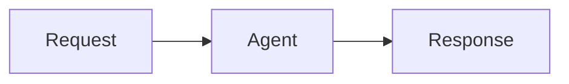
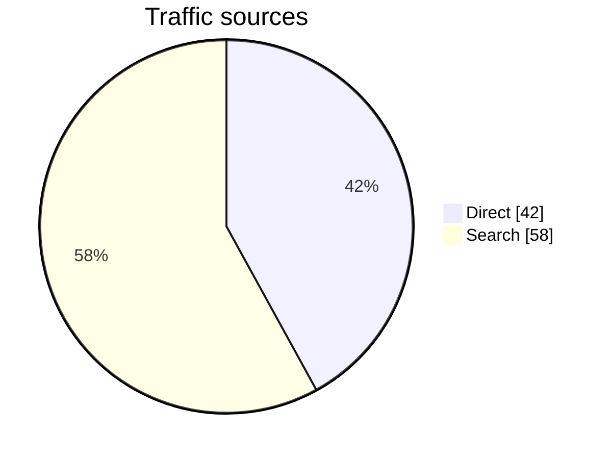

# VeADK Web

A React web UI for VeADK / Google ADK agents. It talks to the standard ADK API
server that `veadk frontend` launches — no separate backend.

## Release notifications

The release workflow sends one Feishu card after both cloud providers finish
publishing. A separate VeFaaS Webhook discovers the app bot’s group memberships
and persists delivery results to avoid duplicate notifications on retries.
See [deployment and operation](service/studio_release_notifier/README.md).

## Features

- **Agent publication review**: Developers deploy privately and apply from an
  Agent card. The review center's Agent tab lets administrators inspect the
  submitted Runtime metadata, approve with an optional comment, or return with
  a required reason. Administrators can also publish directly. The applicant
  sees the reviewer name/avatar, decision time, comment and return reason

  Agent review is independent of SkillSpaces. Runtime `TagResources` writes
  `veadk:visibility` and explicit `veadk:review:*` fields for application ID,
  status, submission time/message, reviewer ID/name, decision time/reason/comment,
  and withdrawal/unpublication actors and times. Agent details are read live from
  the Runtime; applicant identity reuses its `veadk:owner` and `veadk:author` tags
  instead of storing another snapshot. Display profiles resolve through the
  configured Identity user pool. Cloud error bodies and request IDs are
  returned intact. The repository uses provider-scoped clients for Volcengine
  and BytePlus

  Only an approved Runtime tagged enterprise-visible is shared. Other users can
  use it through the server proxy and access their own conversations; management,
  logs, credentials and other users' sessions remain restricted. Pending Agents
  must be withdrawn before editing/deleting; published Agents must be unpublished
  first. Unpublishing revokes subsequent shared proxy requests, including when
  connection credentials were cached. An already running stream is not terminated

  This first iteration stores the latest application on each Runtime and
  replaces it on resubmission. Review covers name, description, model and Runtime
  configuration metadata, not source files or automatic scoring. A configuration
  fingerprint rejects approval if the submitted Runtime has changed. Version
  upgrades, public-version selection and archived application history are deferred.
  Studio guards do not prevent direct cloud changes; concurrent decisions are
  serialized within one process, without a cross-replica transaction. The record
  limits application messages to 20 characters and decision reasons/comments to
  256 characters. Text unsupported by cloud tags is encoded per field, splitting
  long values into numbered continuations. Every tag value fits within 256 bytes;
  continuation tags are written first, then field heads and visibility together
  within the 20-tag call limit. Writes are read back before reporting success
  and reject exceeding the 50-tag Runtime quota. Existing packed applications
  remain readable; new writes use explicit fields

- **Skill publication requests**: Each personal Skill version can be submitted
  from its action row. Studio copies its archive into an independent Skill in
  `studio_review_space`, preserving the original name and writing the signed-in
  submitter's display name to the `author` tag. Source space, Skill, version and
  submission time are also recorded in tags. Matching names remain separate
  requests; repeat submissions of the same source Skill version are rejected
  while pending or approved. Administrators inspect submitted files, approve
  with an optional comment, or return with a required reason and optional comment.
  Approval copies that fixed snapshot into `studio_share_space`. A returned
  version can be submitted again as a new request; earlier decisions remain in
  history. Personal Skill rows, details and the version dialog show persisted
  status, reviewer, decision time, comments and return reasons

  Submission verifies source membership and authorship. Review list and file
  endpoints require an administrator; generic catalog/download routes also block
  review copies for ordinary users. The workflow requires readable Skill tags
  from the cloud provider and fails without publishing a request if metadata
  cannot be verified. Review copies survive Studio restarts. `TagResources`
  directly updates Skill tags and each write is read back with `GetSkill`;
  `UpdateSkillSpace` is not used for tags. Cloud tag values reject newlines,
  some punctuation and values longer than 256 characters. Review text is encoded
  in bounded tag chunks and restored on read, preserving multiline comments and
  reasons up to 256 characters. Approval intent is stored before publication;
  a retry after final metadata failure reuses the existing shared copy.
  Duplicate checks and decisions are serialized within one server process;
  multiple server processes do not have a transactional shared lock

  Reviewer identity comes from the authenticated server principal. The configured
  Identity user pool's `GetUser` resolves the stored stable UID to name, email and
  avatar, with a short profile cache. Clients cannot supply the reviewer or time.
  Local users without a pool UID, removed users and directory failures fall back
  to the recorded name and a placeholder avatar; access checks remain unchanged

- **Automatic Skill assessment**: New review copies are tagged `queued` on
  submission and assessed in the background using the same provider-specific
  model as automatic Agent creation. A Pydantic `output_schema` is sent through
  Ark's structured-output API; the system prompt contains the rubric, not a
  duplicate JSON schema. Safety (40%), usability (25%), completeness (15%),
  reliability (10%) and maintainability (10%) each receive a score and reason;
  Studio calculates the weighted total and includes risks and suggestions

  Assessment reads the fixed submitted snapshot without running its code or
  tools. At most 100 text files, 40,000 characters per file and 120,000 characters
  total are included. Omitted, binary and truncated files are disclosed;
  incomplete coverage leaves safety, completeness and total scores unset

  Private JSON jobs and reports live in the configured Skill archive TOS bucket
  under `review-scores/`. Conditional ETag writes prevent concurrent workers
  from claiming the same job. Skill tags hold status, total, time, model, rubric
  and report location. Startup and periodic scans recover queued or expired
  running jobs, with up to two attempts and a ten-minute interrupted-job lease.
  Recovery also reconciles stale status tags without repeating completed model
  calls. Recorded bucket/key tags locate existing reports after storage config
  changes; new jobs use the current configuration. Existing unscored requests
  remain unscored until an administrator requests assessment

  Administrators and the submitting user can read the full JSON report, using
  the stored identity UID or owner ID for new requests and the recorded author
  as a fallback for older requests;
  administrators can retry failed jobs. Completed reports are immutable.
  Errors preserve the upstream text and request IDs in the report and API
  response, without translated summaries or truncation into cloud tags.
  Manual decisions and published versions remain independent of AI scores

- **Skill versions**: Personal Skills expose native version history. Uploading
  a ZIP with the same Skill name creates a new version under the original Skill
  ID and updates only its personal space association. Both ZIP uploads and
  optimized source updates wait for a new ready version instead of reusing an old
  running version. Users can inspect files and submit reviews for a selected
  historical version. Shared copies remain independent and read-only in this
  version dialog; new or pending personal versions do not change published files.
  Shared rows and details show the source version and author, while file requests
  retain the copy's native version so an approved source v2 is read correctly

- **SkillSpace display names**: Personal space creation generates a unique cloud
  name containing only lowercase letters, numbers and underscores. The name the
  user enters is stored in the `display_name` tag alongside the `author` tag.
  Library cards, details and selectors prefer that display name and fall back to
  the cloud name when the tag is missing or blank. Skill lookups and exports keep
  using the original cloud name. Renaming display names is not included

- **System SkillSpaces**: `studio_share_space` is the enterprise shared space,
  permanently shown first in the Skill library. `studio_review_space` stores
  submitted versions for review and is excluded from the library and Skill
  selectors. The library provisions the shared space; submitting a Skill or opening
  Skill reviews provisions the review space. Each space
  is created once per provider region and `VEADK_STUDIO_PROJECT` (or `default`).
  Definitions live in `server/skills/consts.json`, consumed by `consts.py` and
  `src/create/skills/consts.ts`, so both ends use the same names. User-facing create
  and rename operations reject reserved names, and the backend enforces the same
  restriction even when called directly. System spaces cannot be renamed or
  deleted; review content can only be changed by the review workflow. Administrators
  can maintain shared skills. No legacy names are recognized or migrated

  Cloud names must use lowercase letters, numbers and underscores; hyphenated
  names return `InvalidParameter.skillSpaceName`. Native SkillSpace tag support
  varies by provider: Volcengine returns creation tags, while BytePlus may omit them.
  Managed names and description markers identify system spaces independently
  of tags. Do not change these identities through the cloud console.
  Creation failures remain visible with a retry action

- **DeepSeek Harness native configuration**: Quick-create now offers VeADK
  Agent or DeepSeek Harness (Beta) through a radio-selection dialog. Continuing closes
  the dialog and opens the selected Agent type’s own configuration page. The
  Harness page uses a separate settings form for session
  defaults, the DeepSeek adapter, custom model providers, command execution,
  tool concurrency, sub-agent model selection and DeepSeek web search. Catalog
  fields use dropdowns, with provider-dependent model and reasoning choices;
  custom presets, DeepSeek model IDs and search settings remain editable. Default
  values are prefilled and included in the exported configuration. Preview and ZIP
  export include a Dockerfile, native settings, startup script, Runtime adapter,
  AgentKit configuration and credential-name placeholders. The image installs the
  official DSH npm package and runs the web profile privately as a non-root user.
  The Runtime plugin exposes health checks and JSON invocations through DSH's native
  session controller, preserving the selected model and Agent preset. The Deploy
  action opens Studio's shared Runtime deployment page for cloud region, CP/CR
  resource selection and credentials. Git sync, message channels and evaluation
  sets are hidden for Harness deployments in both cloud environments. The form supports Chinese and English and
  custom Volcengine and BytePlus model endpoints. It follows upstream revision
  [`aa8262ec`](https://github.com/deepseek-ai/deepseek-harness/blob/aa8262ec091698bae9a6b04773a6b5b06ad4aef2/docs/config-catalog.md).
  Other plugin parameters and preset-file editing are outside this initial form.
  Harness drafts remain in memory; export before refreshing or closing Studio.
  The adapter uses the Runtime gateway for authentication and does not implement
  Studio's ADK chat protocol. Sessions require persistent storage to survive
  container replacement, and multiple replicas require appropriate session routing.

- **Runtime IAM role reuse**: ordinary and quick Agent creation reuse the first
  role with the `AgentKitDefaultRuntimeAccess` system policy in the selected
  cloud account, including roles on later IAM result pages. If none matches,
  Studio creates `AgentKit_Runtime_Default_ServiceRole_<7 random characters>`
  with only that policy. Existing roles keep all their current permissions;
  quick creation no longer adds `AgentKitFullAccess`. Lookup errors stop the
  deployment instead of triggering role creation. This applies to Volcengine
  and BytePlus; existing Runtime updates and Sidecar deployments keep their
  existing role behavior

- **User management** stores Studio roles in Identity user groups
  scoped to the configured user pool and client. A super administrator can search
  all pool users, filter roles, and assign super administrator, administrator,
  developer, or ordinary-user access. The next page refresh reads current roles;
  protected backend requests also resolve live membership. Only immutable
  subject-to-user-ID mappings are cached

- **Review center**: the sidebar's 管控 group contains 审核中心 and 用户管理,
  showing only entries allowed by the current role and hiding an empty group.
  Administrators can open 审核中心 and switch
  between Skills and Agents. Skill requests and submitted files load from the
  regional review space, with search, refresh and status filters. Agent requests
  remain empty. Skill decisions include comments, reviewer details and history.
  The list shows AI assessment status and total; details and applicant history
  expose dimension reasons, risks, coverage, model metadata and JSON download.
  Empty lists and filtered results have distinct messages.
  Chinese and English, Volcengine and BytePlus are supported

- **Sandbox updates** in System Information compare each Tool's current image
  with `ListToolTypes` for its cloud provider and actual region. Volcengine and
  BytePlus use their own credentials and API hosts; catalogs are cached for
  60 seconds and fetched again before an update. Admins can update configured
  prebuilt Tools with `UpdateTool.ImageUrl`. Codex and DeepSeek Harness share
  update state when they reference the same Tool; snapshot Tools are checked
  independently. Missing Codex `MODEL_AGENT_API_KEY` / `MODEL_AGENT_BASE_URL`
  values are still backfilled from `CODEX_*`, preserving existing variables.
  Completion requires Tool `Ready` and the target image; this does not verify
  existing Sessions or rebuild their snapshots. BytePlus has automated coverage,
  but its image update has not been verified against a live account.

- **Code projects**: open 工作区 → 代码项目 or 从工作区新建 to name,
  create and reopen projects. Each user has one persistent cloud Sandbox;
  projects are directories under `/home/gem/Projects`. Creating another project
  reuses the same Session and opening a project changes VS Code's `folder` path.
  The image initializes Git, `AGENTS.md` and a Python environment per project.
  The dedicated Private Tool must enable snapshots. Studio reuses the user's
  stable cloud session identity and automatically restores its latest ready
  snapshot after hibernation, rather than creating an empty replacement.
  Project lists are read from the Sandbox filesystem and survive Studio restarts.
  The editor opens directly at `/code-server/`; signed routing parameters remain
  private/no-store. Returning to management keeps the editor mounted, while
  switching directories opens the selected project directly. Volcengine
  defaults to Chinese and BytePlus to English.

- **Streaming chat** over the ADK `/run_sse` event stream. While an Agent is
  generating, the composer exposes a stop control that cancels only the active
  response, preserves content already received, and immediately enables the
  next turn in the same session.
- **Context usage meter** beside Send uses provider-specific model windows and
  a 100-cell hover/focus map for estimated system/tool overhead, input/history,
  output/reasoning, and remaining capacity. System/tool usage is explicitly
  marked as an estimate because ADK usage metadata does not report it separately.
- **Markdown** rendering for user and assistant messages (GFM + code highlight).
- **Multimodal messages** with images, TXT/Markdown, PDF, and video attachments,
  including previews and history replay for both user and model media. Chat
  images use compact thumbnails and open in a zoomable full-screen viewer.
- **Composer invocations**: type `/` to select a mounted skill or `@` to route
  the turn to a mentionable sub-agent. New conversations address the selected
  Agent by its display name in the composer placeholder.
- **New-chat modes**: keep the existing Agent conversation path, start a
  temporary Codex conversation in an AgentKit Sandbox, or create a Skill with
  a real two-model A/B run in independent AgentKit CodeEnv sessions. Skill
  progress resumes from Sandbox state if the creation stream is interrupted;
  completed candidates can be compared, downloaded as ZIP files, and added to
  AgentKit. Connected Harness agents expose supported image, video, and
  presentation task types; Studio mounts only missing task tools for the
  current session and preserves tools already supplied by the Agent.
- **Intelligent Agent development**: describe the intended VeADK Agent once and
  receive immediate, cancellable preparation feedback before the development
  conversation opens. Studio then automatically runs intent gating,
  implementation, local checks, a temporary cloud deployment, acceptance calls,
  log inspection, and cleanup.
  Public Codex reasoning updates and Assistant replies use the normal
  conversation renderer; credentials, raw Sandbox paths, and internal commands
  stay hidden. Each build appears in the shared conversation history for the
  lifetime of its remote development environment (up to eight hours); reopening
  it restores the latest conversation and current source-delivery card.
  Navigating away from an active build requires confirmation and stops that
  build before leaving, while the conversation remains available until expiry.
  Stopping preserves received output and blocks the next submission until
  cleanup finishes. Users can inspect generated text files and download the
  complete ZIP (including binary assets) as soon as the source is ready.
  Each completed build or optimization is also saved as an immutable project
  version in the private Studio TOS bucket. Users can reopen any saved version,
  view, download, deploy, delete, or restore it into a new Sandbox for another
  intent-driven iteration after the original Sandbox expires. The source
  workspace provides an IDE-style file tree with persistent light and dark
  themes. Optimizations expose their before/after changes directly, and any two
  saved versions of the same project can be compared on demand without storing
  another artifact.
  Deployable source can be sent to Runtime manually; an incomplete verification
  report requires an explicit confirmation. No separate “start verification”
  action is required.
- **Existing Agent migration**: upload a local project ZIP for read-only
  analysis, confirm the detected framework and entry point, then migrate and
  validate it in a temporary Sandbox. Successful migration source is saved as
  an immutable version in the same private Studio TOS project store. The
  separate “已迁移项目” page can view, download, deploy, delete, and compare
  versions; any version can be restored into the intelligent-development flow
  for another intent-driven iteration after the temporary migration environment
  has ended.
  Pencil icons beside project and version names open the existing-style name
  dialog; the check icon saves and the close icon cancels. Names are normalized
  and trimmed, allow 1–128 Unicode characters, and reject control/invisible
  formatting characters and `<` / `>` on both client and server. They are plain
  display text: renaming never changes source archives, validation reports,
  version IDs/order, the latest-version marker, or deployed Runtime names.
  Historical names remain compatible; optional display metadata is stored
  separately from immutable versions. Optimization session titles retain the
  existing 40-character limit without shortening the saved project name.
  An optional migration-effect evaluation is off by default; when enabled,
  users can enter 1–100 evaluation cases by hand or bulk paste, while expected
  outcomes and criteria remain optional.
  Standard evaluation uses three dimensions; users can instead select custom
  dimensions before upload. The locked dataset and final HTML report are stored
  as immutable owner-only TOS assets. The report is fetched and rendered in a
  side drawer only after the user selects “View report,” and remains available
  for download.
- **Reasoning & tool calls** shown inline (collapsible "thinking", tool blocks).
- **Agent context rail** keeps the selected Agent's description, model, tools,
  skills, and optional live multi-Agent topology together in the conversation's
  right workspace, with the transcript protected from overlap on narrower screens.
- **Built-in tool activity** gives web search, image/video generation, memory,
  and knowledge-base retrieval their own repository-drawn icons and concise
  Chinese running/completed labels. Active work uses the shared Prompt Kit-style
  `TextShimmer`, which also powers thinking and branded heading shimmer states.
- **Sessions**: pick an agent, browse history, new chat, delete — per signed-in
  user. The new-session composer stays minimal until a conversation begins,
  when its session metadata appears. The page header follows the active session's
  first user message, while long titles truncate without shifting header actions.
  Session IDs use normal text with a copy action, and sidebar title tooltips show
  the full conversation name. Long Agent lists stay within the viewport and
  scroll independently.
- **Sandbox Agents**: create and reopen user-owned Codex, OpenClaw, and Hermes
  AgentKit Sessions from the Agent page. Each type supports list, detail, and
  explicit deletion. Persistence is enabled by default through a snapshot Tool;
  clearing it creates an eight-hour transient Session and shows an expiry
  warning. Codex streams reasoning, tool activity, and replies into the normal
  conversation renderer, while its sidebar history can resume or remove
  standard Codex App Server threads. Leaving the conversation only
  disconnects it, so the Agent remains available until the user deletes it.
  OpenClaw and Hermes expose their main interface and Terminal through Studio.
- **Codex conversation handoff** creates a temporary cloud Sandbox, restores
  the current Git worktree, injects only completed user-visible user and
  assistant messages into the cloud Thread, then starts one new turn with
  `继续` or the user's explicit cloud task. System/developer prompts, reasoning,
  tool logs, local runtime databases, and SSH keys are never transferred.
- **System information**: open a full page from the account menu to inspect the
  Studio version, configured Sandbox Tool IDs (with snapshot Tools badged), and
  available Identity user pools. Resource identifiers remain read-only and
  require Agent-management access.
- **AgentKit Skill center**: browse Skill Spaces and their skills with
  server-side pagination by region, then inspect the selected Skill content.
  Skill and knowledge requests default to the Studio deployment region in
  cloud deployments and to `cn-beijing` in local Volcengine development.
- **Library hub**: manage Skills, user-owned AgentKit knowledge bases, and chat
  artifacts from one sidebar entry. Knowledge documents support verified
  JPG/PNG, PDF/PPTX/DOCX/XLSX/TXT uploads and public webpage imports. Studio
  fetches webpages server-side with SSRF protections, extracts the main content
  as Markdown, and shows a safe rendered preview before any data is created.
  Only an explicit confirmation stores the previewed Markdown through the
  existing private TOS-to-Viking flow; cancelling or a preview failure leaves
  the knowledge base unchanged. Imported webpages are named automatically from
  the page title, with the hostname as a fallback.
  AgentKit knowledge names use its native identifier rules: 1-48 characters,
  starting with a letter and containing only letters, numbers, or underscores.
  Descriptions are limited to 80 characters so the signed owner marker remains
  within AgentKit's 200-character provider limit.
- **Automation directory**: browse development and message-channel integrations
  from the Studio sidebar. The local Coding Agents integration detects Trae,
  Claude Code, and Codex across macOS, Linux, and Windows, then globally installs
  the bundled VeADK development and AgentKit platform-operation Skills. The
  browser can select only fixed client and Skill identifiers; arbitrary shell
  commands, filesystem targets, and Skill content are never accepted. GitHub-backed
  automations can add a basic AgentKit
  project, configure Runtime continuous delivery, or add automatic Pull Request
  review. The browser creates GitHub branches, files, and Pull Requests directly;
  repository tokens stay in the current form state and are never persisted. The
  Feishu automation accepts an App ID and App Secret, generates a basic
  Studio-compatible agent, creates a new single-instance AgentKit Runtime, and
  enables the Feishu channel. The Feishu App Secret is used only for the current
  deployment and never enters generated source, workflow, documentation, or
  logs; cloud credentials remain GitHub Secrets or Runtime environment variables.
- **Tracing viewer**: a span tree + detail panel from the ADK debug trace.
- **Message feedback**: rate persisted Runtime replies with accessible,
  repository-drawn like/dislike controls. Studio identifies the final ADK Event,
  stores the latest rating through the existing Session state-delta API, and
  idempotently syncs the server-derived question and answer to per-Agent
  `{agent_name}_good_case` or `{agent_name}_bad_case` AgentKit evaluation sets.
  Studio creates regular evaluation sets and confirms they are list-visible
  before writing feedback items. On finalized Volcengine Runtime replies, users
  can also select a text fragment and add an inline annotation; Studio preserves
  the selected fragment in the feedback comment and saves the reply as a Bad
  case evaluation sample. Failed saves keep the annotation open for retry.
  Runtime credentials and Volcengine credentials remain server-side.
- **Smart search**: search sessions, the network through `web_search`, and a
  selected Agent's KnowledgeBase or long-term memory when mounted. The source
  picker follows live Agent metadata and disables unavailable sources before a
  search; active retrieval sources show their index/name and backend separately.
- **Runtime management**: inspect or delete deployed runtimes, or connect one
  directly so the global Agent selector switches to that Runtime. The cloud
  selector gives each two-line Runtime row explicit connect and info actions;
  the info action opens a tabbed Agent/Runtime panel. The Agent directory loads
  one selected region at a time, defaults to Beijing, and carries the Runtime's
  region through details, connection, update, evaluation, and deletion. Studio
  enables in-place updates for an authorized single-Agent Runtime when its
  `web/agent-info` response, or the compatible `web/agent-draft` fallback,
  contains a validated Studio publishing snapshot. For an older Runtime without
  that snapshot, Studio can instead recover public MCP metadata server-side and
  extract bounded local Skill files from its exact digest-pinned Volcengine CR
  image. That legacy path keeps the existing application image and overlays only
  confirmed Skill/MCP changes. If the image, Skill roots, MCP identity, or
  authentication state is missing or ambiguous, the Runtime remains visible but
  its update action is blocked, preventing an empty generated project from
  replacing custom source. The Agent directory prepares update capability for a
  bounded set of likely targets with at most two background requests, then
  reuses the version-keyed in-memory result or in-flight request when details
  open. Capability failures are not cached, and no recovered configuration is
  written to browser storage.
  Multi-Agent Runtimes are rejected because an AgentKit update replaces the
  whole Runtime package. Every accepted update carries the recovered snapshot
  etag and base Runtime version so a stale page cannot overwrite a newer
  release. Studio distinguishes its
  own ownership checks from Agent Server compatibility and authentication
  failures when a connection cannot be established. Each Agent detail page also
  probes and lists confirmed API Server and A2A integration endpoints; protocols
  that the Runtime does not expose are shown as unavailable. The integration
  panel switches between the detected protocols and provides a Python request
  example for each one. While a deployment is running, the detail page keeps the
  Agent heading and a scrollable deployment panel visible, then reloads the
  normal detail tabs after the Runtime connects. Runtime API Keys stay masked as
  `****` and are fetched only after the user explicitly reveals them; examples
  always use placeholders
  instead of credentials. Long descriptions, names, component summaries, IDs,
  and environment values stay inside the scrollable panel.
- **Custom-agent workbench**: configure an agent with a rich Markdown
  system-prompt editor (including heading and list shortcuts), choose Harness
  Sidecar optimizations, then debug with expandable, copyable runner error
  details and per-result Trace inspection. The workbench order is `架构` →
  `优化` → `调试` → `环境` → `发布`. On the optimization page, `自定义`
  appears first and starts with no components, while `运维场景` applies the
  `ops` component combination. Component checkboxes remain editable and an empty
  selection keeps Sidecar disabled. The Environment step can optionally add the
  official Lark CLI, GitHub CLI, and Pandoc to the cloud runtime. Selecting a
  tool generates an inspectable provider-specific Dockerfile with pinned
  releases, amd64/arm64 assets, and SHA-256 verification. Advanced configuration
  can edit that Dockerfile directly or restore the generated version; selecting
  no tool and leaving the Dockerfile unchanged keeps AgentKit's default image
  build. Credentials are never written into the generated Dockerfile. Published
  Agent details display the saved Sidecar scenario and selected components as
  read-only information. In-progress drafts are stored only in the current
  browser and scoped
  to the signed-in user. MCP tokens are converted to Runtime environment
  variables: generated source retains only the `${ENV_NAME}` reference, while
  YAML and browser drafts preserve the corresponding environment value.
  Runtime updates restore only explicitly public environment values. Existing
  MCP authentication references are resolved against the server-managed Runtime
  configuration and transiently restored to the masked editor: leaving the MCP
  identity unchanged reuses the stored value without another environment-variable
  input. Changing an authenticated MCP
  URL requires the user to enter a replacement Token, explicitly confirm reuse
  of the previous credential, or mark the new endpoint as unauthenticated;
  Studio never silently replays a credential to a different endpoint. Feishu
  App ID and App Secret are restored from the selected Runtime into the masked
  update form and remain in the signed-in user's browser draft so a resumed
  draft shows the same editable values. Disabling Feishu during an update
  removes both Runtime variables; leaving it enabled preserves or replaces
  them with the submitted values. Model configuration supports ordered fallback
  models. Same-provider fallbacks stay compact and are emitted through the
  existing `model_name=[primary, ...fallbacks]` contract; cross-provider
  fallbacks are emitted as `ModelFallbackEndpoint` entries and reference API
  keys by Runtime environment variable name so secret values stay out of YAML,
  source, and local browser drafts. Long descriptions and
  prompts scroll within bounded editors, while the sidebar stays pinned to the
  viewport. On narrow desktop windows, the structure, configuration, and debug
  panels stack vertically instead of squeezing the form. The deployment page
  pairs an inspectable Agent topology with a vertically aligned action rail for
  YAML export, source download, and the code browser/editor dialog, while keeping
  region, access authentication, message channel, network, and environment
  settings primary. New Runtime deployments default to API Key authentication
  and can instead select an Identity user pool loaded by the Studio server. The
  current Studio pool is marked in the picker; selecting it lets Studio forward
  the validated login JWT to the Runtime, while other pools require a JWT issued
  by that pool. Runtime updates keep their existing authentication mode. Local
  skills accept a dropped
  folder or ZIP and detect the format automatically. Component forms omit
  credentials that VeADK can resolve automatically, while the Studio server
  forwards its Volcengine credentials to debug runs and deployed runtimes. A
  global task list keeps Runtime, region, and progress visible across page
  switches and keeps failed or cancelled drafts available for editing. For a
  new deployment, the default Runtime name is a deterministic normalization of
  the Root Agent name, without a random suffix. Runtime names must contain
  4–64 letters, digits, hyphens (`-`), or underscores (`_`). The name can be
  changed before the first deployment, but it is read-only when updating an
  existing Runtime. Successful releases clear their drafts before Studio waits
  up to 60 seconds for the Runtime endpoint to become reachable. Remote
  topology and trace requests use the selected Runtime endpoint. The Remote
  Agent type is available only for child Agents;
  its generated internal proxy mounts AgentKit A2A center agents dynamically
  from the center ID, recall count, region, and OpenAPI endpoint. Remote names,
  descriptions, and capabilities come from the returned Agent Cards.
- **Code-package deployment**: upload a ZIP project from the add-Agent menu,
  inspect or edit its files in the existing code browser, then choose the
  region and public/VPC network before deploying it to AgentKit. The package
  uses `agentkit.yaml` `common.entry_point` when declared and otherwise keeps
  root `app.py` as the compatible default. Studio removes a single wrapping
  directory, rejects unsafe paths, and shows upload, image build, Runtime
  creation, and service publishing as separate deployment stages.
- **Existing-project migration**: upload one local ZIP of at most 20 MiB from
  the add-Agent menu. Studio creates one user-owned Dev Sandbox Session with a
  one-hour TTL, extended to two hours when effect evaluation is enabled, then
  asks the preinstalled Codex to perform read-only framework, entry-point, and
  migration-boundary analysis. Migration starts only after the user confirms
  the framework, entry point, and open questions. Structured frameworks run the
  preinstalled `ak migrate`; Dify and Any projects run
  `ak migrate --execution in-place` with Codex in the same Session. Evaluation
  deploys a temporary Runtime, checkpoints per-case execution as JSONL, judges
  batches in one fresh resumable Codex thread, and always reconciles Runtime
  cleanup before completing or cancelling. Reports show 0–100 display scores,
  execution success, evidence coverage, N/A counts, low-scoring and failed
  cases, versions, evidence severity, and cleanup status without a pass/fail
  verdict. Evaluation failure never hides or rolls back the migration artifact.
  Runtime deployment resolves and verifies the owned Session artifact on the
  server instead of trusting browser-provided files or entry points. The Dev
  Sandbox image must pin AgentKit CLI `0.52.16` and its SHA256 at image build
  time.
- **Built-in code execution**: selecting `代码执行` adds VeADK's `run_code`
  tool to generated Python and reveals the required `AGENTKIT_TOOL_ID` sandbox
  field and optional `AGENTKIT_TOOL_REGION` field below the built-in tool list.
  The region defaults to `cn-beijing`. Studio applies both fields to local debug
  runs and deployments, and generated `.env.example` contains both.
- **Auth**: optional VeIdentity SSO, or a local username for dev.
- **Agent-driven UI (A2UI)**: when an agent emits A2UI, it renders as native
  components (one feature among the above — not required).

Changing the Feishu channel on the deployment page regenerates the project so
`app.py`, the `extensions` dependency, and the runtime environment variables
stay aligned before deployment.

The deployment card supports automatic and manual credential setup without
changing its footprint in the publish form. Automatic setup uses the reusable
`frontend.server.feishu_bot_setup` provider interface and Feishu's official
PersonalAgent app-registration flow. Credentials are returned only after the
user confirms the QR authorization; no mock provider or synthetic credentials
are shipped. The App Secret remains process-local until Studio returns it to
the authorized browser for credential autofill.

Insight Sandbox requires server-side `VOLCENGINE_ACCESS_KEY`,
`VOLCENGINE_SECRET_KEY`, `MODEL_AGENT_API_KEY`, and `MODEL_AGENT_NAME` values.
These credentials and the AgentKit session endpoint remain on the Studio server
and are never returned to the browser.

Temporary Sandbox state is process-local. Run Studio with one server worker, or
configure session affinity so create, message, and delete requests from the same
browser reach the same instance.

## Studio BFF reverse tools

Studio can expose local or intranet-only tools to a compatible AgentKit Runtime
without giving the Studio BFF a public address. For each remote `run_sse`
request, the BFF first tries an outbound WSS connection to
`/harness/studio-channel/v1`. If the public gateway doesn't support WebSocket
Upgrade, it automatically falls back to a streaming HTTP/SSE downlink plus HTTP
tool-result posts. It publishes the current tool catalog, executes `tool.call`
messages locally, and returns `tool.result` without exposing a BFF endpoint. The
Runtime sees ordinary tools, but receives neither the executor implementation nor
its credentials. The HTTP fallback currently requires exactly one Runtime
instance so its stream and result posts reach the same process.

Build the Runtime app with
`create_agentkit_app(..., enable_studio_tools=True)` to mount one generic
`StudioExternalToolset`. It contains no concrete executor and is hidden from
Agent introspection. During a Studio-channel run, an async-local immutable
snapshot supplies only the tools selected for that run; ordinary `/run_sse`
requests see an empty snapshot. With the option disabled (the default), the
Runtime advertises `enabled=false` and does not mount the Toolset or Tool Channel
execution endpoints. The enabled host is the stable Runtime compatibility layer
for future BFF-owned tools, so a new plan or goal tool does not need a matching
executor in the deployed Agent.

For a compatible remote Runtime, the existing Agent information rail exposes
**在此对话中添加 Studio 工具** below the Agent's static tools. New chats start
with every Studio tool disabled; an existing session keeps its selection in the
current browser process between turns. The browser sends an explicit
`platform_tools` list on each Runtime run, and an empty or omitted list uses the
ordinary `/run_sse` path. The BFF validates the submitted IDs and freezes an
immutable catalog-and-executor snapshot for that run, so simultaneous users and
sessions cannot add tools to one another. Tool code and credentials stay in the
BFF, while selected tool results are returned to the cloud Agent through the
reverse channel.

Studio always registers the canonical functions from
`veadk/tools/builtin_tools` in its BFF catalog; the implementation files and
their `builtin:` bindings remain unchanged. The BFF supplies the ADK
`ToolContext`, keeps state isolated by Runtime/app/user/session, and publishes
generated ADK artifacts through Studio media storage so downloads remain
available after execution moves out of Runtime.

Studio-owned tools that don't belong in VeADK's built-in catalog live in
`frontend/server/studio_tools/extensions`. Studio discovers every public Python
module in that directory at startup and calls its `register_tools(registry)`
function. Adding one of these tools requires no environment variable or Runtime
change; restart Studio after changing the module. `current_time.py` is the
minimal working example for future Studio-only tools.

Studio forwards the Runtime API-key or Identity authorization on capability
discovery, WebSocket handshakes, and HTTP/SSE fallback requests; the AgentKit
ingress remains the authentication boundary for these channels.

A deployable Runtime agent and launch scripts live in the
[local reverse-tool example](../.agents/local/studio/A_BFF_tool_for_runtime/examples/README.md).

## Studio BFF dynamic routes

A compatible Runtime can also expose Studio-owned HTTP routes without loading
their Python handlers. Build the Runtime app with
`create_agentkit_app(..., enable_studio_routes=True)` and start Studio with
`VEADK_STUDIO_ROUTE_CHANNEL=skill-catalog` (`demo` remains a compatibility
alias). After Studio connects the Runtime, the BFF keeps a separate persistent
reverse-route channel and publishes these Studio-owned, read-only routes:

- `GET /harness/skills/findskill`
- `GET /harness/skills/spaces`
- `GET /harness/skills/spaces/{space_id}/skills`

Runtimes without the dynamic-route opt-in keep their native Skill catalog
handlers. Opted-in Runtimes leave those three read-only query handlers to Studio.
The segment-template request contract is protocol v2, so a Runtime using the
older route-channel protocol must be updated once before accepting this catalog.

Requests still enter through the Runtime URL. Its dynamic dispatcher emits
`route.call`, the local BFF executes the handler, and `route.result` becomes the
Runtime HTTP response. WSS is preferred; unsupported gateways automatically use
a long-lived HTTP/SSE downlink plus HTTP result posts. The current implementation
is currently single-instance: both the persistent stream and arbitrary route
requests must reach the same Runtime process. A disconnected BFF leaves known
Studio-owned routes unavailable with HTTP 503; Agent runs remain available.

Local Studio reads transient and snapshot Tool IDs from
`SANDBOX_CHAT_CODEX`/`SANDBOX_CHAT_CODEX_SNAPSHOT`,
`SANDBOX_CHAT_OPENCLAW`/`SANDBOX_CHAT_OPENCLAW_SNAPSHOT`, and
`SANDBOX_CHAT_HERMES`/`SANDBOX_CHAT_HERMES_SNAPSHOT`. Cloud deployment creates
all six Tools when their IDs are omitted; the three snapshot Tool names end in
`_snapshot`. The matching `--sandbox-chat-*-tool-id` and
`--sandbox-chat-*-snapshot-tool-id` options select existing Tools instead.

## Mermaid diagrams in model messages

Agents can render diagrams in conversation replies by returning standard
Markdown fenced code blocks with the `mermaid` language tag. No tool call or
custom JSON envelope is required. Studio uses the official Mermaid renderer,
so the same contract covers flowcharts, line charts, pie charts, and the other
diagram types supported by the installed Mermaid version.

````markdown


```mermaid
xychart-beta
  title "Requests"
  x-axis [Jan, Feb, Mar]
  y-axis "Count" 0 --> 100
  line [24, 58, 91]
```


````

Studio keeps the Mermaid source visible while a response is streaming and
renders it after the message completes. Users can switch each diagram between
its preview and original Mermaid code. If a definition is invalid, Studio shows
an error while keeping the original source available in the code view.

For interactive data charts, agents can return an ECharts option as JSON or
JSON5 in an `echarts` fenced block. The singular `echart` tag and case variants
such as `ECharts` are accepted as aliases. The common `option = { ... };`
wrapper is also accepted. ECharts linear and radial gradient constructors are
converted to their equivalent data objects without execution. Other functions
and executable JavaScript are not part of this data-only contract. Tooltip
content is forced to ECharts rich-text rendering.

````markdown
```echarts
{
  "tooltip": { "trigger": "axis" },
  "legend": { "data": ["Requests"] },
  "xAxis": { "type": "category", "data": ["Jan", "Feb", "Mar"] },
  "yAxis": { "type": "value" },
  "series": [{ "name": "Requests", "type": "line", "data": [24, 58, 91] }]
}
```
````

## Development specification

All frontend changes must follow [`SPEC.md`](SPEC.md). It defines the required
code, visual, interaction, security, code-generation, and testing conventions
for AgentKit Studio, including these non-negotiable rules:

- New or updated product icons must be repository-owned, hand-drawn SVG React
  components. Do not add generic icon-library, emoji, or remote-icon usage.
- Reuse the existing semantic color tokens, restrained enterprise-workbench
  visual language, component inventory, typography and control-size scale,
  bounded scrolling regions, and accessible interaction states.
- Feature configuration must remain explicit in its domain section and runtime
  environment summary; secrets must never enter generated source, browser
  persistence, logs, documentation, or committed files.
- Run the tests, production build, documentation checks, and secret scan required
  by the specification before submitting a pull request.

## Run

The build output ships inside the package at `veadk/webui` (committed), so
`veadk frontend` works for installed users with no build step. Run it from the
**parent folder of your agent directories** (like `adk web`) — every subdir with
an `agent.py` that exposes `root_agent` becomes a selectable app in the dropdown:

```bash
cd path/to/your/agents     # parent dir containing agent_a/, agent_b/, ...
veadk frontend             # serves UI + ADK API on http://127.0.0.1:8000
# or point elsewhere:  veadk frontend --agents-dir ./examples
```

Rebuild the UI from source after changing it:

```bash
cd frontend && npm install && npm run build   # -> veadk/webui
```

If an existing checkout reports missing `i18next` or `react-i18next` modules,
run `npm ci` from `frontend/` to synchronize dependencies with the lockfile
before rebuilding. Reusing another checkout's `node_modules` can retain older
dependencies even when the current `package.json` already declares them

### Identity-backed user management

Deploy with `--super-admin <existing-user-email-or-uid>` to select the first
super administrator. This is the only deployment role flag; `deploy --admin`
and `deploy --developer` are no longer supported

Without `--super-admin`, deployment first warns that user and permission
management will be inconvenient without a super administrator and asks
`是否继续? [y/N]`. Press Enter or enter `n` to cancel before cloud operations;
enter `y` to continue. Setting `VEADK_STUDIO_SUPER_ADMIN` also satisfies this
check. Read-only `--precheck-only` does not prompt

```bash
veadk studio deploy --user-pool-id <pool-uid> \
  --allowed-client-id <client-uid> --vefaas-app-name <app-name> \
  --super-admin <existing-user-email-or-uid>
```

On first deployment, omitting `--super-admin` stores an **admin** default in
Identity, so existing and future signed-in users are administrators. Specifying
it stores a **regular-user** default for other users. Existing Identity roles
and the stored default are preserved on subsequent deployments and updates

Only super administrators can see **User management** or call its APIs. They
also inherit all administrator capabilities, including visibility into all
agents and resources available to the Studio. The initial super administrator
is protected from demotion. If an existing Studio has none, use
`veadk studio update --vefaas-app-name <app-name> --super-admin <email-or-uid>`
to assign the first one without resetting other users' roles

Role changes validate the browser Origin against the public OAuth callback URL
configured by deployment, so HTTPS gateways can forward to an internal HTTP
server without blocking legitimate changes. Other origins remain blocked, and
client-supplied forwarding headers cannot change the accepted origin. For a
custom public domain, set `--oauth2-redirect-uri` to its OAuth callback URL

For local use, pass `--oauth2-user-pool-uid`, `--oauth2-user-pool-client-uid`, and
optionally `--super-admin` to `veadk studio`, with the selected provider's AK/SK
available. `VEIDENTITY_REGION` selects the Identity region. Volcengine and
BytePlus use their respective credentials and API hosts. Local sessions without
an Identity pool retain the legacy `--admin` / `--developer` options

Four `studio-<client-uid>-<role>` Identity groups store application roles; their
metadata stores the default role and the protected user's immutable UID. These
application roles do not assign cloud IAM roles. Each authenticated backend
request reads current group membership. OIDC subjects map to Identity management
UIDs; email cannot substitute for an authenticated subject. Refreshing the page
shows a newly assigned role. Multiple role memberships fail closed to regular
user access and can be repaired by assigning a role again

Cloud frontend updates automatically migrate `VEADK_STUDIO_ADMINS` and
`VEADK_STUDIO_DEVELOPERS` into Identity. Each UID, subject, email or username
must match exactly one pool user before any assignments are written. Admin
membership takes precedence over developer membership. With either legacy list,
unlisted users remain regular users; with neither list and no initial super
administrator, everyone retains admin access. Migration never promotes a legacy
admin to super administrator automatically

After successful migration, the update clears the old role environment values
and enables Identity roles. Failures retain the old configuration. Updates and
restarts preserve subsequent role edits in Identity. When the running updater
predates this feature, the new runtime performs the migration before accepting
requests and clears the Function configuration. Existing immutable revisions
may still contain their original environment snapshot; the new runtime ignores
those old lists once Identity initialization is complete

Deploy and CLI update provision the required Identity permissions on the
managed Studio IAM policy. In-app updates check permissions and do not change
IAM policies. For an older updater that lacks this check, grant Identity
user/group read and group create/update/add/remove-member permissions before
upgrading, or use the new `veadk studio update` CLI. Missing permissions stop
migration instead of falling back to static role lists

Initialize a new pool/client on one instance before starting additional
instances. Identity membership updates are not transactional across instances;
conflicting edits are denied or reported for retry, and multiple memberships
grant no additional privileges. Audit logs include the actor, target, old/new
roles and operation ID

Dev loop with hot reload (Vite proxies the API):

```bash
veadk frontend --dev        # API only, CORS for the vite dev server
cd frontend && npm run dev  # http://localhost:5173
```

The Vite development server proxies the ADK API routes, including the
`/dev/apps/.../debug/trace` session-trace endpoint, to the backend on port 8000.

For code projects, configure `STUDIO_WORKSPACE_TOOL_ID` with a dedicated
snapshot-enabled Tool in the selected provider and region. The former
single-project `/web/workspace-preview/session` preview is replaced by the
personal-workspace project APIs.

### Dependencies in a new worktree

Run `npm ci` inside this worktree's `frontend/` directory before starting Vite or
running the build. Each worktree needs dependencies matching its own lockfile;
avoid linking another checkout's older `node_modules` directory. If TypeScript
reports missing `i18next` or `react-i18next` despite their entries in
`package.json`, install from the current lockfile with `npm ci`, then rerun the
check. Do not remove imports or change source types to work around missing
dependencies

## Branding

Set a custom title (up to six characters) and a local or remote image logo when
starting Studio. The same logo is used in the sidebar, login page, and browser
favicon; the title is also used as the browser page title.

```bash
veadk studio --site-title 火山助手 --site-logo ./logo.png
veadk studio --site-title 火山助手 --site-logo https://example.com/logo.webp
```

Supported logo formats are PNG, JPEG, GIF, WebP, AVIF, and ICO, up to 5 MB.
`VEADK_SITE_TITLE` and `VEADK_SITE_LOGO` provide equivalent environment-variable
configuration. `veadk studio deploy` accepts the same flags and copies either a
local image or a downloaded network image into the VeFaaS deployment package.

## Environment image builds

Studio 的“工作区”用于组织一组可复用环境。一个工作区可以包含多个环境，同一个环境也可以加入多个工作区；删除工作区只会删除组合关系，不会删除环境。侧边栏只展示“工作区”入口，工作区页面内可在“工作区”和“环境”两个视图之间切换。Agent 的创建与部署仍直接选择具体环境及其构建版本。

工作区元数据保存在与环境相同的 Studio TOS 桶中，路径为 `veadk-studio/v1/workspaces/<owner>/<workspace-id>/summary.json`。接口包括 `/web/workspaces` CRUD，以及 `/web/workspaces/{workspaceId}/environments/{environmentId}` 的添加和移除操作。被工作区引用的环境不能直接删除。

The Studio `环境` page stores each environment definition, generated Dockerfile,
build version, log metadata, and resulting image reference in the private Studio
TOS bucket. Creating or saving an environment starts an asynchronous
CodePipeline build and pushes the resulting image to Container Registry.
Custom and Dockerfile environments can select a preset environment: none, AIO
Sandbox, or Codex Sandbox. Selecting a preset pins its `FROM` instruction ahead
of the editable Dockerfile body; selecting none leaves the complete Dockerfile
under user control. AIO Sandbox keeps the inherited `/opt/gem/run.sh` entrypoint
and port `8080`, while Codex Sandbox exposes task delegation through its Codex
App Server instead of the generic Sandbox shell tool. Legacy records created
before preset environments were introduced remain compatible.
Each image version exposes a read-only Manifest at
`/web/environments/{environmentId}/builds/{versionId}/manifest`; the Studio
environment card opens the same version-bound contract as YAML for inspection
and copying.

When an environment is mounted to an Agent conversation, Studio assigns a new
`mount_instance_id`. Sandbox Tool Sessions are reused only while the Agent
session, mount instance, environment version, Tool ID, image, provider, and
region all remain unchanged. Unmounting and mounting again creates a new mount
instance and therefore a new Sandbox Tool Session. Codex Sandbox progress and
its Sandbox Session and Codex Thread identifiers are streamed into the normal
tool-call card and preserved in conversation history.
Volcengine builds use the Aliyun PyPI mirror, Huawei Cloud Python source mirror,
and npmmirror for Playwright browsers; BytePlus builds use the corresponding
official sources. Cross-version Python combinations are compiled from pinned
source releases instead of depending on GitHub-hosted binaries.

除了自定义配置和上传 Dockerfile，环境还支持两种并列的镜像接入方式：

1. **从公开 Git 仓库构建**：填写无需鉴权的 HTTPS Git 地址和可选的 Branch、Tag
   或 Commit；Studio 通过 `POST /web/environment-repositories/inspect` 探查仓库中的
   `Dockerfile`、`Dockerfile.*` 和 `*.Dockerfile`，用户确认其中一个文件后再创建
   环境；没有匹配文件时不能继续。环境保存
   `gitSource.repositoryUrl`、`gitSource.ref` 和
   `gitSource.dockerfilePath`，CodePipeline 使用仓库根目录作为构建上下文，以选中的
   Dockerfile 构建镜像，并在构建版本中记录实际 Commit SHA。首版不支持私有仓库、
   SSH 地址或 Git 凭据。
2. **绑定已有 CR 镜像**：适用于镜像已经由用户自己的 Git 流水线构建并推送到
   Container Registry 的场景。用户先选择 Region，再依次选择 Registry 实例、
   Namespace、Repository，最后填写 Tag 或 Digest；Studio 保存
   `imageSource.region`、`imageSource.registry`、`imageSource.namespace`、
   `imageSource.repository` 和 `imageSource.reference`，直接使用该镜像，不再启动
   CodePipeline 构建。

CR 资源层级为 `Registry 实例 / Namespace / Repository / Tag 或 Digest`。环境最终
绑定的是可运行镜像，因此已有镜像必须精确到 Repository 和 Tag 或 Digest。对于 Git
构建，`containerRepository` 只指定 CodePipeline 的推送目标，包含 `region`、
`registry`、`namespace` 和 `repository`；每次构建产生的版本 Tag 仍由 Studio 记录在
构建结果中。这两个字段含义不同：`containerRepository` 是构建输出位置，
`imageSource` 是无需构建、直接作为环境使用的现有镜像。两种方式都通过 Region 分段
选择器和服务端资源接口级联选择 CR；切换 Region 会清空已选的 Registry、Namespace
和 Repository，避免跨 Region 组合无效资源。服务端使用所选 Region 校验 CR 资源，
并把 Git 构建结果推送到该 Region 的目标 Repository。

环境配置可以导出为 `akenv://v1/` 分享码，并在另一位 Studio 用户的环境列表中导入。
分享码是自包含、无服务端分享记录的版本化数据：它包含环境名称、描述、系统、语言、
组件、Dockerfile、Git/CR 来源和可移植的 Skill 配置；本地 Skill 文件会直接写入分享码，
导入时再保存为接收者自己的 Skill 资产。环境 ID、所有者、创建/更新时间、构建版本、
构建日志、运行记录及云凭据不会进入分享码。分享码本身可能包含 Dockerfile 和本地
Skill 源码，应只发送给可信接收者。

“导入环境”支持使用英文逗号、中文逗号或换行分隔多个分享码，自动忽略重复项，单次
最多处理 20 个。Studio 会先检测并列出有效、无效项，再逐项导入，因此一个条目失败
不会回滚已成功添加的环境。如果源环境存在可用版本，分享码会同时携带其镜像、
Sandbox Tool 和版本级 Skill 快照，在同一云厂商的 Studio 中导入后可直接挂载；跨
火山引擎与 BytePlus 导入时不会把该版本误标为可用。没有可用版本的自定义、Dockerfile
和 Git 环境不会自动启动 CodePipeline；已有镜像环境会重新校验并绑定指定 CR 镜像。
环境列表检测到剪贴板以 `akenv://` 开头时会提示导入；浏览器拒绝自动复制时，分享弹窗
会保留完整分享码供用户手动复制。

By default, Studio creates or reuses managed CodePipeline and Container Registry
resources on the first environment build. With the account-stable default TOS
bucket, Studio reuses the account's `agentkit-cli-<account-id>` CR instance and
creates the `runtime-environments/base-images` repository inside it. Existing
resources can be selected at deployment time with flags only:

```bash
veadk studio deploy \
  --vefaas-app-name <app-name> \
  --environment-cp-workspace <workspace-id-or-name> \
  --environment-cr-repository <registry/namespace/repository>
```

Either flag can be supplied independently. The System Information page shows
the resolved workspace, pipeline, repository, ownership mode, and provider
console links. These values are resource identifiers, not credentials.

## In-app Studio updates

Studio deployments use the centrally maintained `veadk-studio` TOS bucket in
`cn-beijing` as their immutable release channel, regardless of the deployment
region. Administrators can update the frontend and Python backend together from
the navbar without extra options:

```bash
veadk studio deploy \
  --vefaas-app-name <app-name>
```

When `--user-pool-id` and `--allowed-client-id` are omitted, deployment creates
or reuses them in the selected `--region` and prints the resolved IDs. Pass both
options to keep using existing Identity resources.

After automatic provisioning, the success summary lists every Sandbox type and
Tool ID, the private Studio TOS address, and the resolved Identity user pool and
client IDs. It also links to the matching Volcengine or BytePlus Identity
console. Password sign-in remains disabled by default for security; configure
an SSO identity provider before inviting users to the deployed Studio. Pass
`--allow-dangerous-login` to explicitly enable local password, passwordless,
sign-up, recovery, and unconfirmed-user login flows on a Studio-managed user
pool. When `--user-pool-id` is provided, deployment preserves that existing
user pool's login settings regardless of this flag.

Studio checks `latest.json` every three minutes and lists newer releases with
their changelog and Git SHA. An accepted update verifies the selected complete
Bundle, replaces the current Function code, and releases the existing
Application without changing its URL or SSO configuration.

When an update fails, the administrator dialog shows the failed stage, a
searchable error ID, the complete diagnostic timeline and exception chain, and
a direct link to the deployed Function in the VeFaaS console. The log can be
copied in full for support, and retrying starts a fresh diagnostic record.
Reading the VeFaaS release log is optional: when the Function role lacks
`vefaas:GetApplicationRevisionLog`, the update continues and the dialog links
to the matching provider IAM console so an administrator can grant access.

`.github/workflows/publish-studio-release.yaml` runs only when it is manually
dispatched on `main`. Enter the user-facing changelog when starting the
workflow. GitHub builds the frontend and verifies the fixed offline wheels for
the exact checkout, uploads the prepared source through a short-lived job-bound
URL, and calls the API-key-protected release server. The server builds and
publishes the immutable Bundle and Manifest before replacing `releases.json`
and `latest.json`. Configure only
`STUDIO_RELEASE_SERVER_URL` and `STUDIO_RELEASE_SERVER_API_KEY` as GitHub
Secrets; GitHub receives no TOS credentials.

The Release Server runtime and deployment assets are isolated from the public
Python package under `frontend/service/studio_release_server`. After changing
the service, deploy it from the repository root:

```bash
frontend/service/studio_release_server/deploy.sh
```

The script updates the existing VeFaaS Function, verifies `/readyz`, rotates
the API key, and updates the two GitHub Secrets. It requires
`VOLCENGINE_ACCESS_KEY`, `VOLCENGINE_SECRET_KEY`, and an authenticated GitHub
CLI session with permission to update Actions Secrets in the upstream repository.
It validates that permission before changing any cloud resources and verifies the
new revision with the rotated API key before updating the Secrets.

## Authentication

The ADK `user_id` (which scopes sessions/memory) comes from the signed-in user.

**SSO (VeIdentity OAuth2)** — enable with flags; the UI shows a login page and
redirects through VeIdentity, then uses the `sub` from `/oauth2/userinfo`:

```bash
veadk frontend \
  --oauth2-user-pool <name>      --oauth2-user-pool-client <name>
  # or by id (env: OAUTH2_USER_POOL_ID / OAUTH2_USER_POOL_CLIENT_ID):
  # --oauth2-user-pool-uid <id>  --oauth2-user-pool-client-uid <id>
```

Requires Volcengine credentials (AK/SK) in the environment. The login button's
label/icon is config-driven (`--oauth2-provider` / `--oauth2-provider-label`),
exposed at `GET /web/auth-config`.

**No SSO (local)** — without those flags, the login page asks for a username
(letters + digits, ≤16), stored locally and used as the `user_id`.

Login state is cached: SSO via the `veadk_session` cookie, local mode via
`localStorage`. The session itself is created lazily on the first message or
attachment upload.

Identity and provider discovery failures are shown as retryable errors. The UI
only offers local username login after `/web/auth-config` successfully returns
an empty provider list; network and gateway failures never silently change the
authentication mode.

Non-streaming frontend API requests use a 30-second deadline, while file
transfers use 120 seconds. Chat, debug, and deployment progress streams remain
open until the server finishes or the caller explicitly cancels them.

`veadk studio deploy` keeps the VeIdentity login page enabled and enables the
client's skip-consent setting when it registers the deployed callback URL. This
avoids presenting a second authorization confirmation after login.

## Issue feedback

Assistant responses expose an issue-feedback action, and the sidebar provides a
platform feedback page. Both flows submit through `POST /web/issue-feedback`.
The Studio server redacts credentials, includes the selected Runtime ID and
available conversation/trace context, then posts anonymously to the matching
public Lark form. Runtime deployments enable APMPlus by default; remote feedback
queries APMPlus by Session ID on the server, while local feedback uses the
in-memory development trace endpoint. Trace lookup failures do not block the
feedback submission. Form records store their submission time in Beijing time.
This path does not require TOS credentials, a Lark application, or `lark-cli`.
A successful request returns `{ "submitted": true }`; the UI shows an accessible
success state instead of exposing an internal trace ID.

## Studio persistent storage

For a cloud deployment, Studio uses the deployment region and automatically
creates or reuses the private bucket `veadk-studio-<account-id>`. The stable
account-derived name makes repeated deployments idempotent. A bucket created in
one region cannot be recreated under the same name in another region; changing
the deployment region requires an explicitly configured bucket.

Administrators can override the automatic bucket by setting only its name; the
deployment region remains the storage region:

```bash
export VEADK_STUDIO_TOS_BUCKET=teststudio
```

The server derives the provider-specific endpoint, such as
`tos-cn-beijing.volces.com`, and never sends TOS credentials to the browser.
For Volcengine, Studio probes the public endpoint once and automatically uses
the matching `tos-<region>.ivolces.com` intranet endpoint when the public
endpoint has a transport-level connection failure. Authentication, permission,
and other TOS service errors do not trigger fallback. Browser-facing signed URLs
continue to use the public endpoint. BytePlus and custom endpoints are left
unchanged. Local Studio uses the configured Volcengine or BytePlus AK/SK;
VeFaaS uses its IAM role credentials. Studio objects use the versioned,
user-first layout
`veadk-studio/v1/users/<encoded-user-id>/<namespace>/<scope>/<resource-id>/`.
Video reference assets currently use the `video/<asset-role>/<asset-id>/`
namespace and store `content` plus `metadata.json` below it.

Intelligent-development projects use
`intelligent-development/projects/<project-id>/versions/<version-id>/` below
the signed-in user's prefix. A version contains an immutable source ZIP,
validation report, and commit marker; the mutable project summary is only an
index. Viewing, downloading, and deploying a committed version do not depend on
the original Sandbox. TOS configuration, integrity, and availability failures
are returned as distinct errors and are never rendered as an empty project
list. If persistence fails after a Sandbox delivery is generated, the current
Sandbox delivery remains usable until that environment expires.

Local Studio still accepts `VEADK_STUDIO_TOS_BUCKET` together with
`VEADK_STUDIO_TOS_REGION`. When local storage is not configured,
persistent-storage-dependent controls are disabled and show
`管理员未配置持久化存储`; text-only features remain available. The older
`VEADK_VIDEO_TOS_*` and `DATABASE_TOS_*` settings remain a temporary
compatibility fallback.

## Multimodal media

The composer accepts PNG, JPEG, WebP, GIF, TXT, Markdown, PDF, MP4, WebM, and
QuickTime files. The default per-file limit is 20 MB. Files are uploaded as
binary form data; the browser does not put base64 payloads into chat events.

Media bytes live outside the ADK session store:

- Local mode stores `content` and `metadata.json` below
  `/tmp/veadk-media/apps/.../sessions/.../media/<media-id>/` by default.
- TOS mode stores the same two objects below
  `veadk-media/users/<encoded-username>/apps/<app>/sessions/<session>/media/<media-id>/`
  by default. The user-first prefix keeps each tenant's objects separate;
  username, app, and session segments are URL-encoded.
- Session events contain only a stable Google GenAI `FileData` reference such
  as `veadk-media://apps/.../media/<media-id>`, so history stays small and can
  load the original attachment later.

Immediately before a model call, TXT and Markdown are decoded into `Part.text`;
images and video are loaded from the selected backend into `Part.inline_data`,
and PDF pages are rendered to PNG images. PDF support and its rendering runtime
are included in the default VeADK installation. Model-returned `inline_data` is
persisted first and replaced with the same stable reference before the event is
saved or streamed. TOS uses a 15-minute signed URL only for browser delivery,
not as a model `FileData` URI.

For cloud AgentKit runtimes, media HTTP operations remain on the Studio server;
they are not sent to `/web/runtime-proxy/.../web/media`. The Studio proxy
resolves stored references into model-ready Parts only for `/run_sse` and keeps
the original `veadkMedia` metadata so history still renders the original
attachment. Both the default `/tmp` backend and TOS work without adding media
routes to the remote runtime.

| Environment variable | Default | Purpose |
| :-- | :-- | :-- |
| `VEADK_MEDIA_STORAGE` | `local` | Select `local` or `tos`. |
| `VEADK_MEDIA_LOCAL_DIR` | `/tmp/veadk-media` | Local media root. |
| `VEADK_MEDIA_MAX_FILE_BYTES` | `20971520` | Upload/model-output limit. |
| `VEADK_MEDIA_TOS_PREFIX` | `veadk-media` | TOS object-key prefix. |
| `DATABASE_TOS_BUCKET` | — | TOS bucket name. |
| `DATABASE_TOS_REGION` | cloud-aware | TOS region. |
| `DATABASE_TOS_ENDPOINT` | region-aware | TOS endpoint. |
| `VOLCENGINE_ACCESS_KEY` / `VOLCENGINE_SECRET_KEY` | — | TOS credentials. |
| `VOLCENGINE_SESSION_TOKEN` | — | Optional temporary credential token. |

Deleting a draft attachment deletes its object. Deleting a session deletes all
media scoped to that session from either backend. Because `/tmp` may be cleared
at any time, use TOS when attachments must survive process or host replacement.

## Skills and sub-agents

Type `/` in the composer to search skills mounted on the selected agent. Type
`@` to search any mentionable descendant in its sub-agent tree. Use the arrow
keys to move, Enter or Tab to select, and Escape to close the menu. A selected
item becomes a removable chip instead of remaining plain message text.

After selecting a sub-agent, the `/` menu shows that target's skills. Changing
or removing the target clears its selected skills, so a skill is never sent to
an agent that does not own it. Task and single-turn workflow nodes are shown in
the topology but cannot be selected with `@`.

Selections are sent as structured `veadkInvocation` metadata, not parsed from
the message string. The invocation plugin directs ADK to call the mounted skill
tool or transfer one tree edge at a time until it reaches the selected agent.
The same metadata is attached to the first Google GenAI `Part`, so session
history restores the `/skill` and `@agent` chips after a reload.

### Skill Center

Studio developers and admins create and optimize Skills from the Skill Center.
Each candidate runs in an isolated session on the shared AgentKit Dev Sandbox,
streams its public activity, validates the generated files, and can then be
previewed, downloaded, or published to AgentKit. Model credentials remain on
the Tool and are never returned to the browser.

Local Studio reads the DevEnv Tool ID from `SANDBOX_DEV`. A cloud
deployment creates the Dev Sandbox automatically when the ID is omitted, or
uses the Tool supplied through `--sandbox-dev-tool-id`:

```bash
export SANDBOX_DEV=<dev-env-tool-id>
veadk studio --agents-dir examples
```

The new-session page shows `技能定制` only after this Dev Sandbox and its model
credential are confirmed usable. If the administrator has not configured a
usable Dev Sandbox, the mode is hidden rather than exposing an action that must
fail.

Each task has its own one-hour DevEnv session. Leaving a running task stops and
releases its session; task state remains in Sandbox so polling can continue
across frontend instances.

Deploy Studio with:

```bash
veadk studio deploy \
  --user-pool-id <pool-id> \
  --allowed-client-id <client-id> \
  --vefaas-app-name <app-name>
```

## Scheduled tasks

The `定时任务` workspace runs a fixed text prompt on a selected deployed Runtime
Agent. Each occurrence creates an independent Agent session. Schedules support
one-time, daily, weekly, and five-field Cron expressions with an IANA timezone.

Definitions, locks, execution history, and results live in the private Studio
TOS bucket under `veadk-studio/v1/users/{user_id}/cronjobs/{job_id}`. A derived
minute index lives under `veadk-studio/v1/scheduler/cronjobs/due/{yyyyMMddHHmm}`
so the scheduler never scans user namespaces.

`veadk studio deploy` creates or updates two stateless VeFaaS functions. A
scanner runs once per minute, copies the current due bucket into the durable
`scheduler/cronjobs/ready/` queue, persists queued runs, and advances each
schedule without waiting for Runtime execution. A separate asynchronous worker
drains ready entries, invokes Runtime, and writes terminal results. The scanner,
worker, and Studio BFF can therefore restart independently without losing work.

Duplicate timer deliveries are deduplicated with immutable run IDs and TOS
conditional writes; an ETag lock prevents concurrent executions of the same
task across Studio replicas or worker instances. Ready entries are deleted only
after a terminal result is persisted. The worker uses the function IAM role to
read the Runtime's current endpoint and version. It does not store user tokens
or AK/SK credentials.

Manual runs are persisted with a `queued` status and placed in the next minute's
due bucket, so they normally start within 60 seconds. This avoids losing a run
when the current minute has already been scanned. When Studio is started with
`veadk studio --vite`, the BFF starts independent local scan and execution
loops; no separate local scheduler process is required.

## Agent usage statistics

The `用量统计` tab on a deployed Agent records one invocation after a Studio
`run_sse` stream finishes successfully without an SSE error. Failed, cancelled,
direct API Server, and direct A2A calls are not counted. The tab shows total
invocations, unique signed-in users, per-user invocation counts, and each
user's latest successful invocation.

Usage is stored in the private Studio TOS bucket configured by
`VEADK_STUDIO_TOS_BUCKET` and `VEADK_STUDIO_TOS_REGION`. Cloud deployments
provision and inject this storage automatically. Each invocation is an
immutable object, so concurrent Studio instances do not overwrite a shared
counter. User identifiers are hashed in object keys and remain visible only in
the private object content and the authorized management API.

Only Studio administrators and developers who can access the Runtime may read
the user list. A storage failure never interrupts the Agent response; the tab
instead reports that usage statistics are temporarily unavailable.

## Agent naming

Studio validates every root and nested Agent name against Google ADK rules.
Names must start with an ASCII letter or underscore, may then contain ASCII
letters, digits, and underscores, cannot be `user`, and must be unique in the
Agent tree.

## How it works

- `adk/client.ts` calls `/list-apps`, creates a session, and streams `/run_sse`;
  events are normalised into ordered blocks (`blocks.ts`).
- `veadk.multimodal` validates uploads, abstracts local/TOS storage, resolves
  stable references for model calls, and persists model-returned media.
- `veadk.cli.frontend_invocation` exposes mounted skills and translates
  structured composer selections into ADK skill and transfer tool directives.
- `ui/` holds the chat shell: sidebar, composer, message blocks, trace drawer.
- `adk/identity.ts` resolves the user (SSO `userinfo` or local username).

## Agent-driven UI (A2UI)

When an agent emits [A2UI](https://a2ui.org) (declarative UI), the client renders
it natively. Each component lives in its own self-registering directory under
`src/a2ui/components/<Name>/`; unknown components fall back to a collapsible JSON
view, so a catalog/renderer mismatch never breaks the page. To add a component,
drop a folder there (frontend) and declare it in the agent's catalog (backend —
see `veadk.a2ui.BaseA2UICatalog`).

### Sleeping agents

Agent categories query live Sessions and Session snapshots without restoring them,
including legacy requests with `autoResumeSnapshots=true`. Studio presents the
latest saved record for each logical agent, unless a live Session already
represents it. Live and wakeable cards share the Ready label and styling; saved
records show Never expires. Details use the same Ready label and explain
separately when opening requires waking the agent. Snapshot `SessionMetadata` supplies its display
name, creator and agent kind, including on SDK versions that omit this field.
Owners can list, wake and delete their own records; administrators can also manage
legacy records without owner metadata. Records with a different agent kind are
excluded when kinds share a Tool.

Opening a sleeping agent explicitly restores it and then opens its normal entry
point. The UI explains the wait using “waking” language and permits retry after a
failure. Same-agent wake requests are serialized within a service instance, and
retries check for an existing live Session. This is not a distributed lock.
Deleting a sleeping agent requires confirmation and sends `ToolId` and `SnapshotId`
to `DeleteSessionSnapshot`; it deletes the selected saved record only. If that
logical agent has older records, the next latest record can appear on refresh.
Failed records remain visible for deletion but cannot be opened. The UI uses
agent terminology rather than exposing these control-plane resource types.

### Studio Sandbox 工作区

`veadk studio deploy` 默认创建或复用启用持久化快照的 Studio Sandbox Tool，
新建规格为 8 核 CPU、16 GB 内存，更新时自动补建也使用相同规格。

部署、命令行更新和云上 OTA 共用 Studio Sandbox 创建流程：BytePlus 使用内置
`StudioEnv`，火山引擎继续使用 `Private`。创建时获取模型凭据并配置模型名称、
地址、API Key、鉴权和快照；已有工作区绑定保持不变。

按云环境和地域选择 `studio-sandbox-1.0.1` 镜像：

| 云环境 | 地域 | 镜像 |
| --- | --- | --- |
| 火山引擎 | cn-beijing | `enterprise-public-cn-beijing.cr.volces.com/vefaas-public/agentkit-sandbox:studio-sandbox-1.0.1` |
| 火山引擎 | cn-shanghai | `enterprise-cn-shanghai-cn-shanghai.cr.volces.com/vefaas-public/agentkit-sandbox:studio-sandbox-1.0.1` |
| BytePlus | ap-southeast-1 | `enterprise-public-ap-southeast-1.cr.volces.com/vefaas-public/agentkit-sandbox:studio-sandbox-1.0.1` |

可通过 `STUDIO_WORKSPACE_IMAGE` 指定区域可访问的其他镜像。启动命令使用镜像内的
`/opt/gem/run.sh`，不再注入编辑器补丁。火山引擎默认中文，BytePlus 默认英文，
模型配置沿用相应云环境的 Studio 配置。

部署时 Studio Sandbox 与其他 Sandbox Tool 并行创建，并自动获取模型凭据，
注入 `MODEL_AGENT_NAME`、`MODEL_AGENT_BASE_URL` 和 `MODEL_AGENT_API_KEY`。
可通过 `--studio-sandbox-tool-id t-xxx` 或环境变量 `STUDIO_WORKSPACE_TOOL_ID`
指定已配置好的持久化 Tool，此时直接复用，不重新创建或修改配置。
部署通过 `STUDIO_WORKSPACE_TOOL_ID` 绑定工作区，系统信息显示对应 Tool ID。
`veadk studio update` 和前端更新都会自动补齐缺失的持久化工作区 Tool，
配置上述模型凭据并保存绑定，火山引擎和 BytePlus 均适用。
已有 Tool ID 时保留绑定，避免切换个人项目存储；创建失败时更新报错，不忽略失败。
从尚不支持补建的旧版本更新时，新版本首次启动会在后台补建并保存函数环境中的 Tool ID。
补建期间代码项目暂不可用，失败会记录日志，可检查权限后重试更新。
每位用户的项目共用自己的持久化 Session，打开项目时剩余不足一小时会通过
`SetSessionTtl` 续期为八小时。标题栏显示倒计时，项目管理右侧支持全屏展开；
内嵌浏览器使用当前页面的可用空间。

### 工作区项目模板

默认模板位于 `frontend/server/templates/python-agent/`，由 Studio 在创建项目时传入
Sandbox。修改这些模板只需要更新 Studio，不需要重建镜像，也不会覆盖已有项目。
`${project_name}` 和 `${agent_name}` 在创建时替换为项目名和合法 Python Agent 名。

新镜像的 `studio-project-create NAME --json --template-stdin` 从标准输入接收
`{"version":1,"files":{"main.py":"...","README.md":"..."}}` 格式的 UTF-8 文件项目，
支持子目录。最多 256 个文件、1 MiB，不接受绝对路径、父目录跳转或 `.git`、`.venv`
文件。工具仅将模板写入新项目，保留离线 Python 环境初始化和 `git init`。
模板中的新依赖不会自动安装，运行环境依赖仍由镜像管理。

其他地域需要显式设置 `STUDIO_WORKSPACE_IMAGE`，避免错误使用跨地域镜像。

## 统一组件库与预览

共享组件目录见 [组件库说明](src/components/README.md)，预览目录见
[Components Preview](src/components-preview/README.md)

运行 `npm run dev:components` 打开独立组件预览页，按基础组件、复合组件、布局、节点组件和 AI APP 分组浏览 Figma 组件
预览包含可复用控件、完整 Radio 卡片、表格、页面布局和 Prompt Input，提供持久化明暗主题、语义 Token 展示及从 TypeScript 接口生成的参数表
主次按钮默认等高，Select 支持选项副标题，Prompt Input 支持提示词列表轮播；组件交互与使用约定见预览说明
Menu 提供文字与箭头触发的面板菜单，支持分组、多级子菜单及可选图标，预览中可查看交互示例与参数表
Toast 提供四种状态和自定义操作，通过 ToastProvider 与 useToast 管理堆叠、自动关闭及悬停暂停，继承明暗主题
Loading 提供无限路径与圆环两种加载图形，ScrollArea 和卡片触底加载复用无限路径，支持明暗主题与减少动态效果偏好
EmptyState 支持圆形背景内的 18px 图标、标题与详细说明，以及复用 Button 的横排操作组；ErrorState 使用红色断链图标且无按钮，两者均可在基础组件预览中查看
Button 支持 loading，加载时自动禁用且只显示 Ring 图标，保留按钮尺寸与无障碍名称
LongRunningState 展示长任务的当前步骤和细节，资源页首次加载统一复用 Infinity Path；详情布局不包含 Sidebar
ModalButton 复用 ModalLayout 并提供遮罩和进出动效；Drawer 以留有屏幕边距的浮动卡片打开；FileExplorer 组合文件树、CodeBlock 与 ScrollArea 展示文件内容
FileExplorer 按文件名显示常用文件图标并选择高亮语言，file.language 可覆盖，支持自动格式化、折行及可选编辑保存；CodeBlock 支持自动语法高亮、手动颜色 token 和纯文本，复制保留传入文本
Drawer 默认提供毛玻璃背景；FileUpload 复用 DashedZone 并提供文件选择与校验，Slider 支持原生拖动和键盘调整
DatePicker 在基础组件中展示日期与日期时间选择；IndexLayout 在布局分组中展示首页；侧边栏会话示例位于复合组件的 Sidebar / 会话
